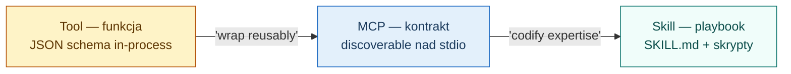
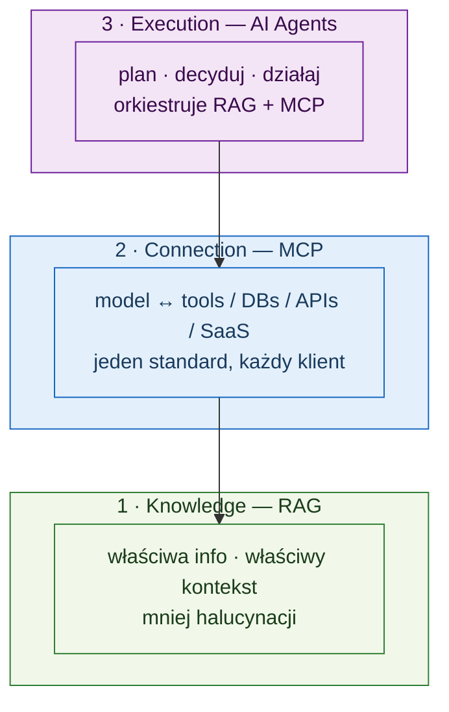
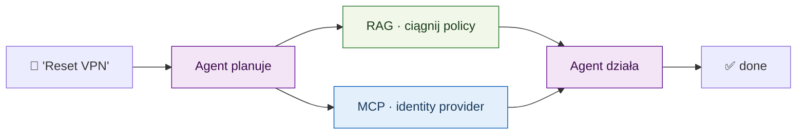
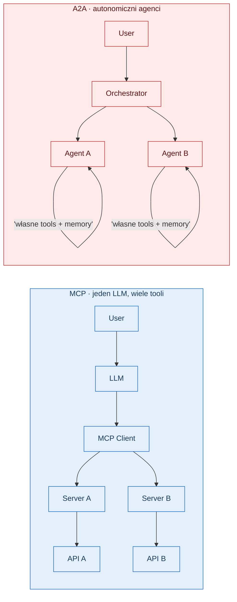
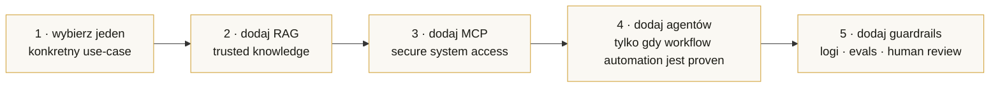

# Architektura nowiro AI — kanoniczna referencja

> Single source of truth dla konceptualnej architektury, którą stosuje każdy projekt w trinity nowiro (`ai-studio`, `ai-mcp-alm`, `ai-mcp-devtools`). **Ten plik jest trinity baseline** — byte-identical w trzech repo, wymuszane przez `pnpm trinity:check`.

---

## 1. Trzy prymitywy — Tool · MCP · Skill

Trzy koncepty, które ludzie najczęściej mylą. Żyją na różnych poziomach abstrakcji i **stackują się**, nie zastępują nawzajem.

| Prymityw         | Co to jest                              | Na co odpowiada                                                       | Kiedy po nie sięgnąć                                                             |
| ---------------- | --------------------------------------- | --------------------------------------------------------------------- | -------------------------------------------------------------------------------- |
| **Tool calling** | Funkcja z JSON schemą                   | "Którą funkcję model powinien zawołać teraz?"                         | Najniższy poziom. Jeden proces jest właścicielem funkcji i jej schemy.           |
| **MCP**          | Protokół / kontrakt nad stdio           | "Gdzie żyje capability i jak ją odkryć at runtime?"                   | Zbuduj capability raz; każdy MCP-aware klient (Claude, Cursor, …) go dostaje.    |
| **Skill**        | Bundle: `SKILL.md` + skrypty + assets   | "Jak dobrze chcemy żeby ten rodzaj zadania był zrobiony?"             | Koduje expert workflow — code review, deployment checklist, scaffolding.         |

**Reguła kciuka:** Tool = funkcja · MCP = kontrakt · Skill = playbook. Używaj ich razem, nie jako alternatyw.

### Czym MCP **nie jest**

MCP **nie jest** plannerem — nie decyduje co robić dalej. MCP **nie jest** pamięcią — nie zachowuje kontekstu między sesjami. MCP **nie jest** autonomicznym executorem. _MCP umożliwia akcję; nie decyduje._ Plannery i pamięć należą do warstwy agenta (§2).

---

## 2. Trzy warstwy — Knowledge · Connection · Execution

Kompletny system ma trzy komplementarne warstwy — kolaborują; nie konkurują.

| Warstwa      | Posiada                                                       | Wchodzi gdy                                                                  |
| ------------ | ------------------------------------------------------------- | ---------------------------------------------------------------------------- |
| **RAG**      | Domain knowledge, cytaty, świeżość                            | Dane zmieniają się szybciej niż model jest retrenowany, lub potrzebujesz exact quotes. |
| **MCP**      | Łączność do systemów i API                                    | Model musi _zrobić_ coś w realnym świecie.                                   |
| **AI Agent** | Planowanie, decyzje, multi-step follow-through, side-effects  | Praca ma więcej niż jeden krok i wymaga autonomicznej orkiestracji.          |

### Worked example — IT helpdesk copilot

RAG dostarcza wiedzę · MCP dostarcza dostęp · agent dostarcza execution.

### Detale RAG (niewidoczne ze screenshotów)

- **Pipeline:** docs → chunks → embeddings → vector store → semantic retrieval → LLM context.
- **Fit:** private docs, często zmieniające się dane, gdy wymagane są cytaty / "pokaż mi źródło", gdy halucynacje muszą być wyeliminowane.
- **Stack options:** LangChain / LlamaIndex (frameworks); Pinecone / Weaviate / Chroma (vector DBs); OpenAI / Cohere embeddings; Anthropic + in-house retriever wystawiony przez MCP.
- **W nowiro:** docs gier Phaser, historia ADR, customer specs, korpus release-notes.

---

## 3. MCP vs A2A — dwa protokoły orkiestracji

Oba to protokoły dla agent systems, ale żyją na **różnych warstwach**. Ten sam scenariusz — kompletnie różna architektura.

| Aspekt            | MCP                                  | A2A                                                |
| ----------------- | ------------------------------------ | -------------------------------------------------- |
| Kontrola          | Jeden LLM trzyma stery               | Każdy agent autonomiczny; orchestrator koordynuje  |
| Execution         | Sequential tool calls                | Praca równoległa między agentami                   |
| Context isolation | Single context window (size-limited) | Per-agent context — skaluje się między domenami    |
| Debugging         | Łatwiejsze — jeden trace             | Trudniejsze — wiele trace, eventual consistency    |
| Sweet spot        | Jedna app, jedna domena              | Wiele app / wiele domen / heterogeneous tooling    |

> **Kiedy NIE używać A2A:** jeśli workload to jedna app i zadania uruchamiają się sekwencyjnie, MCP wygrywa prostotą. A2A to overhead dla prostego przypadku.

---

## 4. MCP power stack — siedem rekomendowanych serwerów

Siedem serwerów MCP, które wzięte razem dają LLM enterprise-class capabilities. Każdy rozwiązuje jeden konkretny problem.

| #   | Server         | Kategoria  | Co rozwiązuje                                                                                                                                            |
| --- | -------------- | ---------- | -------------------------------------------------------------------------------------------------------------------------------------------------------- |
| 01  | **Figma MCP**  | Design     | Design → code w sekundach. Czyta komponenty Figma, emituje production code.                                                                              |
| 02  | **Memory MCP** | Memory     | Persistent knowledge graph (entities + relations + observations). Cross-session persistence — kontekst przeżywa między konwersacjami. Anthropic-official. |
| 03  | **Zapier MCP** | Automation | 30 000 akcji między 8 000 app (Gmail, Slack, GitHub, Notion, CRMs). Jeden MCP, każdy automation lane.                                                    |
| 04  | **Sentry MCP** | Debugging  | Identyfikuje root cause prod-errora, otwiera fix PR. Świetny dla `ai-mcp-devtools`.                                                                      |
| 05  | **Tavily MCP** | Research   | Real-time web z structured results — zabija "facts hallucinated from training data".                                                                     |
| 06  | **Context7**   | Docs       | Version-specific, zawsze-świeże docs frameworków (React 19, Angular 21, Vue 4 …). Już wired tutaj.                                                       |
| 07  | **Playwright** | E2E        | Browser automation via accessibility tree (no screenshots). Już wired tutaj.                                                                             |

Rekomendacje dla trinity:

| Repo trinity      | Już wired                                | Warto dodać                                              |
| ----------------- | ---------------------------------------- | -------------------------------------------------------- |
| `ai-studio`       | context7 · playwright · nx · angular-cli | Memory (cross-session orchestrator state)                |
| `ai-mcp-alm`      | (żaden — repo _jest_ zestawem MCP serwerów) | Zapier (broad automation surface dla ALM workflows)   |
| `ai-mcp-devtools` | (żaden — repo _jest_ zestawem MCP serwerów) | Sentry (auto-fix prod errors); Tavily (research surface) |

Aktualny rejestr `mcp.json` jest per-repo (`.ai/mcp.json`); ten plik dokumentuje _rekomendowany_ zestaw — wiring to operator decision.

---

## 5. Mechanika Claude Code — jak to repo z niej korzysta

Cheat sheet prymitywów Claude Code, na których polega trinity. Te same mechaniki mapują się na `/promptname` workflows w GitHub Copilot Chat (trinity wspiera **tylko** Claude Code i GitHub Copilot — patrz `.ai/README.md`).

| Prymityw    | Gdzie żyje w tym repo                                             | Cel                                                                                  |
| ----------- | ----------------------------------------------------------------- | ------------------------------------------------------------------------------------ |
| `CLAUDE.md` | repo root (≤ 150 lines)                                           | Project rulebook; ładowany przed każdym zadaniem.                                    |
| `/skills`   | `.claude/skills/` (i `.github/skills/` dla mirroru Copilot)       | Reusable markdown playbooks dla code review, scaffolding, releases.                  |
| `/MCP`      | `.ai/mcp.json` + `.vscode/mcp.json`                               | Rejestr serwerów MCP, które agent może podłączyć.                                    |
| `/agents`   | `.claude/agents/` (i `.ai/agents/` jako SoT)                      | Specialist subagents (analyst, architect, frontend-dev, …) używani przez orchestrator. |
| `/plan`     | `docs/ai-workflow/plans/`, `docs/analytical/specs/<slug>/plan.md` | Plan-first generation wg `core.md` §7.                                               |
| `/compact`  | runtime                                                           | Kompresuje historię zanim context się rozdmie. Uruchom przy ~70 % kontekstu.         |
| `/memory`   | runtime                                                           | View / edit per-project notes, które przeżywają sesję.                                |
| Hooks       | `.claude/hooks/`, husky                                           | Auto-lint / auto-format po edycjach; pre-commit + pre-push validation.               |

---

## 6. Decision guide — kiedy po co sięgnąć

**Reguła:** _użyj najmniejszego stacku, który bezpiecznie rozwiązuje pracę._ Każda warstwa dodaje operational cost.

| Potrzeba                                  | RAG      | MCP              | AI Agent | A2A | Skill |
| ----------------------------------------- | -------- | ---------------- | -------- | --- | ----- |
| Dokładne odpowiedzi z private docs        | ✅       | —                | —        | —   | —     |
| Sięganie do business systems / API        | —        | ✅               | —        | —   | —     |
| Multi-step zadanie z follow-through       | —        | supports         | ✅       | —   | —     |
| Wiele app równolegle (monorepo)           | —        | ✅ (Nx affected) | optional | ✅  | ✅    |
| Code standards / best practices           | —        | —                | —        | —   | ✅    |
| Debug production errors                   | —        | ✅ (Sentry)      | ✅       | —   | —     |
| Automated E2E testing                     | —        | ✅ (Playwright)  | optional | —   | ✅    |
| ALM / lifecycle management                | optional | ✅               | ✅       | ✅  | ✅    |
| Real-time web research                    | —        | ✅ (Tavily)      | —        | —   | —     |
| Zawsze-świeże docs frameworków            | —        | ✅ (Context7)    | —        | —   | —     |

### Rekomendowana kolejność budowy

### Production must-haves

Zoperacjonalizowane w [`.ai/rules/production-readiness.md`](rules/production-readiness.md): permissions, audit logs, monitoring, cost control, human approval, fallback paths.

> **Najlepsze systemy są: Grounded (RAG) · Connected (MCP) · Controlled (guardrails + human review).**

---

## 7. Mapa projektów nowiro

Mapa jak cztery logiczne projekty się komponują. Trzy z nich obecnie dzielą dwa git repa (`ai-studio` hostuje zarówno workspace tier jak i dashboard tier — splitting ich to future ADR; patrz `docs/architecture/nowiro-projects-map.md` dla per-repo specifics).

| Logiczny projekt          | Gdzie żyje                               | RAG          | MCP                                | Skills           | Agent        | A2A                  |
| ------------------------- | ---------------------------------------- | ------------ | ---------------------------------- | ---------------- | ------------ | -------------------- |
| **studio-workspace**      | repo `ai-studio` (Nx + Angular + Phaser) | docs (lekkie) | Nx · Angular · GitHub · Playwright | SKILL.md per lib | optional     | —                    |
| **ai-studio (dashboard)** | future apps pod repo `ai-studio`         | historia     | Memory · Monitor                   | yes              | Orchestrator | yes — multi-agent UI |
| **ai-mcp-devtools**       | repo `ai-mcp-devtools`                   | —            | core product (server bundle)       | yes              | —            | —                    |
| **ai-mcp-alm**            | repo `ai-mcp-alm`                        | spec corpus  | GitHub · Jira · Confluence · CI/CD | yes              | yes          | consider             |

**Target nowiro architecture:** dashboard tier `ai-studio` to orchestrator (A2A) → deleguje do per-project specialist agents → każdy specialist konsumuje serwery MCP z `ai-mcp-devtools` + `ai-mcp-alm` → Skills są shared standards layer → RAG biega po dokumentacji i historii decyzji.

---

## Trinity invariants (nie naruszaj)

1. Ten plik jest byte-identical między `ai-studio`, `ai-mcp-alm`, `ai-mcp-devtools` (`pnpm trinity:check`).
2. Diagramy są wyłącznie mermaid — żadnego ASCII art, żadnych embedded images.
3. Referencje do nazw repozytoriów używają **aktualnych** nazw repo (`ai-studio`, `ai-mcp-alm`, `ai-mcp-devtools`); _logiczny_ split `studio-workspace` / dashboard jest konceptualny tylko, do czasu split przez ADR.
4. Tabela rekomendacji MCP jest informational — operators wirują serwery per-repo w `.ai/mcp.json`.
5. Tooling references zostają limitowane do **Claude Code** i **GitHub Copilot**. Żadne inne wrappery AI tool nie mogą się tu pojawić.
