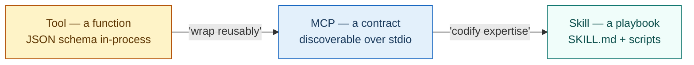
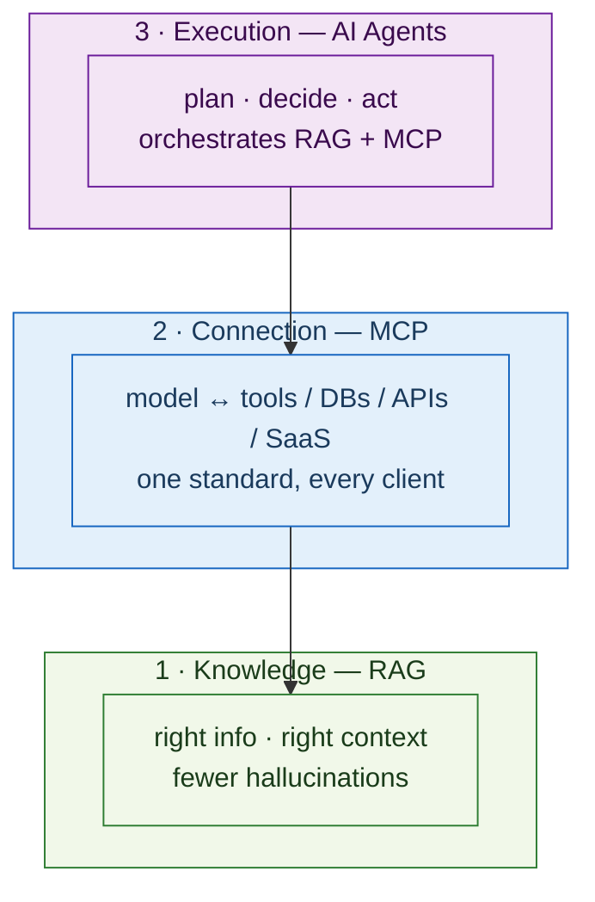
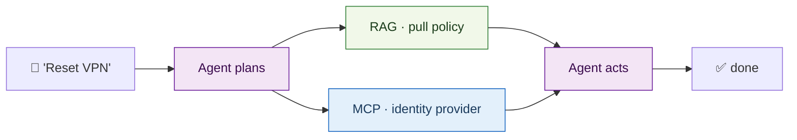
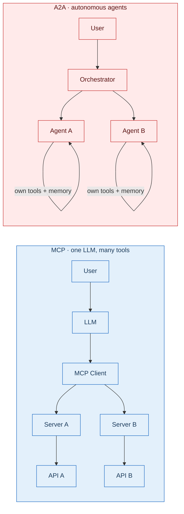
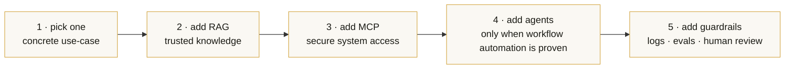

# nowiro AI Architecture — canonical reference

> Single source of truth for the conceptual architecture every project in the nowiro trinity (`ai-studio`, `ai-mcp-alm`, `ai-mcp-devtools`) follows. **This file is a trinity baseline** — byte-identical in all three repos, enforced by `pnpm trinity:check`.

---

## 1. Three primitives — Tool · MCP · Skill

The three concepts people most often confuse. They live at different levels of abstraction and **stack**, they do not replace each other.

| Primitive        | What it is                              | What it answers                                                       | When to reach for it                                                           |
| ---------------- | --------------------------------------- | --------------------------------------------------------------------- | ------------------------------------------------------------------------------ |
| **Tool calling** | A function with a JSON schema           | "Which function should the model call right now?"                     | Lowest level. One process owns the function and its schema.                    |
| **MCP**          | A protocol / contract over stdio        | "Where does the capability live and how do I discover it at runtime?" | Build the capability once; every MCP-aware client (Claude, Cursor, …) gets it. |
| **Skill**        | A bundle: `SKILL.md` + scripts + assets | "How well do we want this kind of task done?"                         | Encodes expert workflow — code review, deployment checklist, scaffolding.      |

**Rule of thumb:** Tool = function · MCP = contract · Skill = playbook. Use them together, not as alternatives.

### What MCP is **not**

MCP is **not** a planner — it does not decide what to do next. MCP is **not** memory — it does not retain context across sessions. MCP is **not** an autonomous executor. _MCP enables action; it does not decide._ Planners and memory belong to the agent layer (§2).

---

## 2. Three layers — Knowledge · Connection · Execution

A complete system has three complementary layers — they collaborate; they do not compete.

| Layer        | Owns                                                         | Picks up when                                                              |
| ------------ | ------------------------------------------------------------ | -------------------------------------------------------------------------- |
| **RAG**      | Domain knowledge, citations, freshness                       | Data changes faster than the model is retrained, or you need exact quotes. |
| **MCP**      | Connectivity to systems and APIs                             | The model needs to _do_ something in the real world.                       |
| **AI Agent** | Planning, decisions, multi-step follow-through, side-effects | The job has more than one step and needs autonomous orchestration.         |

### Worked example — IT helpdesk copilot

RAG supplies the knowledge · MCP supplies the access · the agent supplies the execution.

### RAG details (not visible from the screenshots)

- **Pipeline:** docs → chunks → embeddings → vector store → semantic retrieval → LLM context.
- **Fit:** private docs, frequently changing data, when citations / "show me the source" is required, when hallucinations must be eliminated.
- **Stack options:** LangChain / LlamaIndex (frameworks); Pinecone / Weaviate / Chroma (vector DBs); OpenAI / Cohere embeddings; Anthropic + an in-house retriever exposed over MCP.
- **In nowiro:** Phaser game docs, ADR history, customer specs, release-notes corpus.

---

## 3. MCP vs A2A — two orchestration protocols

Both are protocols for agent systems, but they live on **different layers**. Same scenario — completely different architecture.

| Aspect            | MCP                                  | A2A                                                |
| ----------------- | ------------------------------------ | -------------------------------------------------- |
| Control           | One LLM stays in charge              | Each agent is autonomous; orchestrator coordinates |
| Execution         | Sequential tool calls                | Parallel work across agents                        |
| Context isolation | Single context window (size-limited) | Per-agent context — scales across domains          |
| Debugging         | Easier — one trace                   | Harder — many traces, eventual consistency         |
| Sweet spot        | Single app, single domain            | Many apps / many domains / heterogeneous tooling   |

> **When NOT to use A2A:** if the workload is one app and tasks run sequentially, MCP wins on simplicity. A2A is overhead for the simple case.

---

## 4. The MCP power stack — seven recommended servers

The seven MCP servers that, taken together, give an LLM enterprise-class capabilities. Each solves one specific problem.

| #   | Server         | Category   | What it solves                                                                                                                                            |
| --- | -------------- | ---------- | --------------------------------------------------------------------------------------------------------------------------------------------------------- |
| 01  | **Figma MCP**  | Design     | Design → code in seconds. Reads Figma components, emits production code.                                                                                  |
| 02  | **Memory MCP** | Memory     | Persistent knowledge graph (entities + relations + observations). Cross-session persistence — context survives between conversations. Anthropic-official. |
| 03  | **Zapier MCP** | Automation | 30 000 actions across 8 000 apps (Gmail, Slack, GitHub, Notion, CRMs). One MCP, every automation lane.                                                    |
| 04  | **Sentry MCP** | Debugging  | Identifies prod-error root cause, opens a fix PR. Great for `ai-mcp-devtools`.                                                                            |
| 05  | **Tavily MCP** | Research   | Real-time web with structured results — kills "facts hallucinated from training data".                                                                    |
| 06  | **Context7**   | Docs       | Version-specific, always-fresh framework docs (React 19, Angular 21, Vue 4 …). Already wired here.                                                        |
| 07  | **Playwright** | E2E        | Browser automation via accessibility tree (no screenshots). Already wired here.                                                                           |

Recommendations for the trinity:

| Trinity repo      | Already wired                            | Worth adding                                             |
| ----------------- | ---------------------------------------- | -------------------------------------------------------- |
| `ai-studio`       | context7 · playwright · nx · angular-cli | Memory (cross-session orchestrator state)                |
| `ai-mcp-alm`      | (none — repo _is_ a set of MCP servers)  | Zapier (broad automation surface for ALM workflows)      |
| `ai-mcp-devtools` | (none — repo _is_ a set of MCP servers)  | Sentry (auto-fix prod errors); Tavily (research surface) |

The actual `mcp.json` registry is per-repo (`.ai/mcp.json`); this file documents the _recommended_ set — wiring is an operator decision.

---

## 5. Claude Code mechanics — how this repo uses them

Cheat sheet of the Claude Code primitives the trinity relies on. The same mechanics map to `/promptname` workflows in GitHub Copilot Chat (the trinity supports **only** Claude Code and GitHub Copilot — see `.ai/README.md`).

| Primitive   | Where it lives in this repo                                       | Purpose                                                                              |
| ----------- | ----------------------------------------------------------------- | ------------------------------------------------------------------------------------ |
| `CLAUDE.md` | repo root (≤ 150 lines)                                           | Project rulebook; loaded before every task.                                          |
| `/skills`   | `.claude/skills/` (and `.github/skills/` for the Copilot mirror)  | Reusable markdown playbooks for code review, scaffolding, releases.                  |
| `/MCP`      | `.ai/mcp.json` + `.vscode/mcp.json`                               | Registry of MCP servers the agent may attach.                                        |
| `/agents`   | `.claude/agents/` (and `.ai/agents/` as the SoT)                  | Specialist subagents (analyst, architect, frontend-dev, …) used by the orchestrator. |
| `/plan`     | `docs/ai-workflow/plans/`, `docs/analytical/specs/<slug>/plan.md` | Plan-first generation per `core.md` §7.                                              |
| `/compact`  | runtime                                                           | Compresses history before context bloats. Run at ~70 % context.                      |
| `/memory`   | runtime                                                           | View / edit per-project notes that survive the session.                              |
| Hooks       | `.claude/hooks/`, husky                                           | Auto-lint / auto-format after edits; pre-commit + pre-push validation.               |

---

## 6. Decision guide — when to reach for what

**The rule:** _use the smallest stack that solves the job safely._ Each layer adds operational cost.

| Need                                      | RAG      | MCP              | AI Agent | A2A | Skill |
| ----------------------------------------- | -------- | ---------------- | -------- | --- | ----- |
| Accurate answers grounded in private docs | ✅       | —                | —        | —   | —     |
| Reach into business systems / APIs        | —        | ✅               | —        | —   | —     |
| Multi-step task with follow-through       | —        | supports         | ✅       | —   | —     |
| Many apps in parallel (monorepo)          | —        | ✅ (Nx affected) | optional | ✅  | ✅    |
| Code standards / best practices           | —        | —                | —        | —   | ✅    |
| Debug production errors                   | —        | ✅ (Sentry)      | ✅       | —   | —     |
| Automated E2E testing                     | —        | ✅ (Playwright)  | optional | —   | ✅    |
| ALM / lifecycle management                | optional | ✅               | ✅       | ✅  | ✅    |
| Real-time web research                    | —        | ✅ (Tavily)      | —        | —   | —     |
| Always-fresh framework docs               | —        | ✅ (Context7)    | —        | —   | —     |

### Recommended build order

### Production must-haves

Operationalised in [`.ai/rules/production-readiness.md`](rules/production-readiness.md): permissions, audit logs, monitoring, cost control, human approval, fallback paths.

> **Best systems are: Grounded (RAG) · Connected (MCP) · Controlled (guardrails + human review).**

---

## 7. nowiro project map

The map of how the four logical projects compose. Three of them currently share two git repos (`ai-studio` hosts both the workspace tier and the dashboard tier — splitting them is a future ADR; see `docs/architecture/nowiro-projects-map.md` for per-repo specifics).

| Logical project           | Where it lives                           | RAG          | MCP                                | Skills           | Agent        | A2A                  |
| ------------------------- | ---------------------------------------- | ------------ | ---------------------------------- | ---------------- | ------------ | -------------------- |
| **studio-workspace**      | `ai-studio` repo (Nx + Angular + Phaser) | docs (light) | Nx · Angular · GitHub · Playwright | SKILL.md per lib | optional     | —                    |
| **ai-studio (dashboard)** | future apps under `ai-studio` repo       | history      | Memory · Monitor                   | yes              | Orchestrator | yes — multi-agent UI |
| **ai-mcp-devtools**       | `ai-mcp-devtools` repo                   | —            | core product (server bundle)       | yes              | —            | —                    |
| **ai-mcp-alm**            | `ai-mcp-alm` repo                        | spec corpus  | GitHub · Jira · Confluence · CI/CD | yes              | yes          | consider             |

**Target nowiro architecture:** the dashboard tier of `ai-studio` is the orchestrator (A2A) → it delegates to per-project specialist agents → each specialist consumes MCP servers from `ai-mcp-devtools` + `ai-mcp-alm` → Skills are the shared standards layer → RAG runs over the documentation and decision history.

---

## Trinity invariants (do not violate)

1. This file is byte-identical across `ai-studio`, `ai-mcp-alm`, `ai-mcp-devtools` (`pnpm trinity:check`).
2. Diagrams are mermaid only — no ASCII art, no embedded images.
3. References to repository names use the **current** repo names (`ai-studio`, `ai-mcp-alm`, `ai-mcp-devtools`); the _logical_ `studio-workspace` / dashboard split is conceptual only until split via ADR.
4. The MCP recommendation table is informational — operators wire servers per-repo in `.ai/mcp.json`.
5. Tooling references stay limited to **Claude Code** and **GitHub Copilot**. No other AI tool wrappers may appear here.
