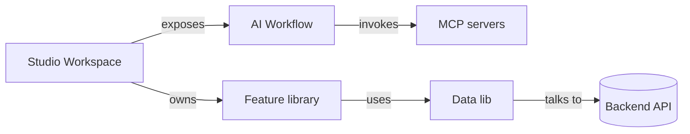

# Domain model

> Replace this placeholder once the first real feature lands. Keep entities small and aligned with the database / API.

## Bounded contexts

## Entities

| Entity   | Owner lib                | Notes                                              |
| -------- | ------------------------ | -------------------------------------------------- |
| Workspace | `libs/data/workspace`    | Top-level container the user works in.             |
| Project   | `libs/data/project`      | Belongs to a workspace.                            |
| Run       | `libs/data/agent-run`    | One execution of the orchestrator's workflow.      |

> Adjust as the schema solidifies. Keep this in lock-step with `docs/architecture/data-model.md`.
