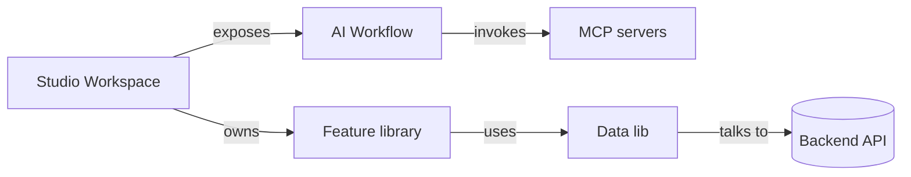

# Domain model

> Wymień ten placeholder gdy wyląduje pierwszy realny feature. Trzymaj entities małe i zgodne z bazą / API.

## Bounded contexts

## Entities

| Entity    | Owner lib             | Notes                                             |
| --------- | --------------------- | ------------------------------------------------- |
| Workspace | `libs/data/workspace` | Top-level container, w którym pracuje użytkownik. |
| Project   | `libs/data/project`   | Należy do workspace.                              |
| Run       | `libs/data/agent-run` | Jedno execution workflow orchestratora.           |

> Adjust, gdy schema się utrwala. Trzymaj w lock-step z `docs/architecture/data-model.md`.
