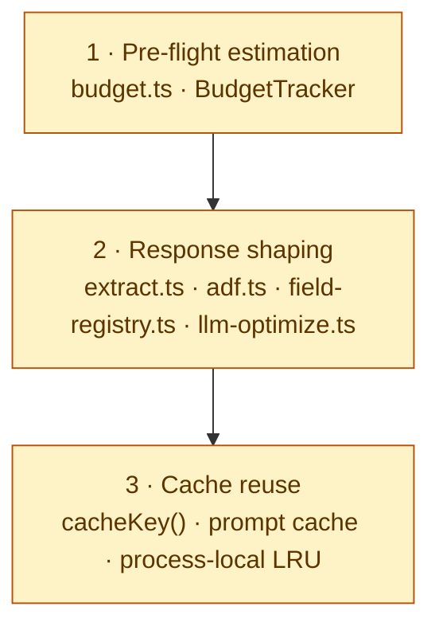

# Optymalizacja zapytań do LLM

> Trinity baseline. Reguły zmniejszania zużycia tokenów na trzech warstwach: pre-flight estimation, response shaping, cache reuse. Dotyczy każdego MCP toola, każdego pipeline'u ekstrakcji oraz każdej odpowiedzi wracającej do agenta.

## Dlaczego to ma znaczenie

Tokeny kosztują pieniądze i kontekst. Zmarnowany token to:

- **Wolniejsza odpowiedź** (więcej do wygenerowania).
- **Wyższy rachunek** (per-token billing).
- **Wcześniejszy overflow** kontekstu — agent traci pamięć rozmowy szybciej.
- **Słabszy reasoning** — szum w kontekście pogarsza dobór tokenów.

Trzy warstwy obrony, w kolejności od najlepszego ROI:



## Reguły

### 1. Estymuj zanim wyślesz

**Zasada:** każda operacja zwracająca >50 000 tokenów ma `BudgetTracker`. Zwróć `truncated: true` + `next` cursor zamiast cichego ucięcia.

```ts
import { BudgetTracker } from './budget.js';

const budget = new BudgetTracker(60_000); // ≈ 30% kontekstu Claude 200k
```

### 2. Kompaktowy JSON

Wyrzuć `null`, `undefined`, puste tablice/obiekty. Użyj `compactJson()` z `llm-optimize.ts`.

**Anti-pattern:** `JSON.stringify(value, null, 2)` — pretty-print marnuje 30%+ tokenów.
**Pattern:** `JSON.stringify(compactJson(value))`.

### 3. Streszczaj długie tablice

Tablica > 50 elementów → zwróć `summarizeArray()`: `{ head, tail, total, truncated: true }`. Agent dostaje pierwsze N + ostatnie M + liczbę ukrytych pozycji.

### 4. ADF / HTML → Markdown

Nigdy nie wracaj do LLM raw ADF JSON ani HTML. Użyj `adfToMarkdown()`. **~3× redukcja tokenów** + lepszy reasoning.

### 5. Custom-field reshape

Nigdy nie wysyłaj `customfield_NNNNN` do modelu. Użyj `reshapeFieldValue()`. **~1.5× redukcja** + agent rozumie "Story Points" zamiast "customfield_10042".

### 6. Cache identycznych promptów

Statyczne odpowiedzi MCP (rejestr pól, schemat tooli, lista projektów) — trzymaj proces-local LRU z TTL ≥ 60 s. Klucz: `cacheKey([toolName, ...params])`.

Anthropic prompt cache: dla long-running tool descriptions ustaw `cache_control: { type: 'ephemeral' }` — 5-minutowy hit window.

### 7. English w `description` MCP toola

Pole `description` jest wysyłane do LLM przy **każdym** `list_tools`. Polski tokenizuje się ~1.4× drożej niż angielski. **Reguła:** opis toola po angielsku, krótki, czasownikowy.

✅ `"Search Jira issues by JQL. Returns up to 50 issues per page."`
❌ `"Wyszukuje zgłoszenia w Jirze według zapytania JQL. Zwraca maksymalnie 50 elementów na stronę."`

### 8. Tylko potrzebne pola

Gdy LLM mówi "find the assignee of issue X" — zwróć **tylko** assignee, nie całe issue. Dodaj parametr `fields: string[]` do toola.

```ts
search_issues({ jql: '...', fields: ['key', 'summary', 'assignee'] });
```

### 9. Truncate, nie crashuj

`truncate(text, maxTokens, '\n…[truncated]')` zawsze zwraca string mieszczący się w budżecie. Nigdy nie odrzucaj odpowiedzi — degraduj.

## Domyślne budżety per klasa zadania

| Klasa                          | Budżet (tokens) | Uzasadnienie                                          |
| ------------------------------ | --------------- | ----------------------------------------------------- |
| Single fetch (1 issue, 1 page) | 5 000           | Pojedyncze wywołanie, nie powinno wymagać paginacji   |
| List / search (1-2 stron)      | 20 000          | Typowe zapytanie z filtrami                           |
| Search z paginacją             | 60 000          | ~30 % kontekstu Claude 200k — zostaje miejsce na chat |
| Bulk export (z trunkacją)      | 100 000         | Maksimum dla single-call                              |
| Compliance / pełen audyt       | 150 000         | Specjalny tryb; orchestrator dzieli na sub-tasks      |

Override per tool przez parametr `budget?: number` w args; `BudgetTracker` szanuje overrride.

## Anti-patterns

- ❌ `JSON.stringify(value, null, 2)` przy zwracaniu do LLM
- ❌ Zwracanie pełnego raw payload z Atlassiana
- ❌ Wysyłanie pełnych zawartości plików gdy wystarczy slice ±25 linii
- ❌ Polski w MCP tool `description`
- ❌ Hard-cap "fetch 1000 latest" bez `truncated` flagi
- ❌ Gołe `console.log(huge_object)` — leci do logów + (potencjalnie) do LLM
- ❌ Wstawianie pełnego ADF do prompt (struktura JSON to ~3× tokenów vs Markdown)

## Mierzenie efektu

Każdy tool emituje w logu:

```json
{ "tool": "jira.search_issues", "tokens_estimate": 18420, "items": 47, "truncated": false }
```

Dashboard agreguje `tokens_estimate` per tool per dzień. Cel: średni < budżet × 0.8.

## Implementacja referencyjna

`ai-mcp-alm/src/shared/`:

- `budget.ts` — `BudgetTracker` + `estimateTokens` + `truncate`
- `extract.ts` — composition (paginate → reshape → charge → stop)
- `adf.ts` — ADF → Markdown
- `field-registry.ts` — custom-field reshape
- `llm-optimize.ts` — `compactJson` + `summarizeArray` + `terse` + `cacheKey`

`ai-mcp-devtools/src/shared/`:

- `llm-optimize.ts` — ten sam plik (mirror; nie trinity-baseline, ale taki sam content)

## Zobacz też

- [`.ai/architecture.md`](../architecture.md) §6 — decision guide (kiedy co)
- [`.ai/rules/production-readiness.md`](production-readiness.md) §3 (Monitoring) i §4 (Cost control)
- [`.ai/rules/connectors.md`](connectors.md) — kontrakt connectora używającego ekstrakcji
- [`.ai/rules/language.md`](language.md) — dlaczego MCP `description` po angielsku
- `docs/architecture/extraction-strategy.md` (w `ai-mcp-alm`) — pipeline w praktyce
