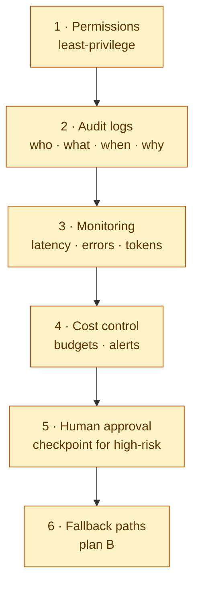

# Production readiness — six must-haves

> Trinity baseline. Every agent-bearing feature in `ai-studio` / `ai-mcp-alm` / `ai-mcp-devtools` MUST satisfy these six controls **before** it touches a production-impacting system.

These rules expand on [`.ai/rules/security.md`](security.md) (data and authn) with the **operations** controls that turn a working agent into a safe one. See also [`.ai/architecture.md`](../architecture.md) §6 for context.

---

## 1. Permissions — least-privilege

**What.** Every agent gets only the scopes / API tokens / file paths it needs for the current task — nothing more.

**Why.** The blast radius of a compromised agent equals the union of its permissions.

**Signals it is in place:**

- Tokens are **per-feature**, not per-user-everything. (e.g. `ai-mcp-alm`'s Jira write-token has `write:issue` only — not `admin`.)
- File-system access is sandboxed to `PROJECT_ROOT` (already enforced in `ai-mcp-devtools` — see `src/server.ts`).
- Network calls are allowlisted (already enforced in `ai-mcp-devtools/read-docs`).
- Tokens are read **at use-time** from the environment or the user-profile config, never from the repo.

**Trinity hook:** `assertWriteAllowed()` in `ai-mcp-alm` is the canonical guard. Any new mutating tool wraps `assertWriteAllowed()` before the side-effect.

---

## 2. Audit logs — who · what · when · why

**What.** Every state-mutating action is logged with: actor, tool/agent name, input fingerprint, outcome, timestamp, correlation id.

**Why.** Post-incident forensics is impossible without it. Compliance frameworks (SOC 2, ISO 27001, AI Act) require it.

**Signals it is in place:**

- A `log()` helper writes structured JSON to **stderr** (never stdout — MCP servers use stdout for protocol).
- Every tool's `handle()` wraps work in `timed(server, tool, fn)` (see `ai-mcp-alm/src/shared/log.ts`).
- Inputs containing secrets are **fingerprinted** (sha256 prefix), never logged raw.
- A central log shipper picks up the stderr stream; logs are retained ≥ 90 days.

**Anti-patterns:** `console.log(token)`, swallowing exceptions silently, logging full request bodies.

---

## 3. Monitoring — latency · errors · tokens

**What.** Real-time dashboards on the four numbers that matter:

- **Latency** — p50/p95/p99 per tool.
- **Error rate** — per tool, per upstream system.
- **Token usage** — input + output tokens per tool invocation.
- **Tool fan-out** — how many tools the orchestrator calls per turn.

**Why.** A silent regression that doubles latency or token cost goes undetected for weeks otherwise.

**Signals it is in place:**

- Metrics are emitted alongside log entries (or extracted from them).
- An on-call runbook exists for each red threshold.
- Dashboard panels are versioned in the repo.

---

## 4. Cost control — budgets · alerts

**What.** A hard ceiling on monthly spend per project + alerts at 50 / 80 / 100 % of budget.

**Why.** LLM spend scales superlinearly with bad prompts, runaway loops, and forgotten background jobs.

**Signals it is in place:**

- Budgets are configured at the API-key level (Anthropic, OpenAI, Sentry, …).
- A killswitch exists — when budget is exhausted, the orchestrator returns a "budget exceeded" error code (`BudgetExceededError = -32013` in trinity error codes).
- Cost is attributed per repo / per feature so the owner of the spike is unambiguous.

---

## 5. Human approval — checkpoint for high-risk actions

**What.** Mutating actions that meet a "high-risk" predicate must surface a confirmation step that a human (not the agent) clears.

**Why.** _MCP enables action; it does not decide._ Some decisions must remain human.

**High-risk predicates (non-exhaustive):**

- Deleting or moving production data.
- Sending external email / Slack / Teams messages on behalf of a user.
- Posting public content (social media, public GitHub comments).
- Spending money (purchase, refund, transaction).
- Granting or revoking access.
- Anything that crosses a regulatory boundary (AI Act, GDPR, financial).

**Signals it is in place:**

- The mutating tool's input schema requires an explicit `confirm: true` flag, defaulted to `false`.
- A human-readable summary of "what is about to change" is shown before the action.
- The audit log captures the approver's identity.

---

## 6. Fallback paths — plan B

**What.** Every agent flow has a documented degraded mode for when an external system fails.

**Why.** "Sentry is down" / "the model returns 5xx" / "Jira API rate-limited" — the orchestrator must not crash; it must fall back gracefully.

**Signals it is in place:**

- Each MCP tool documents its **fail-mode contract**: what does it return if the upstream is down?
- Retries are bounded (≤ 3 attempts with exponential backoff) and logged.
- A circuit-breaker trips on repeated failure (open for ≥ 30 s before half-open retry).
- The end user gets a clear message: "X is unavailable; try again in Y minutes." — never a stack trace.

---

## End-of-feature checklist

Before any feature crosses the "production-impacting" line, the architect signs off the following:

- [ ] **Permissions** — token scopes are minimal; file-system + network access are sandboxed.
- [ ] **Audit logs** — every mutating call goes through `timed()`; secrets are fingerprinted, not logged.
- [ ] **Monitoring** — latency / error / token metrics are visible on the dashboard.
- [ ] **Cost control** — feature is under a budget with at-thresholds alerts.
- [ ] **Human approval** — all high-risk predicates require explicit `confirm: true` + summary.
- [ ] **Fallback** — each upstream has a documented fail-mode and circuit-breaker.

This checklist appears in the orchestrator's "Definition of Done" gate alongside lint / test / build.
