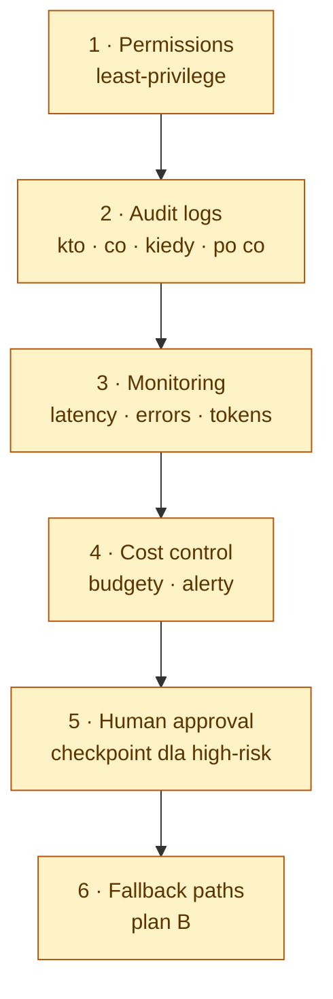

# Production readiness — sześć must-haves

> Trinity baseline. Każdy agent-bearing feature w `ai-studio` / `ai-mcp-alm` / `ai-mcp-devtools` MUSI spełnić te sześć kontroli **zanim** dotknie production-impacting system.

Te reguły rozszerzają [`.ai/rules/security.md`](security.md) (dane i authn) o **operations** kontrole, które zamieniają działającego agenta w bezpiecznego. Patrz też [`.ai/architecture.md`](../architecture.md) §6 dla kontekstu.

---

## 1. Permissions — least-privilege

**Co.** Każdy agent dostaje tylko te scopes / API tokens / file paths, których potrzebuje do aktualnego zadania — nic więcej.

**Po co.** Blast radius skompromitowanego agenta równa się unii jego uprawnień.

**Sygnały, że jest w miejscu:**

- Tokeny są **per-feature**, nie per-user-everything. (Np. write-token Jira w `ai-mcp-alm` ma tylko `write:issue` — nie `admin`.)
- Dostęp do file-system jest sandboxed do `PROJECT_ROOT` (już wymuszone w `ai-mcp-devtools` — patrz `src/server.ts`).
- Calls sieciowe są allowlisted (już wymuszone w `ai-mcp-devtools/read-docs`).
- Tokeny są czytane **at use-time** z environment lub user-profile config, nigdy z repo.

**Trinity hook:** `assertWriteAllowed()` w `ai-mcp-alm` to canonical guard. Każde nowe mutujące narzędzie wrappuje `assertWriteAllowed()` przed side-effectem.

---

## 2. Audit logs — kto · co · kiedy · po co

**Co.** Każda state-mutating akcja jest logowana z: actor, nazwa narzędzia/agenta, input fingerprint, outcome, timestamp, correlation id.

**Po co.** Post-incident forensics jest niemożliwe bez tego. Compliance frameworks (SOC 2, ISO 27001, AI Act) tego wymagają.

**Sygnały, że jest w miejscu:**

- Helper `log()` zapisuje structured JSON do **stderr** (nigdy stdout — serwery MCP używają stdout do protokołu).
- Każde `handle()` narzędzia wrappuje pracę w `timed(server, tool, fn)` (patrz `ai-mcp-alm/src/shared/log.ts`).
- Inputy zawierające sekrety są **fingerprinted** (sha256 prefix), nigdy logowane raw.
- Centralny log shipper zbiera stream stderr; logi są retained ≥ 90 dni.

**Anti-patterns:** `console.log(token)`, silent swallowing exceptions, logowanie pełnych request bodies.

---

## 3. Monitoring — latency · errors · tokens

**Co.** Real-time dashboardy na czterech liczbach, które się liczą:

- **Latency** — p50/p95/p99 per tool.
- **Error rate** — per tool, per upstream system.
- **Token usage** — input + output tokens per tool invocation.
- **Tool fan-out** — ile narzędzi orchestrator wywołuje per turn.

**Po co.** Silent regression, który podwaja latency lub token cost, inaczej zostaje niewykryty przez tygodnie.

**Sygnały, że jest w miejscu:**

- Metryki są emitowane obok log entries (lub ekstrahowane z nich).
- On-call runbook istnieje dla każdego red threshold.
- Panele dashboarda są wersjonowane w repo.

---

## 4. Cost control — budgety · alerty

**Co.** Twardy sufit na monthly spend per project + alerty na 50 / 80 / 100 % budżetu.

**Po co.** LLM spend skaluje się superlinearnie ze złymi promptami, runaway loops i zapomnianymi background jobs.

**Sygnały, że jest w miejscu:**

- Budgety są skonfigurowane na poziomie API-key (Anthropic, OpenAI, Sentry, …).
- Killswitch istnieje — gdy budget jest wyczerpany, orchestrator zwraca error code "budget exceeded" (`BudgetExceededError = -32013` w trinity error codes).
- Cost jest atrybuowany per repo / per feature, żeby właściciel spike był jednoznaczny.

---

## 5. Human approval — checkpoint dla high-risk akcji

**Co.** Mutujące akcje, które spełniają "high-risk" predicate, muszą wystawić confirmation step, który człowiek (nie agent) clearuje.

**Po co.** _MCP umożliwia akcję; nie decyduje._ Niektóre decyzje muszą pozostać ludzkie.

**High-risk predicates (non-exhaustive):**

- Usuwanie lub przenoszenie production data.
- Wysyłanie external email / Slack / Teams messages w imieniu użytkownika.
- Postowanie public content (social media, public GitHub comments).
- Wydawanie pieniędzy (purchase, refund, transaction).
- Przyznawanie lub odbieranie dostępu.
- Cokolwiek, co przekracza regulacyjną granicę (AI Act, GDPR, financial).

**Sygnały, że jest w miejscu:**

- Input schema mutującego narzędzia wymaga jawnej flagi `confirm: true`, defaulted do `false`.
- Human-readable podsumowanie "co się ma zmienić" jest pokazane przed akcją.
- Audit log łapie tożsamość zatwierdzającego.

---

## 6. Fallback paths — plan B

**Co.** Każdy agent flow ma udokumentowany degraded mode na wypadek failu external system.

**Po co.** "Sentry jest down" / "model zwraca 5xx" / "Jira API rate-limited" — orchestrator nie może crashować; musi spaść z gracją.

**Sygnały, że jest w miejscu:**

- Każde narzędzie MCP dokumentuje swój **fail-mode contract**: co zwraca jeśli upstream jest down?
- Retries są bounded (≤ 3 próby z exponential backoff) i logowane.
- Circuit-breaker tripuje na repeated failure (open dla ≥ 30 s przed half-open retry).
- End user dostaje czysty komunikat: "X jest niedostępne; spróbuj ponownie za Y minut." — nigdy stack trace.

---

## End-of-feature checklist

Zanim jakikolwiek feature przekroczy linię "production-impacting", architect zatwierdza następujące:

- [ ] **Permissions** — scopes tokenów są minimalne; dostęp file-system + network jest sandboxed.
- [ ] **Audit logs** — każde mutujące wywołanie idzie przez `timed()`; sekrety są fingerprinted, nie logowane.
- [ ] **Monitoring** — metryki latency / error / token są widoczne na dashboardzie.
- [ ] **Cost control** — feature jest pod budgetem z at-thresholds alerts.
- [ ] **Human approval** — wszystkie high-risk predicates wymagają jawnego `confirm: true` + summary.
- [ ] **Fallback** — każdy upstream ma udokumentowany fail-mode i circuit-breaker.

Ta checklista pojawia się w orchestrator's "Definition of Done" gate obok lint / test / build.
