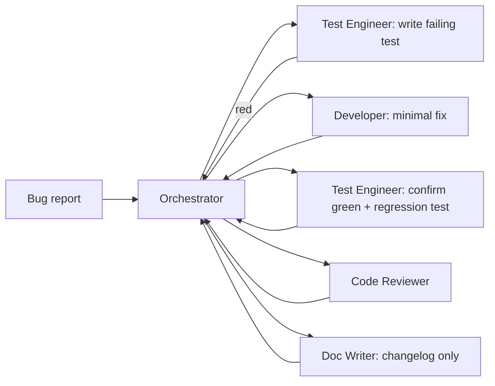

# Workflow: Bug Fix

## Steps

### 0. Plan

Orchestrator creates `docs/ai-workflow/plans/<YYYY-MM-DD>-<bug-slug>.md` from the template. The task table lists at minimum: `T001 reproduce` (test-engineer), `T002 fix` (frontend or backend), `T003 regression test` (test-engineer), `T004 review` (code-reviewer). For security bugs, add `T05 security audit`. Status `accepted` once the user confirms the bug is real.

### 1. Reproduce

Orchestrator delegates to **test-engineer** with the bug report. Test engineer:

- Writes a **failing test** at the lowest reasonable layer (unit > integration > E2E).
- Confirms it reproduces the bug locally.
- Hands the failing test back.

If the bug can't be reproduced, Orchestrator pushes back to the user with a request for steps.

### 2. Fix

Orchestrator delegates to the appropriate developer agent with:

- the failing test,
- the offending file(s):line(s) (from the test stack trace),
- a strict instruction: **smallest possible diff**.

### 3. Verify

Test-engineer reruns the failing test (now green) plus the full affected test suite and adds at least one regression test that covers the original failure mode without depending on the fix's internal structure.

### 4. Review

Code-reviewer pass. Security-auditor only if the bug was a security issue.

### 5. Document

Doc-writer adds an entry to `CHANGELOG.md` (via conventional commit footer); only updates docs if user-visible behaviour changed.

## Anti-patterns

- ❌ Fixing without a failing test first.
- ❌ Drive-by refactors. Bug-fix PRs are scoped to the bug.
- ❌ Closing the issue before the regression test ships.
