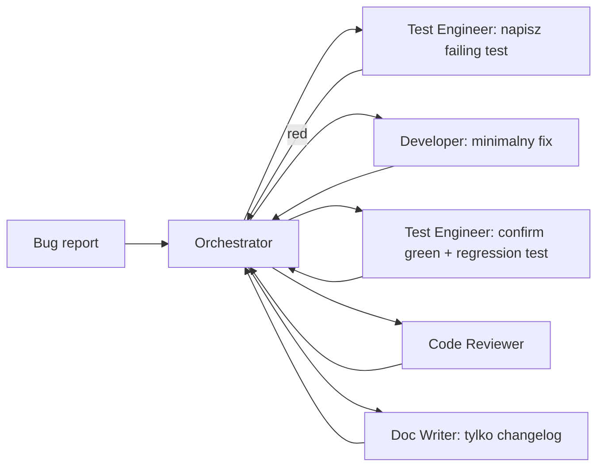

# Workflow: Bug Fix

## Kroki

### 0. Plan

Orchestrator tworzy `docs/ai-workflow/plans/<YYYY-MM-DD>-<bug-slug>.md` z templatu. Task table wymienia minimum: `T001 reproduce` (test-engineer), `T002 fix` (frontend lub backend), `T003 regression test` (test-engineer), `T004 review` (code-reviewer). Dla security bugów, dodaj `T05 security audit`. Status `accepted` gdy użytkownik potwierdzi, że bug jest realny.

### 1. Reproduce

Orchestrator deleguje do **test-engineer** z bug report. Test engineer:

- Pisze **failing test** na najniższej rozsądnej warstwie (unit > integration > E2E).
- Potwierdza, że reprodukuje buga lokalnie.
- Oddaje failing test wstecz.

Jeśli bug nie da się zreprodukować, Orchestrator pushuje wstecz do użytkownika z requestem o kroki.

### 2. Fix

Orchestrator deleguje do odpowiedniego developer agent z:

- failing test,
- offending file(s):line(s) (z test stack trace),
- ścisłą instrukcją: **najmniejszy possible diff**.

### 3. Verify

Test-engineer reruns failing test (teraz green) plus full affected test suite i dodaje przynajmniej jeden regression test, który pokrywa oryginalny failure mode bez polegania na internal structure fixu.

### 4. Review

Code-reviewer pass. Security-auditor tylko jeśli bug był security issue.

### 5. Document

Doc-writer dodaje wpis do `CHANGELOG.md` (przez conventional commit footer); aktualizuje docs tylko jeśli user-visible behaviour się zmienił.

## Anti-patterns

- ❌ Fixowanie bez failing test najpierw.
- ❌ Drive-by refactory. Bug-fix PR są scoped do buga.
- ❌ Zamykanie issue przed shipem regression test.
