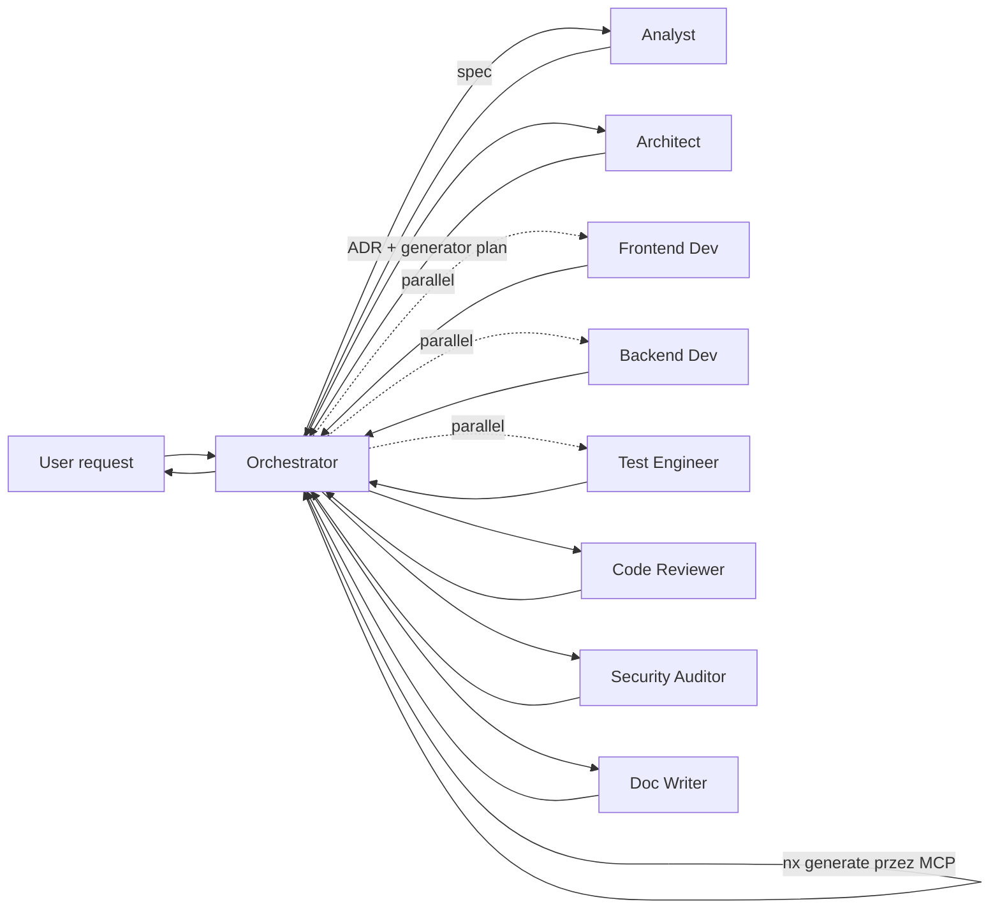

# Workflow: New Feature



## Kroki

### 0. Plan

Orchestrator tworzy `docs/ai-workflow/plans/<YYYY-MM-DD>-<feature-slug>.md` z templatu. Task rows dla analyst/architect/developer/test-engineer/reviewer/auditor/doc-writer (parallel gdzie independent). Ustaw `status: accepted` gdy użytkownik zgodzi się z planem. Dla większych greenfield work, wybieraj dedicated SDD flow (`/specify` → `/plan` → `/tasks` → `/implement`), który już tworzy `docs/analytical/specs/<slug>/plan.md`.

### 1. Clarify

Orchestrator deleguje do **analyst**.
Done gdy `docs/analytical/specs/<date>-<slug>.md` istnieje z measurable acceptance criteria.

### 2. Design

Orchestrator deleguje do **architect**.
Done gdy `docs/adr/NNNN-<slug>.md` jest `Status: accepted` i zawiera generator plan.

### 3. Scaffold

Orchestrator uruchamia generator plan przez serwery **nx** + **angular-cli** MCP. Żadnych hand-edits do `project.json`.
Done gdy `nx graph` pokazuje nowe projekty z poprawnymi tagami.

### 4. Implement (parallel)

Dwie delegacje w tym samym turn:

- **frontend-developer** — UI + integracja z services.
- **backend-developer** — server routes / Genkit flows (tylko jeśli spec ich potrzebuje).
- **test-engineer** — pisze testy przeciw developer hand-off block (uruchamia się równolegle po dev hand-off).

Done gdy każdego developer hand-off block deklaruje że testy są potrzebne i test-engineer raportuje `verdict: pass`.

### 5. Validate

Orchestrator uruchamia:

```bash
pnpm affected:lint
pnpm affected:test
pnpm affected:build
pnpm affected:e2e
pnpm typecheck
```

Failures route wstecz do responsible agent.

### 6. Review

Dwie delegacje równolegle:

- **code-reviewer** — convention + correctness.
- **security-auditor** — tylko jeśli zmiana dotyka auth / input / output / deps / CSP / AI surfaces.

Done gdy oba verdicts są `approved` / `pass`.

### 7. Document

Orchestrator deleguje do **doc-writer** dla każdej public-API lub behaviour change.
Done gdy odpowiedni `docs/technical/*.md` jest zaktualizowany i run log entry istnieje.

### 8. Wrap

Orchestrator emituje finalny blok `done:` do użytkownika z:

- lista zmienionych plików (z paths),
- coverage delta,
- link do ADR,
- next steps jeśli są (np. release).

## Common deviations

- **Nie potrzebna nowa abstrakcja** → pomiń krok 2 (architect). Orchestrator zaznacza to jawnie i kontynuuje od kroku 4.
- **Spike / throwaway** → uruchom tylko krok 4, label PR `spike`. Doc step zastąpiony one-line notką w issue.
- **AI feature dotykający server keys** → obowiązkowy security-auditor pass nawet jeśli checklist conditions nie triggerują.

## Escalation na quality gates (opcjonalne — z `spec-driven.md` v2.1.0)

`new-feature.md` to **continuous flow** (jeden turn orchestratora). Gdy w trakcie pracy ujawnia się jeden z poniższych warunków, orchestrator **może promote** zadanie na high-assurance path z `spec-driven.md`:

| Trigger                                                               | Promote do                        |
| --------------------------------------------------------------------- | --------------------------------- |
| Analyst widzi > 3 markery `[?]` w spec                                | `/clarify` (Faza 1.5 SDD)         |
| Spec / plan / tasks drift po > 1 cyklu fix-back                       | `/analyze` (Faza 3.6 SDD) — audyt |
| Wieloczęściowy refactor + nowe ADR + ≥ 2 nowe agent roles             | `/checklist` (Faza 3.5 SDD)       |
| Cross-team visibility wymagana (regulatory, sponsor wymaga GH Issues) | `/taskstoissues` (Faza 5 SDD)     |

Mechanika: orchestrator emituje blok `escalated:` zamiast `done:` z wyjaśnieniem powodu, użytkownik akceptuje promote, dalej idzie SDD high-assurance path. **Nie chowaj eskalacji za milczeniem** — zawsze jawnie zaznacz, że odeszliśmy z continuous flow.
