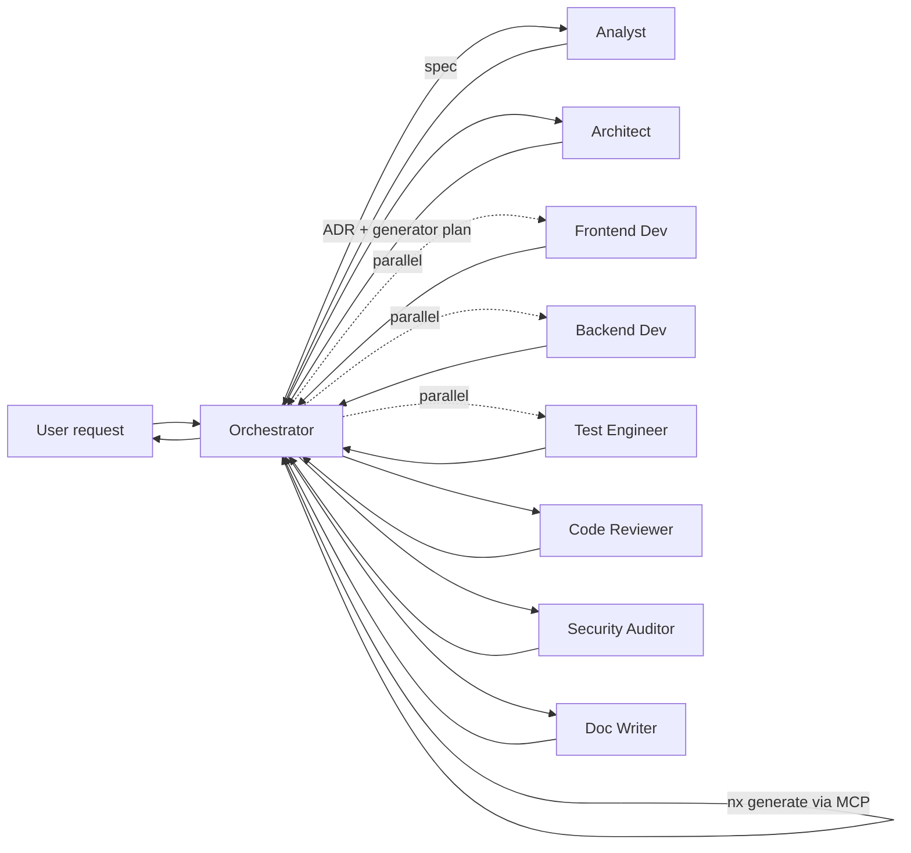

# Workflow: New Feature



## Steps

### 0. Plan

Orchestrator creates `docs/ai-workflow/plans/<YYYY-MM-DD>-<feature-slug>.md` from the template. Task rows for analyst/architect/developer/test-engineer/reviewer/auditor/doc-writer (parallel where independent). Set `status: accepted` once the user agrees with the plan. For larger greenfield work, prefer the dedicated SDD flow (`/specify` → `/plan` → `/tasks` → `/implement`) which already creates `docs/analytical/specs/<slug>/plan.md`.

### 1. Clarify

Orchestrator delegates to **analyst**.
Done when `docs/analytical/specs/<date>-<slug>.md` exists with measurable acceptance criteria.

### 2. Design

Orchestrator delegates to **architect**.
Done when `docs/adr/NNNN-<slug>.md` is `Status: accepted` and includes a generator plan.

### 3. Scaffold

Orchestrator runs the generator plan via **nx** + **angular-cli** MCP servers. No hand-edits to `project.json`.
Done when `nx graph` shows the new project(s) with the right tags.

### 4. Implement (parallel)

Two delegations in the same turn:

- **frontend-developer** — UI + integration with services.
- **backend-developer** — server routes / Genkit flows (only if the spec needs them).
- **test-engineer** — write tests against the developer's hand-off block (runs in parallel after the dev hand-off).

Done when each developer's hand-off block declares tests are needed and test-engineer reports `verdict: pass`.

### 5. Validate

Orchestrator runs:

```bash
pnpm affected:lint
pnpm affected:test
pnpm affected:build
pnpm affected:e2e
pnpm typecheck
```

Failures route back to the responsible agent.

### 6. Review

Two delegations in parallel:

- **code-reviewer** — convention + correctness.
- **security-auditor** — only if the change touches auth / input / output / deps / CSP / AI surfaces.

Done when both verdicts are `approved` / `pass`.

### 7. Document

Orchestrator delegates to **doc-writer** for any public-API or behaviour change.
Done when the relevant `docs/technical/*.md` is updated and the run log entry exists.

### 8. Wrap

Orchestrator emits the final `done:` block to the user with:

- list of changed files (with paths),
- coverage delta,
- link to the ADR,
- next steps if any (e.g. release).

## Common deviations

- **No new abstraction needed** → skip step 2 (architect). Orchestrator notes this explicitly and continues from step 4.
- **Spike / throwaway** → run step 4 only, label PR `spike`. Doc step replaced by a one-line note in the issue.
- **AI feature touching server keys** → mandatory security-auditor pass even if checklist conditions don't trigger.
