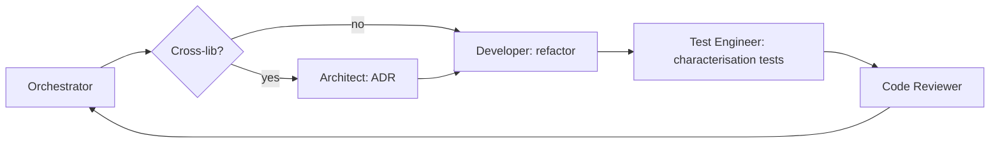

# Workflow: Refactor

Refactor zmienia strukturę bez zmiany observable behaviour.

## Kroki

### 0. Plan

Orchestrator tworzy `docs/ai-workflow/plans/<YYYY-MM-DD>-refactor-<slug>.md` z templatu. Tasks: characterisation tests (test-engineer) → refactor (developer) → re-validate tests (test-engineer) → review. Status `accepted` gdy użytkownik zgodzi się że zmiana jest in-scope (żaden behaviour drift).

### 1. Decide scope

Jeśli refactor przekracza lib boundaries → **architect** pisze ADR. W przeciwnym razie pomiń.

### 2. Pin behaviour

Test-engineer dodaje **characterisation tests** dla każdego behaviour nie pokrytego, uruchomione przed wylądowaniem refactora. Te testy muszą przejść na pre-refactor code najpierw.

### 3. Refactor

Developer robi zmianę. Diff powinien:

- nie modyfikować żadnego testu (poza rename/move),
- nie modyfikować żadnego public API (selectors, exports, route paths),
- skompilować się i przejść wszystkie testy za pierwszym razem.

### 4. Validate

Orchestrator uruchamia pełen affected suite plus `nx graph` diff żeby potwierdzić brak boundary changes.

### 5. Review

Code-reviewer sprawdza, że diff jest genuinely behaviour-preserving. Każda zmiana testu to red flag.

## Definition of Done

- Public API niezmieniony (lub zmiana udokumentowana w ADR).
- Wszystkie poprzednio-przechodzące testy nadal przechodzą.
- Coverage nie spada.
- `nx graph` ma ten sam kształt (lub strictly simpler).
