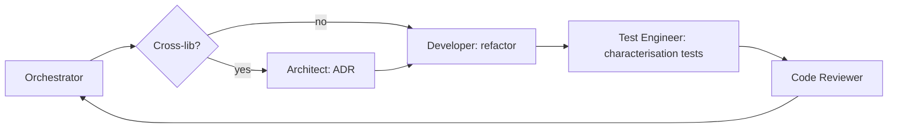

# Workflow: Refactor

A refactor changes structure without changing observable behaviour.

## Steps

### 0. Plan

Orchestrator creates `docs/ai-workflow/plans/<YYYY-MM-DD>-refactor-<slug>.md` from the template. Tasks: characterisation tests (test-engineer) → refactor (developer) → re-validate tests (test-engineer) → review. Status `accepted` once the user agrees the change is in-scope (no behaviour drift).

### 1. Decide scope

If the refactor crosses lib boundaries → **architect** writes an ADR. Otherwise skip.

### 2. Pin behaviour

Test-engineer adds **characterisation tests** for any behaviour not yet covered, run before the refactor lands. These tests must pass on the pre-refactor code first.

### 3. Refactor

Developer makes the change. Diff should:

- not modify any test (other than rename/move),
- not modify any public API (selectors, exports, route paths),
- compile and pass all tests on the first try.

### 4. Validate

Orchestrator runs the full affected suite plus `nx graph` diff to confirm no boundary changes.

### 5. Review

Code-reviewer checks that the diff is genuinely behaviour-preserving. Any test change is a red flag.

## Definition of Done

- Public API unchanged (or change is documented in an ADR).
- All previously-passing tests still pass.
- Coverage doesn't drop.
- `nx graph` is the same shape (or strictly simpler).
