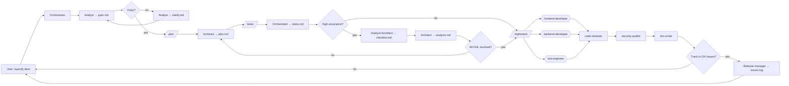

# Workflow: Spec-Driven Development

> Zaadaptowane z metodologii GitHub [spec-kit](https://github.com/github/spec-kit), zmapowane na naszych agentów.
> Rdzeń: **Specify → Plan → Tasks → Implement** — używa naszych analyst, architect i orchestrator zamiast parallel CLI.
> v2.1.0 (2026-05-20) dodaje quality gates `/checklist` + `/analyze` (sync z spec-kit PR #2518 z 2026-05-15) oraz opcjonalny most `/taskstoissues` do GitHub Issues.

## Dlaczego istnieje obok `new-feature.md`

Oba workflows produkują features. Różnica to **rytm**:

| Aspekt           | `new-feature.md`                      | `spec-driven.md`                                                                                       |
| ---------------- | ------------------------------------- | ------------------------------------------------------------------------------------------------------ |
| Cadence          | Continuous — jeden turn orchestratora | Phased — checkpoint między każdą fazą                                                                  |
| Najlepszy dla    | Incremental work, well-scoped change  | Greenfield, duże features, legacy modernisation, production-grade                                      |
| Output artefacts | Spec + ADR + code + docs              | `spec.md` + `plan.md` + `tasks.md` + `checklist.md` + `analysis.md` + code + docs                      |
| User involvement | Zatwierdza na końcu                   | Zatwierdza na każdej granicy fazy                                                                      |
| Slash commands   | `/new-feature`                        | `/specify` → `/clarify` → `/plan` → `/tasks` → `/checklist` → `/analyze` → `/implement` → `/taskstoissues` (opt) |

Używaj SDD gdy chcesz, żeby użytkownik zreviewował spec _zanim_ architect planuje, i plan _zanim_ tasks zostaną zdekomponowane. Dla rutynowych features, `/new-feature` jest szybsze.

## High-assurance vs lightweight path

SDD ma dwa preset paths — wybór per feature:

- **Lightweight** (default): `/specify` → `/plan` → `/tasks` → `/implement`. Pomiń `/clarify`, `/checklist`, `/analyze` jeśli spec już jest ostry, zespół jest senior, a scope mały.
- **High-assurance** (production, regulatory, ambiguity-heavy): `/specify` → `/clarify` → `/plan` → `/tasks` → `/checklist` → `/analyze` → `/implement`. Wszystkie quality gates obowiązkowe.

Orchestrator decyduje, którą ścieżką iść w bloku planu — i może promote z lightweight na high-assurance, jeśli walidator wykryje ambiguity lub drift cross-artifact.

## Konstytucja = `.ai/rules/principles.md`

Spec-kit nazywa to _constitution_. My już mamy taką — złote reguły inżynierskie (DRY, SOLID, KISS, YAGNI, …) żyją w [`.ai/rules/principles.md`](../rules/principles.md). Każda faza poniżej je ładuje.

## Directory layout

Specs żyją obok naszych istniejących analytical specs:

```
docs/analytical/specs/
└── <YYYY-MM-DD>-<feature-slug>/
    ├── spec.md       # Faza 1 — co i dlaczego (analyst)
    ├── clarify.md    # Faza 1.5 — open questions + odpowiedzi (analyst, opcjonalne)
    ├── process.bpmn  # Faza 1.5b — BPMN 2.0 (analyst, opcjonalne — patrz ADR-0015)
    ├── plan.md       # Faza 2 — jak (architect)
    ├── tasks.md      # Faza 3 — ordered work units (orchestrator)
    ├── checklist.md  # Faza 3.5 — quality gate na jakość requirements (orchestrator)
    ├── analysis.md   # Faza 3.6 — cross-artifact consistency report (orchestrator)
    ├── issues.log    # Faza 5 — mapping task→GitHub issue (opcjonalne)
    └── runs/         # Faza 4 — implementation logs per task (auto-appended)
```

Cross-cutting BPMN (reusable między features) żyje w `docs/bpmn/<slug>.bpmn` zamiast.

To jest spójne z miejscem, gdzie `tools/scripts/scenarios-from-specs.mjs` już szuka specs.

## Fazy

### Faza 1 — Specify (`/specify <description>`)

Orchestrator deleguje do **analyst**. Output: `docs/analytical/specs/<slug>/spec.md`.

Spec łapie:

- User story / problem statement
- Persony dotknięte (cytuj ids z `.ai/context/personas.md`)
- Acceptance criteria — Given/When/Then gdzie użyteczne
- Success metrics (jak wiemy że zadziałało)
- Non-goals (jawnie out-of-scope)
- Open questions (feeduje Fazę 1.5)

**Żadnych tech choices jeszcze.** Jeśli analyst napisze "use signals" — to jest robota architekta.

Done gdy: `spec.md` istnieje; użytkownik mówi "looks good" LUB przechodzi do `/clarify`.

### Faza 1.5 — Clarify (`/clarify` — opcjonalna, obowiązkowa w high-assurance)

Pomiń, jeśli spec jest już ostry. W przeciwnym razie analyst re-interviewuje użytkownika na każdym open question i aktualizuje `spec.md`. Open questions log żyje w `clarify.md`.

Done gdy: `spec.md` ma zero markerów `[?]`.

### Faza 1.5b — BPMN (opcjonalna — patrz ADR-0015)

Gdy spec opisuje proces z > 3 user-decision points (XOR gateways), parallel work (parallel gateway), timer event (daily batch, retry), lub cross-cutting reusability, **analyst** produkuje diagram BPMN 2.0 obok specu:

- Per-spec one-off process: `docs/analytical/specs/<slug>/process.bpmn`.
- Cross-cutting reusable process: `docs/bpmn/<slug>.bpmn` (patrz `docs/bpmn/README.md`).

Diagram jest walidowany przez `pnpm bpmn:lint` (pre-commit + CI). Architect (Faza 2) mapuje BPMN na technical plan; identyfikatory BPMN (`Task_*`, `Gateway_*`) powinny zgadzać się z realnymi nazwami service/method w `plan.md`.

Pomiń tę fazę dla CRUD work i trivial flows. Wymagana tylko gdy spec przechodzi gateway criteria powyżej.

Done gdy: `process.bpmn` istnieje i `pnpm bpmn:lint` jest czysty.

### Faza 2 — Plan (`/plan`)

Orchestrator deleguje do **architect**. Ładuje `spec.md` + `.ai/rules/principles.md` + relevant `.ai/rules/{angular,nx,security}.md`. Output: `docs/analytical/specs/<slug>/plan.md`.

Plan łapie:

- Tech stack additions (z ADR ref jeśli zmiana jest non-trivial)
- Module taxonomy — które `apps/` i `libs/{feature,ui,data,util,shared}/` dotknąć
- Public API surface (eksporty `src/index.ts`)
- Data model + contracts (linkuj do subdir `contracts/` jeśli API design jest potrzebny)
- Risks + mitigations
- Generator plan — dokładne komendy `nx generate` do scaffold

Jeśli zmiana zasługuje na ADR, architect pisze też `docs/adr/NNNN-<slug>.md` z `Status: proposed`.

Done gdy: użytkownik akceptuje plan; `plan.md` jest kompletny; ADR (jeśli jest) jest `accepted`.

### Faza 3 — Tasks (`/tasks`)

Orchestrator dekomponuje plan na ordered, atomic work units. Output: `docs/analytical/specs/<slug>/tasks.md`.

Każdy task ma:

- `id` — `T001`, `T002`, …
- `title` — imperatywne ("Create UserService with `find()`")
- `agent` — który specjalista jest właścicielem (`frontend-developer`, `backend-developer`, `test-engineer`, …)
- `inputs` — pliki/artefakty od których zależy
- `outputs` — pliki, które tworzy/modyfikuje
- `done_when` — jawna weryfikacja (test passes, contract satisfies schema, etc.)
- `parallel_with` — opcjonalna lista task ids, które mogą biec równolegle
- `blocked_by` — opcjonalna lista task ids, które muszą się zakończyć najpierw

Taski powinny być małe na tyle, żeby agent specjalista mógł skończyć jeden w jednym turn. Jeśli task czuje się >1 turn, rozbij go.

Done gdy: każdy leaf planu mapuje się na ≥1 task; taski formują DAG.

### Faza 3.5 — Checklist (`/checklist` — opcjonalna, obowiązkowa w high-assurance)

> **"Unit tests for English."** Quality gate dla **jakości requirements**, nie dla implementacji. Ujawnia ambiguity, brakujące acceptance criteria, niespójne persony — zanim te problemy wyjdą w kodzie.

Orchestrator deleguje do **analyst** + **architect** (dual review). Output: `docs/analytical/specs/<slug>/checklist.md`.

Format checklisty:

```markdown
## Requirements quality checklist

- [ ] CL001 — Każda user story ma measurable acceptance criteria (Given/When/Then z verifiable observable).
- [ ] CL002 — Wszystkie persony cytowane w spec.md są zdefiniowane w `.ai/context/personas.md`.
- [ ] CL003 — Success metrics są mierzalne w istniejącym analytics stack.
- [ ] CL004 — Non-goals są jawne i wyczerpujące.
- [ ] CL005 — Każdy task w tasks.md ma jeden `agent` i jeden owner (no shared ownership).
- [ ] CL006 — Każdy `done_when` jest verifiable (test passes / file exists / contract satisfies schema), nie subjective ("looks good").
- [ ] CL007 — `plan.md` cytuje co najmniej jedną regułę z `.ai/rules/` per zmiana behaviour.
- [ ] CL008 — Risks + mitigations w plan.md mają konkretne triggery (nie "may happen").
- [ ] CL009 — Generator plan w plan.md ma exact CLI invocations (no "use Nx generators").
- [ ] CL010 — Wszystkie cross-references między spec.md / plan.md / tasks.md są wzajemnie spójne (każdy AC mapuje na ≥ 1 task; każdy task mapuje na ≥ 1 AC).
```

Plus per-feature dodatki gdy applicable:

- Security touches → CL011 — every auth/sanitisation change cytuje OWASP id
- Public API change → CL012 — semver bump uzasadniony
- AI tool / MCP touches → CL013 — `description` po angielsku, `BudgetTracker` skonfigurowany

**Pass criterion:** każda zaznaczona pozycja ma kontekst (`spec.md:42` lub `plan.md:T003`). Brak `[ ]` unchecked po dual review.

Done gdy: `checklist.md` istnieje, wszystkie items resolved (✓ lub `N/A` z uzasadnieniem), użytkownik akceptuje.

### Faza 3.6 — Analyze (`/analyze` — opcjonalna, obowiązkowa w high-assurance)

> Non-destructive cross-artifact consistency check. Czyta `spec.md` + `plan.md` + `tasks.md` + `checklist.md`, raportuje rozbieżności. **Nie modyfikuje** artefaktów — tylko surface'uje problemy do user-decision.

Orchestrator deleguje do **architect** (z code-reviewer w trybie audit). Output: `docs/analytical/specs/<slug>/analysis.md`.

Checks (heurystyki):

1. **Spec ↔ Plan coverage** — czy każda user story w `spec.md` ma adresowanie w `plan.md` (module / endpoint / komponent)?
2. **Plan ↔ Tasks decomposition** — czy każdy leaf w `plan.md` (module, endpoint, komponent, ADR action item) ma ≥ 1 task w `tasks.md`?
3. **Tasks ↔ Spec traceability** — czy każdy AC w `spec.md` mapuje na ≥ 1 task z verifiable `done_when`?
4. **DAG integrity** — czy `tasks.md` formuje DAG bez cykli? Czy `parallel_with` referencjonuje istniejące taski?
5. **Agent coverage** — czy każdy task ma jeden `agent` z `.ai/agents/`? Czy są agenci nadmiernie obciążeni (>5 tasks)?
6. **Rule alignment** — czy `plan.md` cytuje reguły z `.ai/rules/`, które aplikują się do touched modułów?
7. **Drift detection** — jeśli `spec.md` był edytowany po `tasks.md` (mtime), ostrzeż o potencjalnym out-of-date.

Format raportu:

```markdown
## Analysis: <slug> — <YYYY-MM-DD>

### Status: pass | warnings | fail

### Findings

- **FAIL** AN001 — `spec.md:42 (AC4)` nie ma odpowiadającego taska w `tasks.md`. Suggested: dodaj T00X (test-engineer).
- **WARN** AN002 — Task T005 jest assigned do `frontend-developer` ale dotyka `libs/data/*` (data-access scope).
- **PASS** AN003 — DAG integrity OK (12 tasks, 0 cycles, 3 parallel tracks).

### Drift

- `spec.md` mtime > `tasks.md` mtime → user-decision: re-tasks? (lub mark intentional)
```

**Pass criterion:** zero `FAIL` findings. `WARN` items są dyskutowane z użytkownikiem, ale nie blokują `/implement`.

Done gdy: `analysis.md` istnieje, all `FAIL` findings są addressed (fix artefakty + re-run `/analyze`) lub user-acknowledged jako known-acceptable.

### Faza 4 — Implement (`/implement [task-id|all]`)

Orchestrator iteruje task DAG. Dla każdego taska:

1. **Load constitution** — agent ładuje `.ai/rules/principles.md` + odpowiednie reguły stacka (`.ai/rules/{angular,nx,security,styling,llm-optimization}.md`) **przed** wykonaniem.
2. Deleguj do nazwanego `agent` z `inputs` i `done_when`.
3. Agent **cytuje ≥ 1 rule id** w hand-off block (np. "Applied SOLID-D + styling.md §12 ui-kit wrapper"). Bez citation = blocked, route back. Adaptacja z github/spec-kit PR #2460 (constitution loading w `/speckit.implement`).
4. Waliduj przeciw `done_when`.
5. Dopisz one-line wpis do `runs/<task-id>.log` zawierający cited rule ids.
6. On failure: route z powrotem do producing agent z failure context. Trzy failures eskalują do użytkownika.
7. Move to next task (parallel gdzie `parallel_with` pozwala).

Po wszystkich taskach: uruchom standard validation gate (`pnpm affected:lint` etc.) plus **`pnpm rules:check`** (skanuje commit messages / runs/*.log za rule citations — patrz `tools/scripts/check-rule-citations.mjs`). Code-reviewer + security-auditor (jeśli potrzebny) biegnie jako final gate.

**Code-reviewer reject criterion:** PR description / commit body bez citation z `principles.md` lub `.ai/rules/<stack>.md`. Wyjątek: trivial change (typo, format-only, dependency bump bez API change) — flag `[trivial]` w commit subject pomija check.

Done gdy: wszystkie taski `status: done` AND validators zielone AND `rules:check` zielony AND reviewers zaakceptowali.

### Faza 5 — TasksToIssues (`/taskstoissues` — opcjonalna)

> Most do GitHub Issues. Konwertuje `tasks.md` na GitHub issues w tym repo (lub project), tak żeby zespół mógł trackować postęp w GH UI. Lista mapping żyje w `issues.log`.

Orchestrator deleguje do **release-manager** (lub orchestrator self-runs). Output: `docs/analytical/specs/<slug>/issues.log`.

Workflow:

1. Read `tasks.md`. Dla każdego taska bez wpisu w `issues.log`:
   - `gh issue create --title "[<slug>] T00X — <title>" --body "<from done_when + inputs + outputs>" --label "spec-driven,<agent>"`.
   - Append `T00X → #<issue-number>` do `issues.log`.
2. Update każdy task w `tasks.md`: dodaj `issue: #<n>` field.
3. Dla taska oznaczonego `status: done` w runs/<task-id>.log: zamknij issue (`gh issue close #<n> --comment "Closed by /implement at <commit-sha>"`).

**Kiedy używać:**

- ai-studio i siostrzane ai-mcp-\* są na GitHub → opcjonalnie sensowne dla cross-team visibility.
- Pomiń dla solo work lub krótkich iteracji (< 5 tasks).
- Pomiń dla regulatory pracy gdzie GH issues są poza compliance scope.

**Czego NIE robić:**

- Nie shippuj kodu, który linkuje issue # z `issues.log` zanim issue nie powstanie — orchestrator robi to atomically.
- Nie usuwaj `issues.log` — to audit trail.

Done gdy: każdy task w `tasks.md` ma `issue: #<n>` field; `issues.log` jest spójny z GH state.

## Opcjonalnie: pełny CLI spec-kit

Jeśli zespół chce official spec-kit machinery (z własnym dir `.specify/`, `constitution.md`, i Python CLI), uruchom:

```bash
uvx --from git+https://github.com/github/spec-kit.git specify init . --integration claude
# lub --integration copilot
```

⚠ Spec-kit będzie zapisywał do `.claude/commands/` i `.github/prompts/` — overlapping z plikami które już utrzymujemy. Większość zespołów preferuje ten workflow (który już implementuje tę samą metodologię + quality gates z PR #2518) zamiast uruchamiania CLI in-tree. Jeśli uruchamiasz CLI, gitignore `.specify/` żeby trzymać go jako personal-tooling.

## Mermaid


