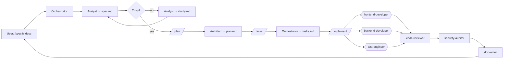

# Workflow: Spec-Driven Development

> Adapted from GitHub's [spec-kit](https://github.com/github/spec-kit) methodology, mapped onto our agents.
> Same 4-phase rhythm — **Specify → Plan → Tasks → Implement** — but reusing our analyst, architect, and orchestrator instead of a parallel CLI.

## Why this exists alongside `new-feature.md`

Both workflows produce features. The difference is **rhythm**:

| Aspect           | `new-feature.md`                     | `spec-driven.md`                                            |
| ---------------- | ------------------------------------ | ----------------------------------------------------------- |
| Cadence          | Continuous — one orchestrator turn   | Phased — checkpoint between each phase                      |
| Best for         | Incremental work, well-scoped change | Greenfield, large features, legacy modernisation            |
| Output artefacts | Spec + ADR + code + docs             | `spec.md` + `plan.md` + `tasks.md` + code + docs            |
| User involvement | Approve at end                       | Approve at every phase boundary                             |
| Slash commands   | `/new-feature`                       | `/specify` → `/clarify` → `/plan` → `/tasks` → `/implement` |

Use SDD when you want the user to review the spec _before_ the architect plans, and the plan _before_ tasks decompose. For routine features, `/new-feature` is faster.

## The constitution = `.ai/rules/principles.md`

Spec-kit calls this the _constitution_. We already have one — golden engineering rules (DRY, SOLID, KISS, YAGNI, …) live in [`.ai/rules/principles.md`](../rules/principles.md). Every phase below loads it.

## Directory layout

Specs live alongside our existing analytical specs:

```
docs/analytical/specs/
└── <YYYY-MM-DD>-<feature-slug>/
    ├── spec.md       # Phase 1 — what & why (analyst)
    ├── clarify.md    # Phase 1.5 — open questions + answers (analyst, optional)
    ├── process.bpmn  # Phase 1.5b — BPMN 2.0 (analyst, optional — see ADR-0015)
    ├── plan.md       # Phase 2 — how (architect)
    ├── tasks.md      # Phase 3 — ordered work units (orchestrator)
    └── runs/         # Phase 4 — implementation logs per task (auto-appended)
```

Cross-cutting BPMN (reusable across features) lives in `docs/bpmn/<slug>.bpmn` instead.

This is consistent with where `tools/scripts/scenarios-from-specs.mjs` already looks for specs.

## Phases

### Phase 1 — Specify (`/specify <description>`)

Orchestrator delegates to **analyst**. Output: `docs/analytical/specs/<slug>/spec.md`.

The spec captures:

- User story / problem statement
- Personas affected (cite ids from `.ai/context/personas.md`)
- Acceptance criteria — Given/When/Then where useful
- Success metrics (how do we know it worked)
- Non-goals (explicit out-of-scope)
- Open questions (feeds Phase 1.5)

**No tech choices yet.** If the analyst writes "use signals" — that's the architect's job.

Done when: `spec.md` exists; user says "looks good" OR moves to `/clarify`.

### Phase 1.5 — Clarify (`/clarify` — optional)

Skip if the spec is already crisp. Otherwise the analyst re-interviews the user on each open question and updates `spec.md`. Open questions log lives in `clarify.md`.

Done when: `spec.md` has zero `[?]` markers.

### Phase 1.5b — BPMN (optional — see ADR-0015)

When the spec describes a process with > 3 user-decision points (XOR gateways), parallel work (parallel gateway), timer event (daily batch, retry), or cross-cutting reusability, the **analyst** produces a BPMN 2.0 diagram next to the spec:

- Per-spec one-off process: `docs/analytical/specs/<slug>/process.bpmn`.
- Cross-cutting reusable process: `docs/bpmn/<slug>.bpmn` (see `docs/bpmn/README.md`).

The diagram is validated by `pnpm bpmn:lint` (pre-commit + CI). Architect (Phase 2) maps the BPMN onto the technical plan; the BPMN identifiers (`Task_*`, `Gateway_*`) should align with real service/method names in `plan.md`.

Skip this phase for CRUD work and trivial flows. Required only when the spec passes the gateway criteria above.

Done when: `process.bpmn` exists and `pnpm bpmn:lint` is clean.

### Phase 2 — Plan (`/plan`)

Orchestrator delegates to **architect**. Loads `spec.md` + `.ai/rules/principles.md` + relevant `.ai/rules/{angular,nx,security}.md`. Output: `docs/analytical/specs/<slug>/plan.md`.

The plan captures:

- Tech stack additions (with ADR ref if the change is non-trivial)
- Module taxonomy — which `apps/` and `libs/{feature,ui,data,util,shared}/` to touch
- Public API surface (`src/index.ts` exports)
- Data model + contracts (link to `contracts/` subdir if API design needed)
- Risks + mitigations
- Generator plan — exact `nx generate` commands to scaffold

If the change warrants an ADR, the architect also writes `docs/adr/NNNN-<slug>.md` with `Status: proposed`.

Done when: user accepts plan; `plan.md` is complete; ADR (if any) is `accepted`.

### Phase 3 — Tasks (`/tasks`)

Orchestrator decomposes the plan into ordered, atomic work units. Output: `docs/analytical/specs/<slug>/tasks.md`.

Each task has:

- `id` — `T001`, `T002`, …
- `title` — imperative ("Create UserService with `find()`")
- `agent` — which specialist owns it (`frontend-developer`, `backend-developer`, `test-engineer`, …)
- `inputs` — files/artefacts it depends on
- `outputs` — files it creates/modifies
- `done_when` — explicit verification (test passes, contract satisfies schema, etc.)
- `parallel_with` — optional list of task ids that can run concurrently
- `blocked_by` — optional list of task ids that must finish first

Tasks should be small enough that a specialist agent can complete one in a single turn. If a task feels >1 turn, split it.

Done when: every leaf of the plan maps to ≥1 task; tasks form a DAG.

### Phase 4 — Implement (`/implement [task-id|all]`)

Orchestrator iterates the task DAG. For each task:

1. Delegate to the named `agent` with `inputs` and `done_when`.
2. Validate against `done_when`.
3. Append a one-line entry to `runs/<task-id>.log`.
4. On failure: route back to the producing agent with the failure context. Three failures escalate to the user.
5. Move to next task (parallel where `parallel_with` allows).

After all tasks: run the standard validation gate (`pnpm affected:lint` etc.). Code-reviewer + security-auditor (if needed) run as the final gate.

Done when: all tasks `status: done` AND validators green AND reviewers approved.

## Optional: full spec-kit CLI

If a team wants the official spec-kit machinery (with its own `.specify/` dir, `constitution.md`, and Python CLI), run:

```bash
uvx --from git+https://github.com/github/spec-kit.git specify init . --integration claude
# or --integration copilot
```

⚠ Spec-kit will write into `.claude/commands/` and `.github/prompts/` — overlapping with files we already maintain. Most teams will prefer this workflow (which already implements the same methodology) over running the CLI in-tree. If you do run the CLI, gitignore `.specify/` to keep it personal-tooling.

## Mermaid


