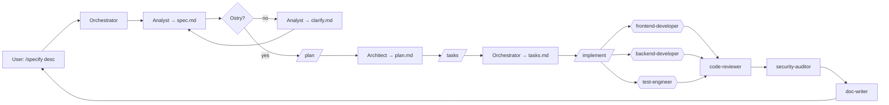

# Workflow: Spec-Driven Development

> Zaadaptowane z metodologii GitHub [spec-kit](https://github.com/github/spec-kit), zmapowane na naszych agentów.
> Ten sam 4-fazowy rytm — **Specify → Plan → Tasks → Implement** — ale reusuje naszych analyst, architect i orchestrator zamiast parallel CLI.

## Dlaczego istnieje obok `new-feature.md`

Oba workflows produkują features. Różnica to **rytm**:

| Aspekt           | `new-feature.md`                     | `spec-driven.md`                                            |
| ---------------- | ------------------------------------ | ----------------------------------------------------------- |
| Cadence          | Continuous — jeden turn orchestratora | Phased — checkpoint między każdą fazą                       |
| Najlepszy dla    | Incremental work, well-scoped change | Greenfield, duże features, legacy modernisation             |
| Output artefacts | Spec + ADR + code + docs             | `spec.md` + `plan.md` + `tasks.md` + code + docs            |
| User involvement | Zatwierdza na końcu                  | Zatwierdza na każdej granicy fazy                           |
| Slash commands   | `/new-feature`                       | `/specify` → `/clarify` → `/plan` → `/tasks` → `/implement` |

Używaj SDD gdy chcesz, żeby użytkownik zreviewował spec _zanim_ architect planuje, i plan _zanim_ tasks zostaną zdekomponowane. Dla rutynowych features, `/new-feature` jest szybsze.

## Konstytucja = `.ai/rules/principles.md`

Spec-kit nazywa to _constitution_. My już mamy taką — złote reguły inżynierskie (DRY, SOLID, KISS, YAGNI, …) żyją w [`.ai/rules/principles.md`](../rules/principles.md). Każda faza poniżej je ładuje.

## Directory layout

Specs żyją obok naszych istniejących analytical specs:

```
docs/analytical/specs/
└── <YYYY-MM-DD>-<feature-slug>/
    ├── spec.md       # Faza 1 — co i dlaczego (analyst)
    ├── clarify.md    # Faza 1.5 — open questions + odpowiedzi (analyst, opcjonalne)
    ├── process.bpmn  # Faza 1.5b — BPMN 2.0 (analyst, opcjonalne — patrz ADR-0015)
    ├── plan.md       # Faza 2 — jak (architect)
    ├── tasks.md      # Faza 3 — ordered work units (orchestrator)
    └── runs/         # Faza 4 — implementation logs per task (auto-appended)
```

Cross-cutting BPMN (reusable między features) żyje w `docs/bpmn/<slug>.bpmn` zamiast.

To jest spójne z miejscem, gdzie `tools/scripts/scenarios-from-specs.mjs` już szuka specs.

## Fazy

### Faza 1 — Specify (`/specify <description>`)

Orchestrator deleguje do **analyst**. Output: `docs/analytical/specs/<slug>/spec.md`.

Spec łapie:

- User story / problem statement
- Persony dotknięte (cytuj ids z `.ai/context/personas.md`)
- Acceptance criteria — Given/When/Then gdzie użyteczne
- Success metrics (jak wiemy że zadziałało)
- Non-goals (jawnie out-of-scope)
- Open questions (feeduje Fazę 1.5)

**Żadnych tech choices jeszcze.** Jeśli analyst napisze "use signals" — to jest robota architekta.

Done gdy: `spec.md` istnieje; użytkownik mówi "looks good" LUB przechodzi do `/clarify`.

### Faza 1.5 — Clarify (`/clarify` — opcjonalna)

Pomiń, jeśli spec jest już ostry. W przeciwnym razie analyst re-interviewuje użytkownika na każdym open question i aktualizuje `spec.md`. Open questions log żyje w `clarify.md`.

Done gdy: `spec.md` ma zero markerów `[?]`.

### Faza 1.5b — BPMN (opcjonalna — patrz ADR-0015)

Gdy spec opisuje proces z > 3 user-decision points (XOR gateways), parallel work (parallel gateway), timer event (daily batch, retry), lub cross-cutting reusability, **analyst** produkuje diagram BPMN 2.0 obok specu:

- Per-spec one-off process: `docs/analytical/specs/<slug>/process.bpmn`.
- Cross-cutting reusable process: `docs/bpmn/<slug>.bpmn` (patrz `docs/bpmn/README.md`).

Diagram jest walidowany przez `pnpm bpmn:lint` (pre-commit + CI). Architect (Faza 2) mapuje BPMN na technical plan; identyfikatory BPMN (`Task_*`, `Gateway_*`) powinny zgadzać się z realnymi nazwami service/method w `plan.md`.

Pomiń tę fazę dla CRUD work i trivial flows. Wymagana tylko gdy spec przechodzi gateway criteria powyżej.

Done gdy: `process.bpmn` istnieje i `pnpm bpmn:lint` jest czysty.

### Faza 2 — Plan (`/plan`)

Orchestrator deleguje do **architect**. Ładuje `spec.md` + `.ai/rules/principles.md` + relevant `.ai/rules/{angular,nx,security}.md`. Output: `docs/analytical/specs/<slug>/plan.md`.

Plan łapie:

- Tech stack additions (z ADR ref jeśli zmiana jest non-trivial)
- Module taxonomy — które `apps/` i `libs/{feature,ui,data,util,shared}/` dotknąć
- Public API surface (eksporty `src/index.ts`)
- Data model + contracts (linkuj do subdir `contracts/` jeśli API design jest potrzebny)
- Risks + mitigations
- Generator plan — dokładne komendy `nx generate` do scaffold

Jeśli zmiana zasługuje na ADR, architect pisze też `docs/adr/NNNN-<slug>.md` z `Status: proposed`.

Done gdy: użytkownik akceptuje plan; `plan.md` jest kompletny; ADR (jeśli jest) jest `accepted`.

### Faza 3 — Tasks (`/tasks`)

Orchestrator dekomponuje plan na ordered, atomic work units. Output: `docs/analytical/specs/<slug>/tasks.md`.

Każdy task ma:

- `id` — `T001`, `T002`, …
- `title` — imperatywne ("Create UserService with `find()`")
- `agent` — który specjalista jest właścicielem (`frontend-developer`, `backend-developer`, `test-engineer`, …)
- `inputs` — pliki/artefakty od których zależy
- `outputs` — pliki, które tworzy/modyfikuje
- `done_when` — jawna weryfikacja (test passes, contract satisfies schema, etc.)
- `parallel_with` — opcjonalna lista task ids, które mogą biec równolegle
- `blocked_by` — opcjonalna lista task ids, które muszą się zakończyć najpierw

Taski powinny być małe na tyle, żeby agent specjalista mógł skończyć jeden w jednym turn. Jeśli task czuje się >1 turn, rozbij go.

Done gdy: każdy leaf planu mapuje się na ≥1 task; taski formują DAG.

### Faza 4 — Implement (`/implement [task-id|all]`)

Orchestrator iteruje task DAG. Dla każdego taska:

1. Deleguj do nazwanego `agent` z `inputs` i `done_when`.
2. Waliduj przeciw `done_when`.
3. Dopisz one-line wpis do `runs/<task-id>.log`.
4. On failure: route z powrotem do producing agent z failure context. Trzy failures eskalują do użytkownika.
5. Move to next task (parallel gdzie `parallel_with` pozwala).

Po wszystkich taskach: uruchom standard validation gate (`pnpm affected:lint` etc.). Code-reviewer + security-auditor (jeśli potrzebny) biegnie jako final gate.

Done gdy: wszystkie taski `status: done` AND validators zielone AND reviewers zaakceptowali.

## Opcjonalnie: pełny CLI spec-kit

Jeśli zespół chce official spec-kit machinery (z własnym dir `.specify/`, `constitution.md`, i Python CLI), uruchom:

```bash
uvx --from git+https://github.com/github/spec-kit.git specify init . --integration claude
# lub --integration copilot
```

⚠ Spec-kit będzie zapisywał do `.claude/commands/` i `.github/prompts/` — overlapping z plikami które już utrzymujemy. Większość zespołów preferuje ten workflow (który już implementuje tę samą metodologię) zamiast uruchamiania CLI in-tree. Jeśli uruchamiasz CLI, gitignore `.specify/` żeby trzymać go jako personal-tooling.

## Mermaid


