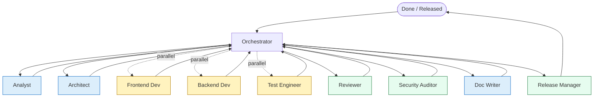

# Multi-agent flow

> The end-to-end recipe for AI Studio's multi-agent collaboration. The **Orchestrator** drives. Specialists do the work. The Definition of Done is the gate.

## TL;DR



- 🟦 **Plan** agents (Analyst, Architect, Doc Writer): reason about what / why.
- 🟨 **Worker** agents (Frontend, Backend, Test Engineer): produce diffs.
- 🟩 **Gate** agents (Reviewer, Security Auditor, Release Manager): say yes / no.

## Roles at a glance

| Agent              | What they own                                                            | Where defined                                       |
| ------------------ | ------------------------------------------------------------------------ | --------------------------------------------------- |
| Orchestrator       | Decomposition, delegation, gating Done                                   | [.ai/agents/orchestrator.md](../../.ai/agents/orchestrator.md) |
| Analyst            | Specs with measurable AC                                                 | [.ai/agents/analyst.md](../../.ai/agents/analyst.md)     |
| Architect          | ADRs (MADR 4.0) + generator plans                                        | [.ai/agents/architect.md](../../.ai/agents/architect.md) |
| Frontend Developer | Angular 21 code (Material 3 + Tailwind v4) conforming to angular.dev/ai  | [.ai/agents/frontend-developer.md](../../.ai/agents/frontend-developer.md) |
| Backend Developer  | Server routes, Genkit flows                                              | [.ai/agents/backend-developer.md](../../.ai/agents/backend-developer.md) |
| Test Engineer      | Vitest + Playwright tests                                                | [.ai/agents/test-engineer.md](../../.ai/agents/test-engineer.md) |
| Code Reviewer      | Last gate before merge                                                   | [.ai/agents/code-reviewer.md](../../.ai/agents/code-reviewer.md) |
| Security Auditor   | OWASP / OWASP-LLM review                                                 | [.ai/agents/security-auditor.md](../../.ai/agents/security-auditor.md) |
| Doc Writer         | docs/ + README + run logs                                                | [.ai/agents/doc-writer.md](../../.ai/agents/doc-writer.md) |
| Release Manager    | `nx release` flow                                                        | [.ai/agents/release-manager.md](../../.ai/agents/release-manager.md) |

## Delegation contract

Every delegation from Orchestrator → Specialist uses this YAML block:

```yaml
delegate:
  to: <agent-id>
  task: <one sentence imperative>
  context:
    - <relevant file path>:<line>
    - <relevant rule>
  inputs:
    - name: <var>
      value: <…>
  outputs_expected:
    - <artefact type, e.g. ADR, component, spec, diff>
  done_when:
    - <verifiable condition 1>
    - <verifiable condition 2>
```

Every specialist returns either a result block (success) or a `blocked:` block.

## Parallelism rules

- Run delegations in parallel **only** when they touch disjoint files / no shared invariant.
- Frontend + backend on the same feature: usually OK in parallel.
- Frontend + test-engineer: frontend first, then test-engineer (test-engineer needs the diff).
- Reviewer + Security Auditor: parallel.
- Release Manager: serial; runs only after all gates pass.

## Failure handling

- Specialist returns `blocked:` → Orchestrator escalates to user with a precise question.
- Validator (lint/test/build/audit) fails → route artefact back to producing agent with the **specific** failure, not "fix it".
- Three failed loops on the same agent → Orchestrator pauses and asks the user how to proceed.

## Run logs

Every multi-agent run produces `docs/ai-workflow/runs/YYYY-MM-DD-<slug>.md` with:

```markdown
# <Date> – <Slug>

## Trigger
- Issue / user prompt
## Plan
- Bullets the Orchestrator emitted
## Delegations
- to: analyst — outcome: spec at …
- to: architect — outcome: ADR NNNN
- …
## MCP calls
- nx graph (twice)
- context7 (Angular signals docs)
## Artefacts
- diff: PR #…
- docs: …
## Validation
- lint ✅ / typecheck ✅ / test ✅ / e2e ✅ / build ✅
## Verdict
- Done | Blocked
```

These logs are reviewed periodically by the AI working group to find patterns to encode into rules or workflows.
