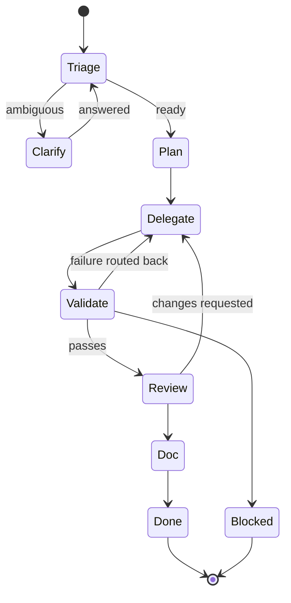

# Orchestration

> How the Orchestrator decides what to do. Reading order: this doc → [`.ai/agents/orchestrator.md`](../../.ai/agents/orchestrator.md) → the workflow files.

## State machine

## Decision rules

| Situation                                            | Move                                       |
| ---------------------------------------------------- | ------------------------------------------ |
| Goal unclear or stakeholders ambiguous               | → Analyst                                  |
| Solution shape unknown / cross-lib                   | → Architect                                |
| Spec ready, design clear                             | → Developer(s) + Test Engineer in parallel |
| Code touches `auth/`, `interceptors/`, deps, CSP, AI | + Security Auditor on the gate             |
| Public API or behaviour change                       | → Doc Writer at the end                    |
| Release-bound                                        | → Release Manager closes the loop          |
| Validator fails repeatedly (3×)                      | Pause; ask the user                        |

## What the Orchestrator never does itself

- Writes feature code (delegates to developers).
- Writes specs (delegates to Analyst).
- Writes tests (delegates to Test Engineer).
- Writes ADRs (delegates to Architect).
- Cuts releases (delegates to Release Manager).

## What the Orchestrator MUST do

- Pull all `.ai/rules/*.md` at the start of every task.
- Open `nx graph` (via the `nx` MCP server) before planning anything cross-lib.
- Parallelise independent delegations.
- Validate each artefact against the `done_when` it issued.
- Maintain the run log under `docs/ai-workflow/runs/`.

## Cost / time-of-flight

Approximate ranges to set expectations:

| Step                   | Typical cost                               |
| ---------------------- | ------------------------------------------ |
| Triage + plan          | seconds                                    |
| Spec (Analyst)         | minutes                                    |
| ADR (Architect)        | minutes                                    |
| Implementation (FE/BE) | minutes (small) – tens of minutes (medium) |
| Tests                  | minutes                                    |
| Review + audit         | minutes                                    |
| Docs                   | minutes                                    |
| Release                | < 5 min in CI                              |

For larger work the Orchestrator splits across PRs and updates the run log between them.
