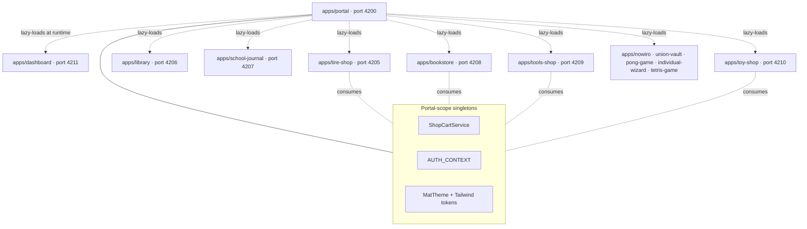

# Plan: dashboard + portal + microfrontend architecture

## Goal

Convert the 11 existing apps from a "many independent SPAs running on
many ports" model into a **single portal** that lazy-loads each app as
a remote microfrontend at runtime. Add a new `dashboard` app that
aggregates per-shop KPIs (sales, top products, low-stock, cart-
abandonment) into one place. Everything keeps working in standalone
mode too — `pnpm start:<app>` still serves the app on its dedicated
port without the portal in the picture.

## Scope

| In                                                                                                         | Out                                                                           |
| ---------------------------------------------------------------------------------------------------------- | ----------------------------------------------------------------------------- |
| New `apps/portal` (port **4200** — replaces nowiro on the root port) host application                      | Replacing nowiro's standalone build; keep `pnpm start:nowiro` working         |
| New `apps/dashboard` (port **4211**) — aggregated KPIs + 5–6 charts                                        | Real backend / analytics pipeline (charts read seeds + cart signals only)     |
| **Native Federation** (Angular 21 built-in, ESM, Vite-native) — all apps published as remotes              | Webpack `Module Federation` (legacy; incompatible with Vite/Angular build 21) |
| Portal sidebar nav with 12 entries (11 existing + dashboard); deep-linkable routes per remote              | iframe-based isolation (rules out shared cart drawer, theme tokens, fonts)    |
| Shared singletons (`ShopCartService`, `SessionService`, `AuthService`) hoisted to portal scope             | Per-MFE auth flows; portal owns the auth context for sub-apps that need it    |
| ApexCharts (or ngx-charts) for the dashboard panels                                                        | Custom D3 work — pick a chart lib and stick with it                           |
| Standalone serve mode preserved per app (`pnpm start:<app>` still boots the app on its own port)           | Removing per-app `serve` targets                                              |
| 5 chart panels on the dashboard: sales-by-shop · top-10 products · low-stock · daily-orders · category-mix | Real-time chart updates (no SSE / WebSocket; signal-driven static snapshots)  |
| ADR explaining MFE choice + shared-state strategy + bundle-budget impact                                   | Server-side rendering / Angular Universal                                     |
| Playwright E2E that boots the portal, navigates to 3 MFEs, asserts each shows its hallmark UI              | Cross-MFE state-transfer beyond the documented shared singletons              |
| Documentation per app updated to add "Portal embedding" section to its `technical.md`                      | Re-writing existing per-app specs (they stay valid in standalone context)     |

## Inputs

- `apps/nowiro/**`, `apps/tire-shop/**`, …, `apps/toy-shop/**` — 11 apps
  to expose as MFEs.
- `libs/shop-core/src/services/cart.service.ts` — the shared `ShopCartService`
  is the model for portal-scope singletons.
- `libs/shared-app-shell/src/auth-context.ts` — `AUTH_CONTEXT` token the
  portal must provide once (so library + school-journal MFEs see the
  same `currentMember`).
- `.ai/rules/{angular,nx,styling,testing}.md`
- <https://angular.dev/tools/cli/esbuild#native-federation> — Native
  Federation overview.
- <https://www.angulararchitects.io/en/blog/native-federation-with-angular/>
  — pattern reference (host + remote, no Webpack).
- <https://swimlane.gitbook.io/ngx-charts> — chart library candidate 1.
- <https://apexcharts.com/angular-chart-demos/> — chart library candidate 2.

## Architecture

```
apps/portal                     (scope:portal, type:app)            port 4200
  ├─ shell with mat-sidenav + sub-app router-outlet
  ├─ federation.config.ts (host, lists every remote)
  └─ provides shared singletons via DI at the portal-scope level

apps/dashboard                  (scope:dashboard, type:app + MFE)   port 4211
  └─ KPI grid + chart panels (loads catalogue services from each
     shop's data lib to compute aggregates)

apps/{nowiro, union-vault, pong-game, individual-wizard, tetris-game,
      tire-shop, library, school-journal, bookstore, tools-shop, toy-shop}
  └─ each gains a federation.config.ts exposing its AppComponent +
     APP_ROUTES; build target adds the `@angular-architects/native-federation`
     builder; standalone `serve` target preserved.

libs/dashboard-feature          (scope:dashboard, type:feature)
  ├─ dashboard-page.component.ts        (grid layout, 6 chart slots)
  ├─ sales-by-shop.chart.component.ts   (bar, ApexCharts)
  ├─ top-products.chart.component.ts    (horizontal bar)
  ├─ low-stock.chart.component.ts       (table + colour-coded chips)
  ├─ daily-orders.chart.component.ts    (line, last 30 days mock)
  ├─ category-mix.chart.component.ts    (donut)
  └─ kpi-tile.component.ts              (reusable single-figure tile)

libs/dashboard-data             (scope:dashboard, type:data-access + type:util)
  ├─ models/                            (Sale, KpiSnapshot, DailyOrder)
  ├─ aggregation/                       (sumByShop, topN, lowStockOf, …)
  │                                     pure-fn + unit-tested
  └─ services/dashboard.service.ts      (signals reading from each shop's CatalogueService)

libs/portal-shell               (scope:portal, type:ui)
  ├─ portal-shell.component.ts          (mat-toolbar + sidenav + router-outlet)
  ├─ portal-nav.component.ts            (sidebar items + active state)
  └─ remote-error-boundary.component.ts (fallback if a remote fails to load)

eslint.config.mjs depConstraints — `scope:portal` may depend on every
demo app's exported lib boundary (i.e. only their published feature
libs, never their internal data libs). `scope:dashboard` may depend on
every shop's `*-data` lib (read-only). Cross-MFE dependencies stay
forbidden — each remote remains independently buildable.
```



## Tasks (DAG)

| id   | title                                                                                | agent              | inputs                               | outputs                                             | done_when                                              | parallel_with | blocked_by |
| ---- | ------------------------------------------------------------------------------------ | ------------------ | ------------------------------------ | --------------------------------------------------- | ------------------------------------------------------ | ------------- | ---------- |
| T001 | Spec — portal personas, MFE boundaries, dashboard KPIs, AC table                     | analyst            | reference apps + user request        | docs/analytical/specs/portal-mfe/spec.md            | No `[?]` markers; AC table complete                    |               |            |
| T002 | ADR — Native Federation vs Module Federation vs Web Components vs iframes            | architect          | T001, principles.md, .ai/rules/nx.md | docs/adr/0009-microfrontend-architecture.md         | ADR Status: accepted                                   |               | T001       |
| T003 | ADR addendum — chart library decision (ApexCharts vs ngx-charts vs Chart.js)         | architect          | T001                                 | docs/adr/0010-dashboard-chart-library.md            | ADR Status: accepted                                   | T002          | T001       |
| T004 | Install `@angular-architects/native-federation` + bootstrap host scaffolding         | frontend-developer | T002                                 | apps/portal/federation.config.ts                    | `pnpm nx build portal` clean                           |               | T002       |
| T005 | Scaffold `libs/portal-shell` (toolbar + sidenav + nav + error boundary)              | frontend-developer | T004                                 | libs/portal-shell/\*\*                              | `pnpm nx lint portal-shell` clean                      | T006          | T004       |
| T006 | Scaffold `apps/dashboard` (Nx app, port 4211, deps on every `*-data` lib via DI)     | frontend-developer | T002                                 | apps/dashboard/\*\*                                 | `pnpm nx serve dashboard` boots :4211                  | T005          | T002       |
| T007 | Scaffold `libs/dashboard-data` + pure aggregation fns + unit tests ≥80%              | frontend-developer | T006                                 | libs/dashboard-data/\*\*                            | Coverage ≥ thresholds                                  | T008          | T006       |
| T008 | Scaffold `libs/dashboard-feature` (page + 5 chart components + kpi-tile)             | frontend-developer | T006, T003                           | libs/dashboard-feature/\*\*                         | All 5 charts render with seed-driven data              | T007          | T006       |
| T009 | Federation config — expose `AppComponent + APP_ROUTES` from each of the 11 apps      | frontend-developer | T004                                 | apps/\*/federation.config.ts                        | `pnpm nx build <app>` produces the federation manifest |               | T004       |
| T010 | Portal routing — register all 12 remotes, lazy-load via `loadRemoteModule`           | frontend-developer | T005, T009                           | apps/portal/src/app/app.routes.ts                   | Every remote reachable at `/portal/<app>/…`            |               | T005, T009 |
| T011 | Hoist `ShopCartService` + `AUTH_CONTEXT` to portal scope; document the contract      | frontend-developer | T010                                 | apps/portal/src/main.ts + ADR-0009 § Shared state   | All shops see the same cart across navigation          |               | T010       |
| T012 | Wire `start:portal` + extend `start:all` to include portal + dashboard               | frontend-developer | T010                                 | package.json                                        | `pnpm start:portal` serves :4200                       |               | T010       |
| T013 | Playwright E2E — portal boots, opens 3 MFEs, asserts hallmark UI per remote          | test-engineer      | T010, T012                           | apps/portal-e2e/src/\*\*.spec.ts                    | E2E green in chromium                                  | T014          | T012       |
| T014 | Vitest tests — dashboard aggregation fns + portal navigation guards                  | test-engineer      | T007, T008                           | libs/dashboard-data/\*_/_.spec.ts                   | Coverage ≥ thresholds                                  | T013          | T008       |
| T015 | Code review — security focus (CSP, sub-app sandboxing, shared-state contracts)       | code-reviewer      | T013 + T014 diff                     | review verdict                                      | verdict: approved                                      |               | T013, T014 |
| T016 | Update each app's `docs/projects/<app>/technical.md` with "Portal embedding" section | doc-writer         | accepted PR                          | docs/projects/\*/technical.md                       | All 11 apps document their MFE export contract         |               | T015       |
| T017 | Write `docs/projects/portal/` + `docs/projects/dashboard/` (4-doc layouts)           | doc-writer         | accepted PR                          | docs/projects/portal/**, docs/projects/dashboard/** | All 8 docs present; AC matrix per testing.md           |               | T015       |
| T018 | CHANGELOG + README + this plan's `status: done`                                      | doc-writer         | T016, T017                           | CHANGELOG.md, README.md, this file                  | doc-audit clean                                        |               | T016, T017 |

## Definition of Done

- `pnpm nx run-many -t lint test build --parallel=3` → all projects green
- `pnpm nx serve portal` boots :4200 and serves every remote on demand
- `pnpm nx serve dashboard` still works standalone on :4211
- `pnpm start:all` still works (all 13 apps in parallel including portal + dashboard)
- `pnpm nx e2e portal-e2e` green
- `libs/dashboard-data` coverage ≥ 80 % stmts / ≥ 75 % branches
- Spec + ADR-0009 + ADR-0010 linked from this plan, all accepted
- This plan's `status: done`
- 11 existing apps' `technical.md` each ship a "Portal embedding" section
- New `docs/projects/portal/` and `docs/projects/dashboard/` 4-doc sets

## Validation gate

```bash
pnpm affected:lint
pnpm typecheck
pnpm affected:test
pnpm affected:e2e
pnpm affected:build
pnpm ai:validate
pnpm docs:audit
```

## Risks & mitigations

- **Risk:** Native Federation + Angular 21 `@angular/build` integration
  is still maturing — sub-app build manifests may drift.
  **Mitigation:** Pin the federation tool's version in `package.json`;
  smoke-test the manifest in `T009` per app, gate CI on it.
- **Risk:** Shared singletons (cart, auth) accidentally diverge per
  remote if a sub-app re-`provideIn: 'root'`s the same service.
  **Mitigation:** ADR-0009 mandates that any service in the **portal-
  scope singletons** list MUST NOT be `providedIn: 'root'` in sub-apps;
  enforced by a custom ESLint rule (or doc-only with reviewer
  vigilance).
- **Risk:** Bundle-size regression from loading the Material runtime
  per remote.
  **Mitigation:** Mark `@angular/material/*`, `@angular/cdk/*`,
  `tailwindcss` as shared in `federation.config.ts`; verify with
  `pnpm nx build portal --stats-json` + bundle analyser.
- **Risk:** Dashboard reads from each shop's `CatalogueService` which
  has its own `signal(seed)` — at runtime each MFE has its **own**
  signal instance. Aggregating across MFEs needs an explicit bridge.
  **Mitigation:** Dashboard imports each shop's data lib **directly**
  (not via federation); it computes aggregates from seeds at boot. ADR-0009
  documents this asymmetry (dashboard isn't a downstream consumer of
  the live cart state; it's a parallel reader of the same seed).
- **Risk:** `start:all` (13 dev servers in parallel) overwhelms a
  developer's laptop.
  **Mitigation:** Keep `start:all` exactly as-is (11 apps); add a new
  `start:portal-only` that boots portal + dashboard only.

## Rollback

Revert the commit set. The 11 existing apps continue to work via their
existing `pnpm start:<app>` targets; portal + dashboard are new
artefacts and have no cross-cutting impact if removed.

## Run log

Per-task one-liners are appended to
`docs/ai-workflow/runs/2026-05-18-portal-mfe.md` as they execute. The
orchestrator updates `status:` above each phase boundary.

## Open questions

(To resolve during `/clarify` before status → `accepted`.)

- [?] **Sub-app authority over its CSP**: each MFE currently ships its
  own `<meta http-equiv="Content-Security-Policy">`. When loaded into
  the portal, only the portal's CSP wins. Do we standardise on the
  portal-defined CSP (and drop per-MFE `index.html`s)?
- [?] **Theming**: portal owns Material's `mat.theme()` tokens once,
  or each MFE declares its own and we accept inconsistent palettes?
- [?] **Routing scheme**: `/portal/tire-shop/product/tire-001` vs
  `/tire-shop/product/tire-001` (portal serves at `/`)?
- [?] **Standalone mode parity**: when a developer runs `pnpm start:tire-shop`,
  the cart service is local. When loaded into the portal, the cart is
  shared. Tests of cart-persistence-across-tabs no longer apply in
  portal mode. Document the two modes explicitly?
- [?] **Dashboard refresh**: signal-driven recompute on every cart
  mutation, or polling every N seconds, or button-triggered? KPI tiles
  blink on every cart update if we go full-reactive.
