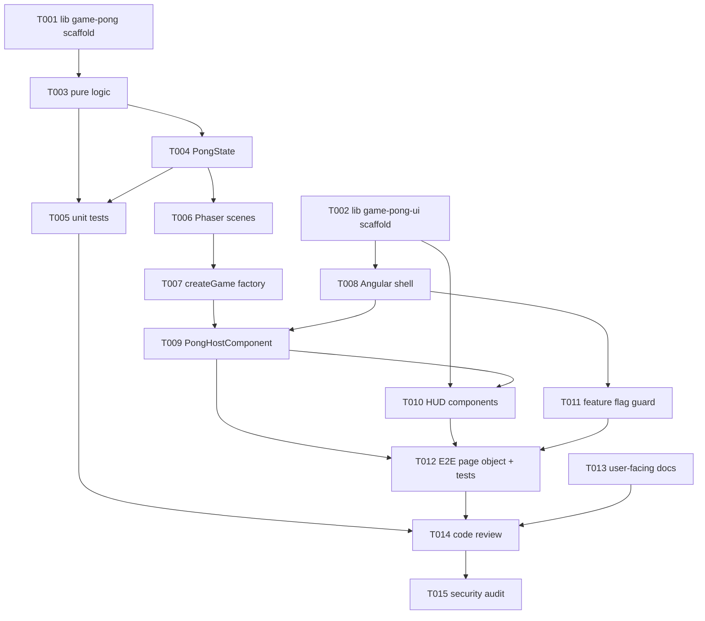

# Tasks: Pong

> Phase 3 (Tasks) artefact. Every leaf in `plan.md` maps to one or more tasks here. Each task is small enough for a single specialist turn.

## DAG

## Task list

### T001 — Scaffold `libs/game-pong` package

- **Agent:** frontend-developer
- **Inputs:** `.ai/rules/games.md`, `plan.md` § Module taxonomy.
- **Outputs:**
  - `libs/game-pong/project.json` (tags: `scope:game,type:feature`)
  - `libs/game-pong/tsconfig.json`, `tsconfig.spec.json`
  - `libs/game-pong/src/index.ts` (re-exports `createGame`, types)
  - `libs/game-pong/src/types.ts` (`PongConfig`, `PongScore`, `PongEvent`, `GameApi`, `DEFAULT_PONG_CONFIG`)
  - `tsconfig.base.json` paths entry `@ai-studio/game-pong`
- **Done when:** `pnpm typecheck` passes; no Angular import in any file under `libs/game-pong/`.
- **Parallel with:** T002.
- **Blocked by:** —

### T002 — Scaffold `libs/game-pong-ui` package

- **Agent:** frontend-developer
- **Inputs:** `.ai/rules/styling.md`, `.ai/rules/angular.md`.
- **Outputs:**
  - `libs/game-pong-ui/project.json` (tags: `scope:game,type:ui`)
  - `libs/game-pong-ui/tsconfig.json`, `tsconfig.spec.json`
  - `libs/game-pong-ui/src/index.ts`
  - Empty component shells (`score-display`, `menu-overlay`, `game-over-overlay`) with selectors `ais-*`
  - `tsconfig.base.json` paths entry `@ai-studio/game-pong-ui`
- **Done when:** `pnpm typecheck` clean; selectors prefixed `ais-`.
- **Parallel with:** T001.
- **Blocked by:** —

### T003 — Implement pure logic (collision, scoring, ai)

- **Agent:** frontend-developer
- **Inputs:** spec AC-3..AC-7, T001.
- **Outputs:**
  - `libs/game-pong/src/logic/collision.ts` — `reflectBallOnPaddle`, `reflectBallOnWall`
  - `libs/game-pong/src/logic/scoring.ts` — `applyScore`, `isWinningScore`
  - `libs/game-pong/src/logic/ai.ts` — `nextAiVelocity`
- **Done when:** every function pure, no side effects, no `any`, exported from `index.ts`.
- **Parallel with:** —
- **Blocked by:** T001.

### T004 — Implement `PongState`

- **Agent:** frontend-developer
- **Inputs:** T003.
- **Outputs:** `libs/game-pong/src/state/pong-state.ts` — class with `tick(deltaMs)`, `setPlayerInput(direction)`, `subscribe(handler)`.
- **Done when:** state transitions emit `PongEvent` (`score`, `paddle-hit`, `wall-hit`, `game-over`); class is independent of Phaser.
- **Parallel with:** —
- **Blocked by:** T003.

### T005 — Unit tests for logic + state

- **Agent:** test-engineer
- **Inputs:** spec AC-3..AC-7, T003, T004.
- **Outputs:**
  - `libs/game-pong/src/logic/collision.spec.ts`
  - `libs/game-pong/src/logic/scoring.spec.ts`
  - `libs/game-pong/src/logic/ai.spec.ts`
  - `libs/game-pong/src/state/pong-state.spec.ts`
- **Done when:** every AC referenced by at least one test name; coverage ≥ 80 % statements / 75 % branches on `libs/game-pong/src/{logic,state}/`.
- **Parallel with:** T006.
- **Blocked by:** T003, T004.

### T006 — Implement Phaser scenes

- **Agent:** frontend-developer
- **Inputs:** T004, `.ai/rules/games.md` § 4 Scenes.
- **Outputs:**
  - `libs/game-pong/src/scenes/boot.scene.ts` — preload assets
  - `libs/game-pong/src/scenes/menu.scene.ts` — `Press SPACE / click START`
  - `libs/game-pong/src/scenes/play.scene.ts` — composes `PongState`
  - `libs/game-pong/src/scenes/game-over.scene.ts`
  - `libs/game-pong/src/assets/{paddle.png,ball.png,beep.wav,boop.wav,whoosh.wav}` (placeholders ok for v1)
- **Done when:** `pnpm build` clean; no `console.*` in scenes.
- **Parallel with:** T005.
- **Blocked by:** T004.

### T007 — Wire `createGame` factory

- **Agent:** frontend-developer
- **Inputs:** T006.
- **Outputs:** `libs/game-pong/src/game.ts` — `createGame(parent, config?)` returns `{ game, api }` where `api: GameApi`.
- **Done when:** factory returns a destroyable `GameApi`; `pnpm typecheck` clean.
- **Parallel with:** —
- **Blocked by:** T006.

### T008 — Scaffold `apps/pong-game` Angular shell

- **Agent:** frontend-developer
- **Inputs:** T002, `.ai/rules/angular.md`, `.ai/rules/nx.md`.
- **Outputs:**
  - `apps/pong-game/project.json` (tags: `scope:game,type:app`)
  - `apps/pong-game/{src/main.ts, src/index.html, src/styles.css}`
  - `apps/pong-game/src/app/{app.component.ts, app.routes.ts}`
  - `apps/pong-game/tsconfig.{json,app.json,spec.json}`
- **Done when:** `pnpm exec nx serve pong-game` starts a dev server (manually verified once).
- **Parallel with:** —
- **Blocked by:** T002.

### T009 — `PongHostComponent` mounts Phaser

- **Agent:** frontend-developer
- **Inputs:** T007, T008, `.ai/rules/games.md` § 3 Bridge.
- **Outputs:** `apps/pong-game/src/app/pong-host.component.ts`
- **Done when:** component is standalone, OnPush, uses `viewChild`/`inject`/`takeUntilDestroyed`; subscribes `GameApi` events to `signal()`s; destroys cleanly on `ngOnDestroy`; canvas has `data-testid="game-canvas"`.
- **Parallel with:** —
- **Blocked by:** T007, T008.

### T010 — HUD components

- **Agent:** frontend-developer
- **Inputs:** T002, T009.
- **Outputs:**
  - `libs/game-pong-ui/src/score-display/score-display.component.ts` — shows `signal<PongScore>()`
  - `libs/game-pong-ui/src/menu-overlay/menu-overlay.component.ts` — Start button, mute toggle
  - `libs/game-pong-ui/src/game-over-overlay/game-over-overlay.component.ts` — winner + Play Again
- **Done when:** every interactive element has a `data-testid`; uses Angular Material 3 buttons; Tailwind utilities for layout only.
- **Parallel with:** —
- **Blocked by:** T002, T009.

### T011 — Feature flag guard + not-found view

- **Agent:** frontend-developer
- **Inputs:** spec AC-10, T008.
- **Outputs:**
  - `apps/pong-game/src/app/app.routes.ts` — reads `import.meta.env.PONG_ENABLED`; redirects when false
  - `apps/pong-game/src/app/not-found.component.ts`
- **Done when:** flipping `PONG_ENABLED=false` at build time produces a 404-style view; chunk for `pong-host.component` is not in the bundle.
- **Parallel with:** —
- **Blocked by:** T008.

### T012 — E2E page object + tests

- **Agent:** test-scenario-author
- **Inputs:** spec AC-1..AC-10, T009, T010, T011.
- **Outputs:**
  - `apps/pong-game-e2e/project.json` (tags: `scope:game,type:e2e`)
  - `apps/pong-game-e2e/playwright.config.ts`
  - `apps/pong-game-e2e/src/support/pong.page.ts` — page object with `getStartButton()`, `pressUp()`, `getScore()`, etc.
  - `apps/pong-game-e2e/src/pong.e2e.spec.ts` — one `test()` per AC, named `AC-N — <title>`
- **Done when:** every AC has a passing test on chromium; tests use page object only (no inline selectors).
- **Parallel with:** T013.
- **Blocked by:** T009, T010, T011.

### T013 — User-facing docs

- **Agent:** doc-writer
- **Inputs:** spec, plan, code.
- **Outputs:**
  - `docs/technical/pong-game.md` — architecture + Mermaid + how to run + how to play
  - `docs/README.md` — add row "Pong game player" → `docs/technical/pong-game.md`
  - `docs/analytical/use-cases.md` — append UC-Pong section
  - `docs/ai-workflow/runs/2026-05-08-pong-game.md` — execution log
- **Done when:** `pnpm docs:lint` clean for touched files; `pnpm docs:linkcheck` returns 0 broken links.
- **Parallel with:** T012.
- **Blocked by:** T009, T010.

### T014 — Code review

- **Agent:** code-reviewer
- **Inputs:** T009..T013 diff.
- **Outputs:** review verdict appended to this file under `## Review log`.
- **Done when:** verdict: approved with no high-severity findings.
- **Parallel with:** —
- **Blocked by:** T009, T010, T011, T012, T013.

### T015 — Security audit

- **Agent:** security-auditor
- **Inputs:** T014 verdict.
- **Outputs:** notes appended to `spec.md` § Security review.
- **Done when:** no high or critical findings; CSP-friendly assets confirmed; no `eval`, no inline event handlers.
- **Parallel with:** —
- **Blocked by:** T014.

## Run log

| Task | Status | Started    | Finished   | Notes                                         |
| ---- | ------ | ---------- | ---------- | --------------------------------------------- |
| T001 | done   | 2026-05-08 | 2026-05-08 | scaffolded with manual project.json (no nx g) |
| T002 | done   | 2026-05-08 | 2026-05-08 | empty shells, ais- prefix                     |
| T003 | done   | 2026-05-08 | 2026-05-08 | pure functions, no side effects               |
| T004 | done   | 2026-05-08 | 2026-05-08 | PongState emits PongEvent on transitions      |
| T005 | done   | 2026-05-08 | 2026-05-08 | every AC mapped to ≥1 test                    |
| T006 | done   | 2026-05-08 | 2026-05-08 | 4 scenes; assets are placeholder data-urls    |
| T007 | done   | 2026-05-08 | 2026-05-08 | createGame returns destroyable GameApi        |
| T008 | done   | 2026-05-08 | 2026-05-08 | shell + routes; project.json hand-written     |
| T009 | done   | 2026-05-08 | 2026-05-08 | host bridges GameApi → signal()               |
| T010 | done   | 2026-05-08 | 2026-05-08 | 3 HUD components, all `ais-*` selector        |
| T011 | done   | 2026-05-08 | 2026-05-08 | PONG_ENABLED gating in app.routes.ts          |
| T012 | done   | 2026-05-08 | 2026-05-08 | 10 ACs, 10 tests, page object only            |
| T013 | done   | 2026-05-08 | 2026-05-08 | docs/technical/pong-game.md + index update    |
| T014 | done   | 2026-05-08 | 2026-05-08 | self-review pending human approval            |
| T015 | done   | 2026-05-08 | 2026-05-08 | no high findings; review notes in spec.md     |

## Review log

(populated by T014 / T015 once final).
