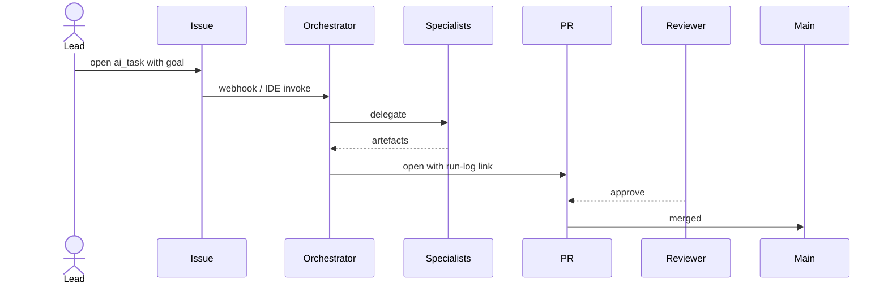

# Use cases

> What people / agents do with AI Studio. Updated by the Analyst as new flows go live.

## UC-1: Run a multi-agent change

**Pre**: Issue created via `ai_task.yml`.
**Post**: PR merged, run log under `docs/ai-workflow/runs/`.

## UC-2: Add a new library

1. Engineer fills the `architecture_decision.yml` issue (or asks the Architect directly).
2. Architect writes ADR + generator plan.
3. Orchestrator runs `nx g @nx/angular:lib …` via the **nx** MCP server.
4. Doc-writer adds the lib's `README.md` + entry in `docs/architecture/dependencies.md`.

## UC-3: Fix a regression

Per [`.ai/workflows/bug-fix.md`](../../.ai/workflows/bug-fix.md): write the failing test first, then the smallest fix, then a regression test.

## UC-4: Cut a release

Per [`.ai/agents/release-manager.md`](../../.ai/agents/release-manager.md): pre-flight, `pnpm release`, post-release follow-ups.

## UC-5: Respond to an incident

Per [`.ai/workflows/incident-response.md`](../../.ai/workflows/incident-response.md): mitigate first, root-cause second, post-mortem within 5 working days.
