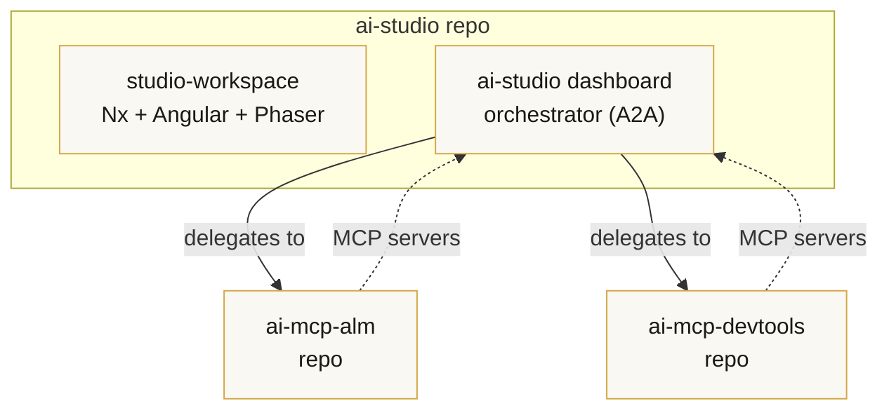

# nowiro projects map

> Per-repo identity card. The conceptual model — three layers (RAG / MCP / Agent) and the seven-server power stack — lives in [`.ai/architecture.md`](../../.ai/architecture.md). This doc says where each piece **actually** runs in the trinity today.

## Repository ↔ logical project

The nowiro architecture has **four logical projects**. They currently share **three git repos**: the workspace tier and the dashboard tier both live inside `ai-studio`. Splitting them is a future ADR — not blocking, the conceptual boundary is enforced by Nx project tags.

## Per-repo signal table

| Repo                         | RAG          | MCP                                                                         | Skills           | Agent        | A2A      | Notes                                                                                                       |
| ---------------------------- | ------------ | --------------------------------------------------------------------------- | ---------------- | ------------ | -------- | ----------------------------------------------------------------------------------------------------------- |
| `ai-studio` (workspace tier) | docs (light) | Nx · Angular · GitHub · Playwright                                          | per-lib SKILL.md | optional     | —        | Hosts apps + libs; Pong is the reference example.                                                           |
| `ai-studio` (dashboard tier) | history      | + **Memory** (recommended)                                                  | yes              | Orchestrator | yes      | Future apps under `apps/`; consumes ALM + devtools as MCP clients.                                          |
| `ai-mcp-alm`                 | spec corpus  | GitHub · Jira · Confluence · Figma · Sonar · GitLab                         | yes              | yes          | consider | The repo _is_ a set of MCP servers. Read sensitive tokens from the user-profile config (see `SECURITY.md`). |
| `ai-mcp-devtools`            | —            | read-docs · analyze-code · propose-fix · run-playwright · compliance-report | yes              | —            | —        | The repo _is_ a set of MCP servers. + **Sentry MCP** (recommended).                                         |

## Where the seven recommended MCP servers light up

| Server     | `ai-studio` | `ai-mcp-alm` | `ai-mcp-devtools` |
| ---------- | ----------- | ------------ | ----------------- |
| Figma      | (consumer)  | provider     | —                 |
| **Memory** | recommended | —            | —                 |
| Zapier     | —           | recommended  | —                 |
| **Sentry** | —           | —            | recommended       |
| Tavily     | —           | —            | recommended       |
| Context7   | wired       | —            | —                 |
| Playwright | wired       | —            | provider          |

## Cross-cutting invariants

1. **Trinity baseline files** (six "core" + the two added 2026-05-09 — architecture, production-readiness) are byte-identical across all three repos. `pnpm trinity:check` enforces this on pre-push.
2. **Sensitive tokens** never live in the repo. They are read from the **user-profile config** (`~/.config/nowiro/<repo>/config.json` on macOS / Linux, `%USERPROFILE%\.config\nowiro\<repo>\config.json` on Windows) — see each repo's `SECURITY.md` for the schema.
3. **Tool support** is intentionally limited to **Claude Code** and **GitHub Copilot**. No other AI tool wrappers may be added without an ADR.
4. **No Nx Cloud.** `nxCloudAccessToken` stays `null`; CI/cost-tracking happens locally.
5. **Diagrams are mermaid only** — no ASCII art, no embedded images.

## Related documents

- [`.ai/architecture.md`](../../.ai/architecture.md) — conceptual reference (three primitives, three layers, MCP power stack).
- [`.ai/rules/production-readiness.md`](../../.ai/rules/production-readiness.md) — six must-haves before going to production.
- [`.ai/README.md`](../../.ai/README.md) — wrapper / source-of-truth layout.
- Per-repo `SECURITY.md` — token storage and rotation policy.
