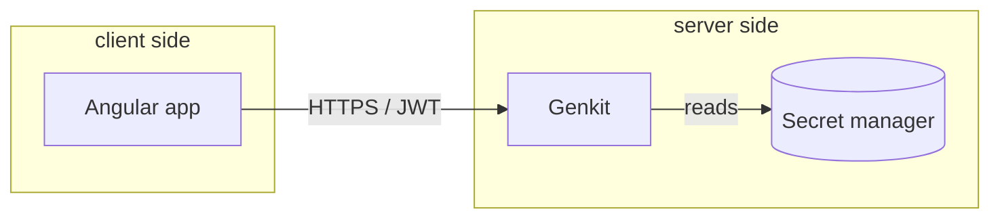

# System architecture

> Top-down picture, suitable for whiteboarding. Mirrors but condenses [`docs/technical/architecture.md`](../technical/architecture.md).

## Layered view

```
┌──────────────────────────────────────────────────────────┐
│                  User-facing apps (Angular)              │
├──────────────────────────────────────────────────────────┤
│              Feature libraries (smart components)         │
├──────────────────────────────────────────────────────────┤
│   UI libraries (dumb)   │   Data libraries (state, API)  │
├──────────────────────────────────────────────────────────┤
│                   Util libraries (pure)                  │
├──────────────────────────────────────────────────────────┤
│                Cross-cutting (theme, i18n)               │
└──────────────────────────────────────────────────────────┘
                  ▲                                ▲
                  │                                │
            CI / GitHub Actions              AI agents (.ai/)
                                                    │
                                            MCP servers (4)
```

## Capabilities map

| Capability               | Owning lib(s)             |
| ------------------------ | ------------------------- |
| Auth                     | `libs/shared/auth`        |
| Theming                  | `libs/shared/theme`       |
| i18n                     | `libs/shared/i18n`        |
| Logging                  | `libs/util/logger`        |
| HTTP / interceptors      | `libs/data/http`          |
| Feature flags            | `libs/util/feature-flags` |
| Telemetry                | `libs/util/telemetry`     |
| AI flow client (browser) | `libs/data/ai-flows`      |

## Trust boundaries



The model never receives raw API keys; the server proxies all model calls.

## Deployment topology (placeholder)

| Environment | Hosting               | Notes                      |
| ----------- | --------------------- | -------------------------- |
| Dev         | local                 | `pnpm exec nx serve <app>` |
| Preview     | per-PR ephemeral      | spun up by CI on PR open   |
| Staging     | continuously deployed | last `main` SHA            |
| Prod        | manual `nx release`   | tagged versions only       |

## Open questions

- _TBD_ — track via ADR drafts.
