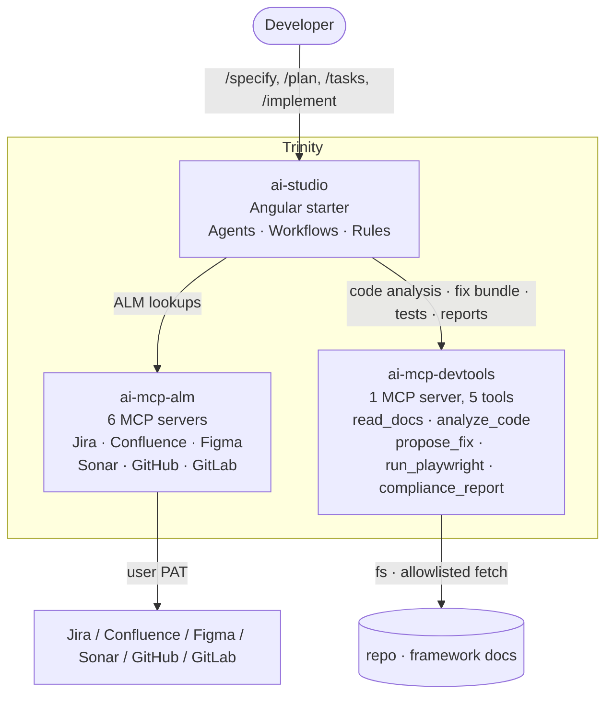

# The trinity — ai-studio + ai-mcp-alm + ai-mcp-devtools

> Three repos, one workflow. Spec-driven coding with MCP-backed tools.

## Overview



## Repos at a glance

| Repo              | Tier        | Tokens?            | What it ships                                                                                                               |
| ----------------- | ----------- | ------------------ | --------------------------------------------------------------------------------------------------------------------------- |
| `ai-studio`       | Application | none               | Angular 21 + Material + Tailwind starter; canonical `.ai/` rules; orchestrator + 12 specialists; spec-driven slash commands |
| `ai-mcp-alm`      | Integration | per-tool user PATs | 6 MCP servers (read-first; writes guarded by `MCP_WRITE_ENABLED` + allowlist)                                               |
| `ai-mcp-devtools` | Toolbox     | none               | 1 MCP server with 5 composable dev-workflow tools                                                                           |

## How they collaborate (the spec-driven loop)

1. **`/specify <feature>`** in `ai-studio` → analyst creates `docs/analytical/specs/<slug>/spec.md`.
2. **`/clarify`** if the spec has `[?]` markers → user answers, analyst updates spec.
3. **`/plan`** → architect writes `plan.md` consulting both Angular docs (via `context7`) and ALM context (via `ai-mcp-alm/get_issue` etc).
4. **`/tasks`** → orchestrator decomposes into `tasks.md` (DAG).
5. **`/implement`** → orchestrator walks the DAG. For each task:
   - Frontend / backend developer writes code.
   - `ai-mcp-devtools/analyze_code` reports findings.
   - `ai-mcp-devtools/run_playwright` runs the affected E2E.
   - On failure, `ai-mcp-devtools/propose_fix` assembles context for the orchestrator's next try.
6. **Code review** → `ai-mcp-devtools/compliance_report` scores against `.ai/rules/`.
7. **PR description** mentions the spec slug, the plan path, and any ALM linkage (Jira issue, Confluence design page, Figma frame).

## DRY contract — the trinity baseline

These six files MUST be byte-identical across the three repos. The canonical lives in `ai-studio`.

- `.ai/rules/core.md`
- `.ai/rules/principles.md`
- `.ai/rules/security.md`
- `.ai/agents/orchestrator.md`
- `.ai/workflows/spec-driven.md`
- `docs/ai-workflow/plans/_template.md`

`tools/scripts/check-trinity.mjs` (in all three repos) hashes them and fails if any sibling drifts. ADR: [`docs/adr/0005-trinity-architecture.md`](../adr/0005-trinity-architecture.md).

### Sync flow

1. Edit a baseline in `ai-studio`.
2. Copy it to `../ai-mcp-alm/` and `../ai-mcp-devtools/` (manual or `pnpm trinity:sync` once authored).
3. `pnpm trinity:check` — must print `✓ trinity in sync`.

## Cloning the trinity

Clone all three under the **same parent directory** so the relative MCP server paths in `ai-studio/.mcp.json` (`../ai-mcp-alm/dist/...`, `../ai-mcp-devtools/dist/...`) resolve.

```bash
cd ~/code
git clone https://github.com/<you>/ai-studio.git
git clone https://github.com/<you>/ai-mcp-alm.git
git clone https://github.com/<you>/ai-mcp-devtools.git

cd ai-mcp-alm        && pnpm install && pnpm build
cd ../ai-mcp-devtools && pnpm install && pnpm build
cd ../ai-studio       && pnpm install && pnpm trinity:check
```

Set the ALM tokens (Jira / Confluence / Figma / Sonar / GitHub / GitLab) in your shell profile per `ai-mcp-alm/.ai/rules/tokens.md`. Then open `ai-studio` in Claude Code or Copilot — both will see the 7 new MCP servers and the trinity is wired.

## Why this shape (vs. one big repo)

- **Independent release cadence**: ALM-API churn doesn't bump the Angular starter.
- **Least privilege**: tokens live only in `ai-mcp-alm`.
- **Separation of concerns**: `ai-studio` is _what to build_, `ai-mcp-alm` is _how to read external state_, `ai-mcp-devtools` is _how to operate locally on code_.
- **Clean DRY mechanism**: 6 files duplicated, hash-verified — no shared package to publish.

See [ADR 0005](../adr/0005-trinity-architecture.md) for the considered alternatives.

## Reference

- Spec-Kit (the methodology this trinity is built around): <https://github.com/github/spec-kit>
- Earlier prior art with 6 MCP apps in one Nx workspace: `C:\github\devflow-ai`
- Workflow file: [`.ai/workflows/spec-driven.md`](../../.ai/workflows/spec-driven.md)
