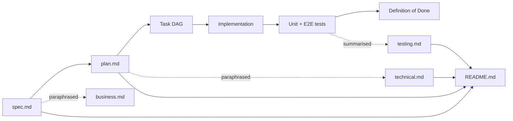

# Demo projects

> Per-project documentation for the demo applications shipped by AI Studio.
> Each project has the same four-document structure so readers always know
> where to look.

## Why this folder exists

The repo started with a single app (`pong-game`) and grew into a portfolio
of demos. Each one solves a different shape of frontend problem
(e-commerce / role-based admin / cross-context views). Without a
predictable per-project doc layout, the architecture / requirements /
test rationale lived only in commits and `spec.md`.

These docs are the **SDD + TDD trail** rendered for humans:

```
spec.md ─→ plan.md ─→ tasks (in plan) ─→ implementation ─→ tests
   │          │              │                  │            │
   └──────────┴──────────────┴──────────────────┴────────────┘
                  ↓ rendered for each persona
        business.md   technical.md   testing.md   README.md
```

`spec.md` is the canonical artefact (Phase 1 of `spec-driven.md`); the
docs below paraphrase it for stakeholders, developers and testers.

## Documentation contract per project

Every project under `docs/projects/<app>/` provides four files:

| File           | Audience           | Owns                                                                           |
| -------------- | ------------------ | ------------------------------------------------------------------------------ |
| `README.md`    | Anyone             | Navigation, status badge, links to spec / plan / ADR.                          |
| `business.md`  | PM, analyst, sales | Vision, personas, user journeys, demo script, KPIs, roadmap.                   |
| `technical.md` | Developer, DevOps  | Architecture, lib graph, public APIs, state strategy, runbook.                 |
| `testing.md`   | Test engineer, QA  | Test pyramid, coverage gates, **AC ↔ test traceability matrix**, TDD workflow. |

If you add a new demo, copy these four files from an existing project,
keep the frontmatter shape, and update the cross-links.

## Spec-Driven Development (SDD) compliance

The docs **never duplicate `spec.md`** — they cross-link to it. The
contract:

1. **`spec.md` is canonical** for problem statement, personas, user
   stories, acceptance criteria (AC-N), success metrics, non-goals.
2. **`plan.md`** (`docs/ai-workflow/plans/<date>-<slug>.md`) is canonical
   for the task DAG, architecture choice, validation gate.
3. **ADRs** (`docs/adr/NNNN-*.md`) are canonical for design decisions.
4. **Per-project docs** add audience-specific framing on top:
   `business.md` translates AC into "what the user sees";
   `technical.md` translates AC into "which lib enforces it";
   `testing.md` translates AC into "which test asserts it".

## Test-Driven Development (TDD) compliance

Each `testing.md` provides a **traceability matrix** that maps every
acceptance criterion `AC-N` in `spec.md` to:

- the file(s) that **implement** it,
- the file(s) that **test** it (unit and/or E2E),
- the **coverage layer** (pure logic / service / component / route).

The matrix is the single source of truth for "is AC-N covered?". CI
fails when a row's tests don't run; reviewers fail PRs that touch
implementation without a matching row update.

Coverage gates per project (enforced in each lib's `vitest.config.ts`):

| Threshold  | Value |
| ---------- | ----- |
| Statements | ≥ 80% |
| Branches   | ≥ 75% |
| Functions  | ≥ 80% |
| Lines      | ≥ 80% |

## Projects

| Project             | Port | Demo focus                                                                                                                                                                    | Docs                                  |
| ------------------- | ---- | ----------------------------------------------------------------------------------------------------------------------------------------------------------------------------- | ------------------------------------- |
| `tire-shop`         | 4205 | Faceted e-commerce + cart + 4-step checkout (legacy — pre `shop-core` split)                                                                                                  | [README](tire-shop/README.md)         |
| `library`           | 4206 | Role-based views (reader / librarian) + MatTable                                                                                                                              | [README](library/README.md)           |
| `school-journal`    | 4207 | Multi-role + multi-context (term × class) views                                                                                                                               | [README](school-journal/README.md)    |
| `bookstore`         | 4208 | E-commerce on shared `shop-core` + `shop-ui`                                                                                                                                  | [README](bookstore/README.md)         |
| `tools-shop`        | 4209 | E-commerce on shared core; numeric attributes                                                                                                                                 | [README](tools-shop/README.md)        |
| `toy-shop`          | 4210 | E-commerce on shared core; age-gating + safety                                                                                                                                | [README](toy-shop/README.md)          |
| `individual-wizard` | 4203 | 5-step reactive-forms wizard for personal data (PESEL, RODO consents). Shares `libs/wizard-core` with business-wizard.                                                        | [README](individual-wizard/README.md) |
| `business-wizard`   | 4212 | 6-step B2B reactive-forms survey + Web Component build (`<ais-business-wizard>`). Shares `libs/wizard-core` with individual-wizard.                                           | [README](business-wizard/README.md)   |
| `portal`            | 4220 | Host application — sidenav listing every demo; each remote loads as a Web Component (`<ais-<slug>>`). WC-based composition (ADR-0009).                                        | [README](portal/README.md)            |
| `dashboard`         | 4211 | KPI panel — revenue per shop, top products, low-stock, daily orders, category mix. Pure aggregation in `libs/dashboard-data`; charts render as tables until ngx-charts lands. | [README](dashboard/README.md)         |

## `shop-core` / `shop-ui` shared primitives

The bookstore, tools-shop and toy-shop demos all sit on top of two
shared libraries that absorb the generic e-commerce concerns:

| Lib              | Tags                                          | Provides                                                                                                                                                                                                                                                                      |
| ---------------- | --------------------------------------------- | ----------------------------------------------------------------------------------------------------------------------------------------------------------------------------------------------------------------------------------------------------------------------------- |
| `libs/shop-core` | `scope:shared · type:data-access · type:util` | `BaseProduct` / `BaseFilters` / `CartLine` / `OrderDraft` types, `matchesBaseFilters`, `sortProducts`, `summariseBaseFacets`, `buildCartView`, `cartTotal`, `cartCount`, `mergeLines`, `popularityScore`, `ShopCartService`, `PRODUCT_LOOKUP` + `CART_STORAGE_KEY` DI tokens. |
| `libs/shop-ui`   | `scope:shared · type:ui`                      | `<ais-shop-product-card>`, `<ais-shop-cart-drawer>`, `<ais-shop-cart-page>`, `<ais-shop-checkout>` (4-step Reactive-Forms), `<ais-shop-price-tag>`, `<ais-shop-stars-rating>`, `<ais-shop-empty-state>`.                                                                      |

Each shop wires its catalogue + storage key in `main.ts`:

```typescript
{ provide: PRODUCT_LOOKUP,   useExisting: BookstoreCatalogueService },
{ provide: CART_STORAGE_KEY, useValue:    'ais.bookstore.cart.v1' },
```

The 4-step Reactive-Forms checkout, the cart drawer, the cart page and
the price/rating/empty-state primitives are **zero-duplication** across
bookstore, tools-shop and toy-shop. Tire-shop predates this split and
keeps its own copies (documented as tech-debt for a future harmonisation
PR).

25 unit tests cover the shared pure layer
(`matchesBaseFilters`, `sortProducts`, `summariseBaseFacets`,
`buildCartView`, `cartTotal`, `cartCount`, `mergeLines`,
`popularityScore`). Each shop's `testing.md` defers to that suite for
the cross-cutting AC coverage.

## Upcoming work (consolidated roadmap)

The two earlier draft plans (`portal-mfe.md`, `ui-kit-wrappers.md`) have
been **merged into one consolidated roadmap** that also adds Web
Components (every app embeddable as `<ais-<app>>`), a pluggable
Keycloak auth provider, and an ESLint scale-up for the 11+-app
workspace. The originals are kept with `status: superseded` headers
pointing here.

| Plan                                                                                                                | Status | Phases                                                                                                                                                                                                                                                                         |
| ------------------------------------------------------------------------------------------------------------------- | ------ | ------------------------------------------------------------------------------------------------------------------------------------------------------------------------------------------------------------------------------------------------------------------------------ |
| [Portal + Web Components + Keycloak + ESLint scale-up](../ai-workflow/plans/2026-05-18-portal-elements-keycloak.md) | draft  | **P0** ESLint scale-up · **P1** dual-mode WC per app · **P2** `libs/ui-kit` wrappers · **P3** `apps/portal` + `apps/dashboard` + Native Federation · **P4** `libs/keycloak-auth` · **P5** docs + final validation gate. ADRs 0009-0013 land alongside their respective phases. |

### Dual-mode embedding contract

Every app is consumable **three ways without code changes**:

1. **Standalone SPA** — `pnpm start:<app>` boots the app on its
   dedicated port (existing).
2. **Web Component** ✅ **landed** — `pnpm nx run <app>:build-element`
   produces an ESM bundle; host pages drop in `<ais-<app>></ais-<app>>`.
   All 12 apps (nowiro, union-vault, pong-game, individual-wizard,
   tetris-game, tire-shop, library, school-journal, bookstore,
   tools-shop, toy-shop, business-wizard) ship the `build-element`
   target. Combined demo page at
   [`docs/projects/elements-demo/index.html`](elements-demo/index.html).
3. **Federated remote** — `apps/portal` (4200) lazy-loads each app's
   Native Federation manifest at runtime. Pending Phase 3.

The same `AppComponent` mounts in all three modes — only the entry
point differs. Contract documented in
[ADR-0012](../adr/0012-app-dual-mode-web-components.md) (Web Components — `accepted`) and
[ADR-0009](../adr/0009-microfrontend-architecture.md) (MFE — `accepted`).

### Pluggable auth (Keycloak-ready)

The existing `AUTH_CONTEXT` token (`libs/shared-app-shell`) now has
two drop-in providers in **`libs/keycloak-auth`** (`scope:auth`,
`type:data-access`) ✅ landed:

- `provideMockKeycloak({ initialRole })` — the default in dev / CI.
  No network calls. Imported from `@ai-studio/keycloak-auth`.
- `provideKeycloak({ url, realm, clientId })` — wires a real
  Keycloak server via `keycloak-js` (peer dependency, lazily loaded
  so unused apps pay zero bundle cost). Imported from
  `@ai-studio/keycloak-auth`.

Switching is a one-line provider change in the app's `main.ts`.
Contract documented in
[ADR-0013](../adr/0013-keycloak-auth-integration.md).

### Roadmap-driven ADRs

| ADR                                                 | Topic                                                               | Linked phase |
| --------------------------------------------------- | ------------------------------------------------------------------- | ------------ |
| [0009](../adr/0009-microfrontend-architecture.md)   | Native Federation vs Module Federation vs Web Components vs iframes | Phase 3      |
| [0010](../adr/0010-dashboard-chart-library.md)      | ngx-charts vs ApexCharts vs Chart.js for the dashboard              | Phase 3      |
| [0011](../adr/0011-ui-kit-wrapper-strategy.md)      | Thin wrappers + ESLint guard for `@angular/material/*`              | Phase 2      |
| [0012](../adr/0012-app-dual-mode-web-components.md) | `@angular/elements` + per-app `build:element` target                | Phase 1      |
| [0013](../adr/0013-keycloak-auth-integration.md)    | `keycloak-js` peer dep + opt-in `provideKeycloak()` helper          | Phase 4      |

## Document lifecycle



A project's `status` is the union of all artefacts:

- `draft` until `spec.md` is accepted and the task DAG is approved.
- `in-progress` while tasks are open.
- `done` when CI passes lint + test + e2e + build and all four docs are
  authored.

## Related top-level docs

- [`docs/programming/testing-strategy.md`](../programming/testing-strategy.md)
  — repo-wide TDD discipline; per-project `testing.md` defers to it.
- [`docs/architecture/system.md`](../architecture/system.md) — the
  layered view (apps → features → ui/data → util) that every project
  inherits.
- [`docs/ai-workflow/multi-agent-flow.md`](../ai-workflow/multi-agent-flow.md)
  — how analyst / architect / frontend-developer / test-engineer
  agents produced the artefacts you're reading.
- [`docs/adr/`](../adr/) — every cross-cutting decision.
