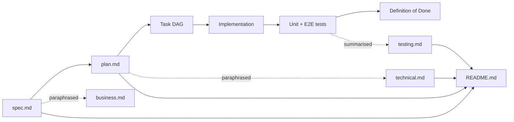

# Demo projects

> Per-project documentation for the demo applications shipped by AI Studio.
> Each project has the same four-document structure so readers always know
> where to look.

## Why this folder exists

The repo started with a single app (`pong-game`) and grew into a portfolio
of demos. Each one solves a different shape of frontend problem
(e-commerce / role-based admin / cross-context views). Without a
predictable per-project doc layout, the architecture / requirements /
test rationale lived only in commits and `spec.md`.

These docs are the **SDD + TDD trail** rendered for humans:

```
spec.md ─→ plan.md ─→ tasks (in plan) ─→ implementation ─→ tests
   │          │              │                  │            │
   └──────────┴──────────────┴──────────────────┴────────────┘
                  ↓ rendered for each persona
        business.md   technical.md   testing.md   README.md
```

`spec.md` is the canonical artefact (Phase 1 of `spec-driven.md`); the
docs below paraphrase it for stakeholders, developers and testers.

## Documentation contract per project

Every project under `docs/projects/<app>/` provides four files:

| File           | Audience           | Owns                                                                           |
| -------------- | ------------------ | ------------------------------------------------------------------------------ |
| `README.md`    | Anyone             | Navigation, status badge, links to spec / plan / ADR.                          |
| `business.md`  | PM, analyst, sales | Vision, personas, user journeys, demo script, KPIs, roadmap.                   |
| `technical.md` | Developer, DevOps  | Architecture, lib graph, public APIs, state strategy, runbook.                 |
| `testing.md`   | Test engineer, QA  | Test pyramid, coverage gates, **AC ↔ test traceability matrix**, TDD workflow. |

If you add a new demo, copy these four files from an existing project,
keep the frontmatter shape, and update the cross-links.

## Spec-Driven Development (SDD) compliance

The docs **never duplicate `spec.md`** — they cross-link to it. The
contract:

1. **`spec.md` is canonical** for problem statement, personas, user
   stories, acceptance criteria (AC-N), success metrics, non-goals.
2. **`plan.md`** (`docs/ai-workflow/plans/<date>-<slug>.md`) is canonical
   for the task DAG, architecture choice, validation gate.
3. **ADRs** (`docs/adr/NNNN-*.md`) are canonical for design decisions.
4. **Per-project docs** add audience-specific framing on top:
   `business.md` translates AC into "what the user sees";
   `technical.md` translates AC into "which lib enforces it";
   `testing.md` translates AC into "which test asserts it".

## Test-Driven Development (TDD) compliance

Each `testing.md` provides a **traceability matrix** that maps every
acceptance criterion `AC-N` in `spec.md` to:

- the file(s) that **implement** it,
- the file(s) that **test** it (unit and/or E2E),
- the **coverage layer** (pure logic / service / component / route).

The matrix is the single source of truth for "is AC-N covered?". CI
fails when a row's tests don't run; reviewers fail PRs that touch
implementation without a matching row update.

Coverage gates per project (enforced in each lib's `vitest.config.ts`):

| Threshold  | Value |
| ---------- | ----- |
| Statements | ≥ 80% |
| Branches   | ≥ 75% |
| Functions  | ≥ 80% |
| Lines      | ≥ 80% |

## Projects

| Project          | Port | Demo focus                                       | Docs                               |
| ---------------- | ---- | ------------------------------------------------ | ---------------------------------- |
| `tire-shop`      | 4205 | Faceted e-commerce + cart + 4-step checkout      | [README](tire-shop/README.md)      |
| `library`        | 4206 | Role-based views (reader / librarian) + MatTable | [README](library/README.md)        |
| `school-journal` | 4207 | Multi-role + multi-context (term × class) views  | [README](school-journal/README.md) |

## Document lifecycle



A project's `status` is the union of all artefacts:

- `draft` until `spec.md` is accepted and the task DAG is approved.
- `in-progress` while tasks are open.
- `done` when CI passes lint + test + e2e + build and all four docs are
  authored.

## Related top-level docs

- [`docs/programming/testing-strategy.md`](../programming/testing-strategy.md)
  — repo-wide TDD discipline; per-project `testing.md` defers to it.
- [`docs/architecture/system.md`](../architecture/system.md) — the
  layered view (apps → features → ui/data → util) that every project
  inherits.
- [`docs/ai-workflow/multi-agent-flow.md`](../ai-workflow/multi-agent-flow.md)
  — how analyst / architect / frontend-developer / test-engineer
  agents produced the artefacts you're reading.
- [`docs/adr/`](../adr/) — every cross-cutting decision.
