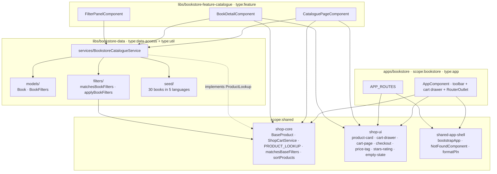

# Bookstore — technical documentation

> Architecture + runbook. AC mapping → [`testing.md`](testing.md). Decisions
> inherited from shop-core/shop-ui design (no per-app ADR required).

## Architecture overview



### Library structure

| Path                               | Scope             | Type                           | Public API                                                               |
| ---------------------------------- | ----------------- | ------------------------------ | ------------------------------------------------------------------------ |
| `apps/bookstore`                   | `scope:bookstore` | `type:app`                     | — (terminal)                                                             |
| `apps/bookstore-e2e`               | —                 | `type:e2e`                     | — (terminal)                                                             |
| `libs/bookstore-data`              | `scope:bookstore` | `type:data-access + type:util` | [`src/index.ts`](../../../libs/bookstore-data/src/index.ts)              |
| `libs/bookstore-feature-catalogue` | `scope:bookstore` | `type:feature`                 | [`src/index.ts`](../../../libs/bookstore-feature-catalogue/src/index.ts) |

## Data model

```typescript
interface Book extends BaseProduct {
  readonly author: string;
  readonly isbn: string;
  readonly language: 'pl' | 'en' | 'de' | 'fr' | 'es';
  readonly publishedYear: number;
  readonly pageCount: number;
  readonly format: 'hardcover' | 'paperback' | 'ebook' | 'audiobook';
}

interface BookFilters extends BaseFilters {
  readonly languages: ReadonlySet<BookLanguage>;
  readonly formats: ReadonlySet<BookFormat>;
  readonly minYear: number | null;
  readonly maxYear: number | null;
}
```

`Book` and `BookFilters` extend the generic shapes from
[`@ai-studio/shop-core`](../../../libs/shop-core). The base predicates
(brand, category, price, in-stock, query) are reused; the domain layer
only adds bibliographic axes.

## Cart wiring

```typescript
// apps/bookstore/src/main.ts
bootstrapApp(AppComponent, {
  providers: [
    provideRouter(APP_ROUTES, withComponentInputBinding()),
    provideHttpClient(withFetch()),
    { provide: PRODUCT_LOOKUP, useExisting: BookstoreCatalogueService },
    { provide: CART_STORAGE_KEY, useValue: 'ais.bookstore.cart.v1' },
  ],
});
```

`ShopCartService` (singleton from `shop-core`) reads `PRODUCT_LOOKUP`
to join cart lines with their books, and `CART_STORAGE_KEY` to namespace
its `localStorage` mirror.

## Routing

```typescript
APP_ROUTES = [
  { path: '',         loadComponent: → CataloguePageComponent }, // lazy
  { path: 'book/:id', loadComponent: → BookDetailComponent    }, // lazy
  { path: 'cart',     component:     CartPageComponent  },       // eager, shop-ui
  { path: 'checkout', component:     CheckoutComponent  },       // eager, shop-ui
  { path: '**',       component:     NotFoundComponent  },
];
```

## Public APIs

### `@ai-studio/bookstore-data`

```typescript
export type { Book, BookFilters, BookLanguage, BookFormat };
export { BOOK_LANGUAGES, BOOK_FORMATS, BOOK_GENRES, EMPTY_BOOK_FILTERS };
export { matchesBookFilters, applyBookFilters };
export { BookstoreCatalogueService };
export { BOOK_CATALOGUE };
```

### `@ai-studio/bookstore-feature-catalogue`

```typescript
export { CataloguePageComponent }; // <ais-bookstore-catalogue-page>
export { BookDetailComponent }; // <ais-bookstore-book-detail [id]="…">
export { FilterPanelComponent }; // <ais-bookstore-filter-panel>
```

## Runbook

```bash
pnpm start:bookstore                # → http://localhost:4208
pnpm nx build bookstore             # production bundle
pnpm nx typecheck bookstore         # strict TS check
pnpm nx lint bookstore              # eslint
pnpm nx e2e bookstore-e2e           # Playwright smoke (chromium)
```

Bundle budgets in
[`apps/bookstore/project.json`](../../../apps/bookstore/project.json):
initial 750 kB warning / 1.5 MB error.

## Troubleshooting

| Symptom                                               | Fix                                                                                        |
| ----------------------------------------------------- | ------------------------------------------------------------------------------------------ |
| Cart drawer shows no items after add-to-cart          | Forgot `{ provide: PRODUCT_LOOKUP, useExisting: BookstoreCatalogueService }` in `main.ts`. |
| Reload clears the cart                                | Forgot `{ provide: CART_STORAGE_KEY, useValue: 'ais.bookstore.cart.v1' }`.                 |
| Generic `<ais-shop-product-card>` shows empty subline | `subline` is an optional input; pass the book's `author + year`.                           |

## Extensibility hooks

| Want to…                         | Touch                                                                                         |
| -------------------------------- | --------------------------------------------------------------------------------------------- |
| Add a new facet (e.g. publisher) | Add field to `BookFilters` + predicate in `matching.ts` + UI in `filter-panel.component.ts`.  |
| Swap the seed for an API         | Replace `signal(BOOK_CATALOGUE)` in `BookstoreCatalogueService` with an HTTP-driven signal.   |
| Add a new product domain         | Copy the bookstore structure; only `<shop>-data` + `<shop>-feature-catalogue` need to be new. |

## Web Component embedding

The app ships a Web Component build target ([ADR-0012](../../adr/0012-app-dual-mode-web-components.md)) so a non-Angular host page can drop in the entire feature with a single tag:

```bash
pnpm nx run bookstore:build-element
# → dist/apps/bookstore-element/{main.js,styles.css,polyfills.js,...}
```

```html
<link
  rel="stylesheet"
  href="https://fonts.googleapis.com/css2?family=Roboto:wght@400;500;700&display=swap"
/>
<link
  rel="stylesheet"
  href="https://fonts.googleapis.com/icon?family=Material+Icons"
/>
<link
  rel="stylesheet"
  href="./bookstore-element/styles.css"
/>
<script
  type="module"
  src="./bookstore-element/main.js"
></script>
<ais-bookstore></ais-bookstore>
```

Bundles the shared cart drawer + Material checkout into a single ESM artefact.

### Limitations

- Routing is virtual — the host page's URL bar does not reflect step / route changes inside the custom element.
- Each Web Component ships its own Angular runtime (~200 KB gzipped). For multiple AI Studio elements on one page, use the portal (ADR-0009) instead.
- CSP for the bundle is the host page's responsibility (the WC ships no <meta http-equiv="Content-Security-Policy">).

Combined demo of 4 Web Components side-by-side: [`docs/projects/elements-demo/index.html`](../elements-demo/index.html).
