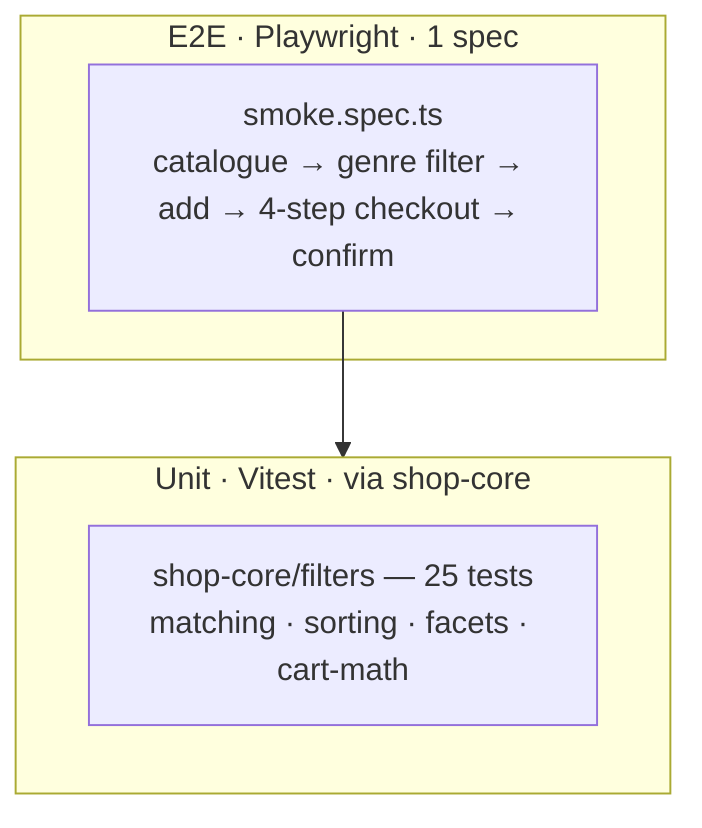

# Bookstore — testing documentation

> TDD discipline + AC traceability. Repo-wide rules:
> [`docs/programming/testing-strategy.md`](../../programming/testing-strategy.md).

## TDD workflow

Standard red → green → refactor:

1. **Red** — failing test first:
   - Pure logic on top of `shop-core` → unit test in
     `libs/shop-core/src/filters/<area>.spec.ts` (already covered).
   - Bookstore-specific predicates (language / format / year) →
     `libs/bookstore-data/src/filters/<area>.spec.ts` (to be added if
     needed; the base layer at 100% covers most cases).
   - End-to-end behaviour → Playwright spec in `apps/bookstore-e2e`.
2. **Green** — minimum implementation.
3. **Refactor** — lint enforces cognitive-complexity (15) +
   no-duplicate-string (5).

## Test pyramid



| Layer         | Count                 | Scope                                                                                                    | Runner     |
| ------------- | --------------------- | -------------------------------------------------------------------------------------------------------- | ---------- |
| Unit (shared) | 25                    | `libs/shop-core/src/filters/`                                                                            | Vitest 4   |
| Unit (domain) | 0                     | Bookstore predicates compose the shared layer; add tests when domain logic grows beyond simple wrappers. | —          |
| E2E           | 1 spec, 11 assertions | Catalogue → checkout flow                                                                                | Playwright |

## Acceptance criteria to test traceability

The bookstore inherits its AC from the **canonical shop-demo
acceptance criteria** documented per app. Each AC maps to its
implementation file + asserting test.

| AC-N  | Acceptance criterion                                     | Implementation                                                   | Asserting test                                          |
| ----- | -------------------------------------------------------- | ---------------------------------------------------------------- | ------------------------------------------------------- |
| AC-1  | Catalogue lists ≥ 20 products                            | `libs/bookstore-data/src/seed/catalogue.ts`                      | E2E: `cards.count() > 20` in `smoke.spec.ts:10`         |
| AC-2  | Genre facet narrows results                              | `bookstore-data/filters/matching.ts` + `FilterPanelComponent`    | E2E: clicks `filter-genre-fantasy` → grid still visible |
| AC-3  | Language / format / price / in-stock facets              | `BookFilters` + base predicates from `shop-core`                 | Covered by `shop-core/filters/matching.spec.ts`         |
| AC-4  | Sort works (price asc/desc, rating, name, popularity)    | `shop-core/filters/sorting.ts`                                   | `shop-core/filters/sorting.spec.ts` (7 tests)           |
| AC-5  | Empty-state for 0 hits                                   | `<ais-shop-empty-state>` from shop-ui                            | Manual; covered by E2E "filter-reset" path.             |
| AC-6  | Book detail with cover + bibliographic info              | `BookDetailComponent`                                            | Manual + E2E navigation.                                |
| AC-7  | Add to cart from card or detail                          | `(addToCart)` output → `cart.addLine(id)`                        | E2E: `card-add-to-cart` click                           |
| AC-8  | Cart persists across reloads                             | `ShopCartService` + `CART_STORAGE_KEY = 'ais.bookstore.cart.v1'` | Manual (E2E intentionally session-scoped).              |
| AC-9  | 4-step checkout (contact / delivery / invoice / summary) | `<ais-shop-checkout>` from shop-ui                               | E2E: 4-step traversal `smoke.spec.ts` lines 19-39       |
| AC-10 | Tests gate the build                                     | `libs/shop-core/vitest.config.ts` thresholds                     | CI: `pnpm nx test shop-core --coverage`                 |
| AC-11 | Playwright smoke green                                   | `apps/bookstore-e2e/src/smoke.spec.ts`                           | The spec itself.                                        |

## How to run

```bash
pnpm nx test shop-core              # 25 unit tests on the shared pure layer
pnpm nx test shop-core --coverage   # → coverage/libs/shop-core
pnpm nx e2e bookstore-e2e           # Playwright (chromium)
pnpm nx e2e bookstore-e2e -- --ui   # live debug
```

## Adding a new test (TDD recipe)

1. Add row to the [traceability matrix](#acceptance-criteria-to-test-traceability).
2. If the change is generic → add the test under
   `libs/shop-core/src/filters/`. If domain-specific → add under
   `libs/bookstore-data/src/filters/<area>.spec.ts` (and set up vitest
   config for the data lib).
3. Write the failing test → confirm red → implement → confirm green.
4. Run the full gate from the repo root:
   - `pnpm nx run-many -t lint test build --projects=bookstore,bookstore-data,bookstore-feature-catalogue`
   - `pnpm nx e2e bookstore-e2e`

5. Update this file + commit.

## Known gaps

| Gap                                           | Reason                                                                       | Mitigation                                                    |
| --------------------------------------------- | ---------------------------------------------------------------------------- | ------------------------------------------------------------- |
| No domain unit tests for `matchesBookFilters` | The base layer at 100% coverage exercises every branch the wrapper composes. | Add tests once `BookFilters` adds non-trivial predicates.     |
| Only chromium in Playwright                   | Smoke-tier demo.                                                             | Add firefox + webkit when cross-browser is required.          |
| No `BookstoreCatalogueService` TestBed test   | Signal services are thin; pure layer in shop-core covers the math.           | Add when service behaviour grows beyond a `computed()` chain. |
