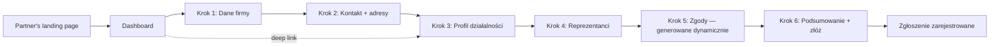

# Business-wizard — business view

## Vision

A guided 6-step onboarding survey that collects every piece of company data
an integrator partner needs from a new B2B client — once, in one place,
with cross-field validation that catches mistakes before they reach the
sales pipeline. Embed the survey into any landing page as a single
`<ais-business-wizard>` custom element; no Angular knowledge required from
the host site.

## Personas

| Persona               | Goal                                                           | Pain we remove                                                                                        |
| --------------------- | -------------------------------------------------------------- | ----------------------------------------------------------------------------------------------------- |
| **Founder / Owner**   | Onboard the company in one sitting with minimal back-and-forth | "Did I send the KRS document?" — single source, validated up-front                                    |
| **Sales rep**         | Receive structured data with NIP / REGON / KRS checksums valid | Free-text "company info" emails that need 3 follow-ups to be usable                                   |
| **Compliance team**   | Know which RODO / PSD2 / DPA consents apply per client         | Hand-curated consent lists per industry — now driven automatically by the survey's industry + segment |
| **Embedding partner** | Drop the survey on a marketing site without a build pipeline   | Custom React/Vue/Angular integration per host — the Web Component is a one-tag drop-in                |

## User journey

Steps are non-linear — the dashboard lets the user jump into any step
directly. Validation only blocks the final submit, not navigation.

## What the user sees per step

| #   | Step             | Key fields                                                                                                                | Conditional logic                                                                                 |
| --- | ---------------- | ------------------------------------------------------------------------------------------------------------------------- | ------------------------------------------------------------------------------------------------- |
| 1   | Dane firmy       | Nazwa, forma prawna, NIP, REGON, KRS, rok założenia, WWW                                                                  | KRS becomes required when legal form switches away from j.d.g. / s.c.                             |
| 2   | Kontakt + adresy | Email, dynamic phone array, dynamic address array (≥1 headquarters)                                                       | Cross-validator: at least one address has `purpose: headquarters`                                 |
| 3   | Profil           | Branża, segment B2B/B2C/B2G, przychody, pracownicy, koniec roku obrotowego, eksport tak/nie, języki robocze               | Industry + segment + export flag drive consent applicability in step 5                            |
| 4   | Reprezentanci    | Imię, rola (CEO/CFO/CTO/…), email, telefon, "uprawniony do podpisu"                                                       | At least one representative required                                                              |
| 5   | Zgody            | RODO B2B + regulamin (zawsze); PSD2 (finanse), DPA medyczne (zdrowie), klauzula B2C (mieszany segment), sankcje (eksport) | Dynamic — items rebuild whenever step 3 changes; `granted` flags preserved across rebuilds by key |
| 6   | Podsumowanie     | JSON snapshot of getRawValue(), accept-terms checkbox, Submit button                                                      | Submit gated on `form.valid && acceptTerms`. Sets `meta.submittedAt`; downstream POST is a TODO.  |

## Demo script (5 min)

1. Otwórz pulpit (`/`) — 6 płytek, każda z chip'em "Niedotknięte".
2. Wejdź w "Dane firmy" → wpisz **"Acme sp. z o.o."**, NIP **5252344078**,
   REGON **192597577**, KRS **0000123456**, rok 2010. Zmień formę prawną
   na "j.d.g." — KRS przestaje być wymagany.
3. Pulpit — chip pierwszej płytki przeskakuje na "Gotowe".
4. Wejdź w "Profil" → branża "Finanse i ubezpieczenia", eksport ON.
   Wróć do pulpitu, wejdź w "Zgody" — pojawiły się klauzule PSD2 i sankcje.
5. Wypełnij pozostałe kroki + zaakceptuj regulamin → "Złóż ankietę"
   wyświetla notkę "Ankieta zarejestrowana o…".
6. Otwórz `apps/business-wizard/src/element-demo.html` (po
   `pnpm build:business-wizard-element`) — ten sam kreator wewnątrz
   strony bez Angulara, jako `<ais-business-wizard/>`.

## KPI (target post-launch)

| Metric                                 | Target  |
| -------------------------------------- | ------- |
| Time-to-complete (median)              | < 8 min |
| Server-side validation rejections      | < 2 %   |
| Drop-off rate before "Złóż ankietę"    | < 25 %  |
| % submissions with valid NIP+REGON+KRS | > 98 %  |

## Out of scope (for now)

- Backend POST + persistence — current "submit" only stamps `meta.submittedAt`.
- PDF export — `wizard-util-pdf` is the personal-wizard equivalent; a B2B
  PDF template lands when the API + branding are signed off.
- Multi-language UI — Polish only for the demo. The dictionaries already
  separate `value` from `label` so translation is a per-key change.
