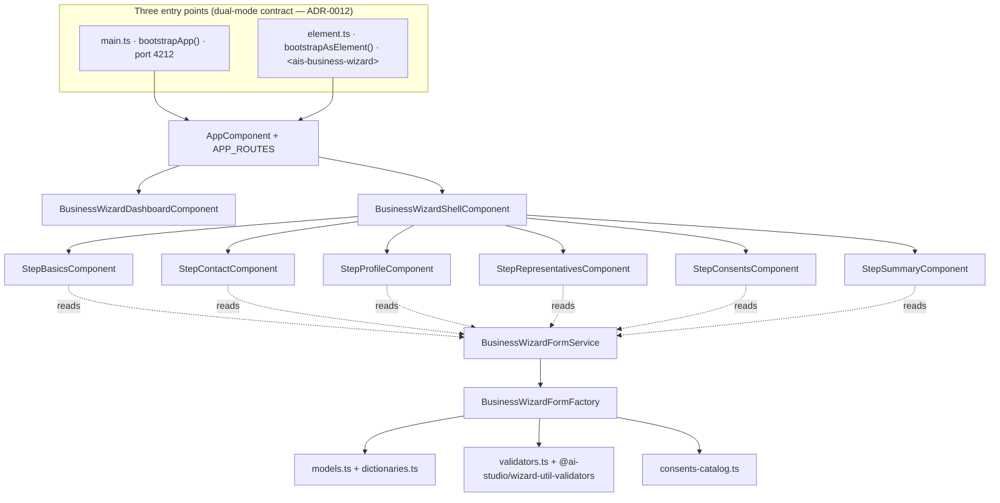

# Business-wizard — technical view

## Architecture



## Lib graph

| Lib                            | Tags                                   | Provides                                                                                               |
| ------------------------------ | -------------------------------------- | ------------------------------------------------------------------------------------------------------ |
| `libs/business-wizard-data`    | `scope:wizard · type:data-access`      | Models, dictionaries, validators (REGON/KRS/URL), consents catalog, FormGroup factory + signal service |
| `libs/business-wizard-feature` | `scope:wizard · type:feature`          | Dashboard, shell, 6 step components                                                                    |
| `libs/wizard-util-validators`  | `scope:wizard · type:util` (reused)    | NIP, Polish phone, Polish postal-code validators                                                       |
| `libs/shared-app-shell`        | `scope:shared · type:ui+util` (reused) | `bootstrapApp()`, `bootstrapAsElement()` (Web Component helper)                                        |

## Public APIs

### `BusinessWizardFormService`

```ts
@Injectable({ providedIn: 'root' })
class BusinessWizardFormService {
  readonly form: Signal<FormGroup>; // lazily built on first read
  reset(): void; // discards + rebuilds
}
```

The signal flips on `reset()`, so any consumer reading `form()` reactively
gets the new instance through Angular's reactive graph — no manual
subscriptions required.

### `BusinessWizardFormFactory`

```ts
@Injectable({ providedIn: 'root' })
class BusinessWizardFormFactory {
  build(destroyRef: DestroyRef): FormGroup;

  // FormArray helpers
  addPhone(root: FormGroup): void;
  removePhone(root: FormGroup, index: number): void;
  addAddress(root: FormGroup, purpose?: AddressPurpose): void;
  removeAddress(root: FormGroup, index: number): void;
  addLanguage(root: FormGroup): void;
  removeLanguage(root: FormGroup, index: number): void;
  addRepresentative(root: FormGroup): void;
  removeRepresentative(root: FormGroup, index: number): void;

  // Consent rebuild — triggered by profile valueChanges
  rebuildConsents(root: FormGroup): void;
}
```

### Conditional wiring (built into `factory.build()`)

| Trigger                                                  | Effect                                                                                                               |
| -------------------------------------------------------- | -------------------------------------------------------------------------------------------------------------------- |
| `companyBasics.legalForm` changes                        | KRS validator toggles between required and optional based on `KRS_REQUIRED_FORMS` set                                |
| `profile.industry / customerSegment / hasExport` changes | `consents.items` FormArray rebuilds from `applicableConsents()`, preserving `granted` flags by `key` across rebuilds |

### Validators (`validators.ts`)

| Function                   | Purpose                                                            |
| -------------------------- | ------------------------------------------------------------------ |
| `isValidRegon(value)`      | REGON-9 + REGON-14 checksum (GUS spec)                             |
| `regonValidator()`         | Angular wrapper — empty passes; combine with `Validators.required` |
| `isValidKrs(value)`        | 10-digit format check (no checksum, KRS is sequential)             |
| `krsValidator()`           | Angular wrapper                                                    |
| `isValidWebsiteUrl(value)` | http/https URL check via `new URL()` parser                        |
| `websiteUrlValidator()`    | Angular wrapper                                                    |

NIP validation reuses `nipValidator()` from `@ai-studio/wizard-util-validators`.

## Web Component contract (dual-mode)

Per [ADR-0012](../../adr/0012-app-dual-mode-web-components.md):

### Standalone SPA

```bash
pnpm start:business-wizard  # boots http://localhost:4212
```

### Web Component bundle

```bash
pnpm build:business-wizard-element
# → dist/apps/business-wizard-element/main.js + styles.css + assets
```

### Host page integration

```html
<link
  rel="stylesheet"
  href="https://fonts.googleapis.com/css2?family=Roboto:wght@400;500;700&display=swap"
/>
<link
  rel="stylesheet"
  href="https://fonts.googleapis.com/icon?family=Material+Icons"
/>
<link
  rel="stylesheet"
  href="./business-wizard-element/styles.css"
/>
<script
  type="module"
  src="./business-wizard-element/main.js"
></script>
<ais-business-wizard></ais-business-wizard>
```

The host page is responsible for the Material font + icon stylesheets —
they're loaded via `<link>` rather than bundled into the WC artefact to
keep the bundle small and let multiple AI Studio Web Components share a
single Material font load.

### Limitations of the WC mode

- **Routing is virtual** — `<ais-business-wizard>` runs its own Angular
  Router; the host page's URL bar is not aware of step navigation.
- **Each WC has its own Angular runtime** — embedding two AI Studio Web
  Components on one page ships Angular twice. For multi-app-on-one-page
  use the portal (ADR-0009) instead.
- **`@angular/elements` is a peer dep** — apps that build a WC must
  install it (the workspace dep is added in Phase 1 of the consolidated
  roadmap; until then add it locally to `apps/business-wizard/package.json`).

## Runbook

| Task                              | Command                                                                          |
| --------------------------------- | -------------------------------------------------------------------------------- |
| Serve standalone SPA              | `pnpm start:business-wizard`                                                     |
| Lint                              | `pnpm nx lint business-wizard business-wizard-data business-wizard-feature`      |
| Unit test (validators)            | `pnpm nx test business-wizard-data`                                              |
| Typecheck                         | `pnpm nx typecheck business-wizard business-wizard-data business-wizard-feature` |
| Build for production (standalone) | `pnpm nx build business-wizard`                                                  |
| Build Web Component bundle        | `pnpm build:business-wizard-element`                                             |
