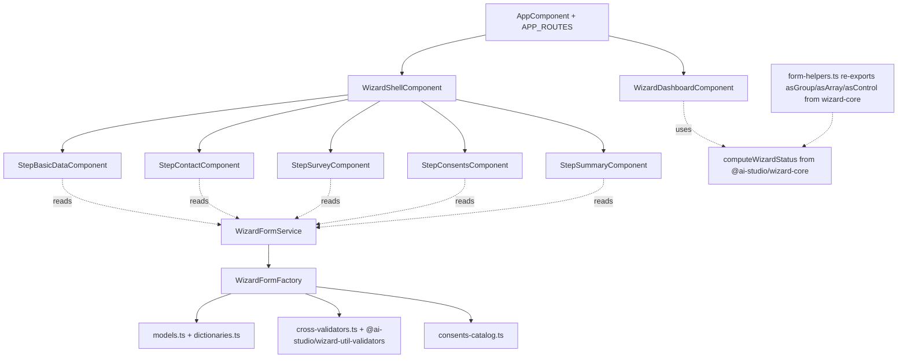

# Individual-wizard — technical view

## Architecture



## Lib graph

| Lib                                    | Tags                              | Provides                                                                         |
| -------------------------------------- | --------------------------------- | -------------------------------------------------------------------------------- |
| `libs/individual-wizard-data`          | `scope:wizard · type:data-access` | Models, dictionaries, cross-validators, consents catalog, form factory + service |
| `libs/individual-wizard-feature`       | `scope:wizard · type:feature`     | Dashboard, shell, 5 step components                                              |
| `libs/individual-wizard-ui`            | `scope:wizard · type:ui`          | `<ais-address-form>`, `<ais-consent-row>`, `<ais-form-error>` primitives         |
| `libs/individual-wizard-dev-tools`     | `scope:wizard · type:feature`     | `<ais-dev-fab>` floating dev panel for filling/inspecting the form               |
| `libs/wizard-core` (shared)            | `scope:wizard · type:util`        | Generic helpers (asGroup/asArray/asControl, computeWizardStatus)                 |
| `libs/wizard-util-validators` (shared) | `scope:wizard · type:util`        | NIP, PESEL, Polish phone/postal-code, age                                        |
| `libs/wizard-util-pdf` (shared)        | `scope:wizard · type:util`        | jsPDF-based summary export                                                       |

## Public APIs

### `WizardFormService`

```ts
@Injectable({ providedIn: 'root' })
class WizardFormService {
  readonly form: Signal<FormGroup>; // lazy-built on first read
  reset(): void; // discards + rebuilds
}
```

### `WizardFormFactory`

```ts
@Injectable({ providedIn: 'root' })
class WizardFormFactory {
  build(destroyRef: DestroyRef): FormGroup;

  // FormArray helpers
  addPhone / removePhone
  addAddress / removeAddress
  addLanguage / removeLanguage
  addContract / removeContract
  addKeyword / removeKeyword

  // Conditional rebuild
  rebuildConsents(root: FormGroup): void;
}
```

### Conditional wiring (built into `factory.build()`)

| Trigger                                                     | Effect                                                                                               |
| ----------------------------------------------------------- | ---------------------------------------------------------------------------------------------------- |
| `basicData.citizenship` changes                             | `basicData.pesel` required/optional toggle                                                           |
| `basicData.pesel` becomes valid                             | `dateOfBirth` + `gender` auto-filled and disabled (re-enabled on invalid PESEL)                      |
| `survey.educationLevel` changes                             | `survey.higherEducation` sub-group added/removed                                                     |
| `survey.higherEducation.field = 'IT'`                       | `survey.higherEducation.specialisation` added                                                        |
| `survey.educationLevel = 'phd' && branch ∈ {data,security}` | `survey.higherEducation.specialisation.thesis` added                                                 |
| `survey.employment.status ∈ {employed, self-employed}`      | `survey.employment.details` added                                                                    |
| Profile triggers change                                     | `consents.items` FormArray rebuilds from `applicableConsents()`, preserving `granted` flags by `key` |

## Runbook

| Task                          | Command                                                                                                                            |
| ----------------------------- | ---------------------------------------------------------------------------------------------------------------------------------- |
| Serve standalone SPA          | `pnpm start:individual-wizard`                                                                                                     |
| Lint                          | `pnpm nx lint individual-wizard individual-wizard-data individual-wizard-feature individual-wizard-ui individual-wizard-dev-tools` |
| Unit tests (data + dev-tools) | `pnpm nx run-many -t test --projects=individual-wizard-data,individual-wizard-dev-tools`                                           |
| Typecheck                     | `pnpm nx typecheck individual-wizard individual-wizard-data individual-wizard-feature`                                             |
| Build for production          | `pnpm nx build individual-wizard`                                                                                                  |
| E2E (Playwright)              | `pnpm nx e2e individual-wizard-e2e`                                                                                                |

## Sibling: business-wizard

The business-wizard ([README](../business-wizard/README.md)) is the B2B
counterpart sharing `libs/wizard-core`. Both apps follow the identical
wizard-shell pattern (MatStepper + dashboard + step-by-step deep-linking)
— only the schema, dictionaries and consents catalog differ.
