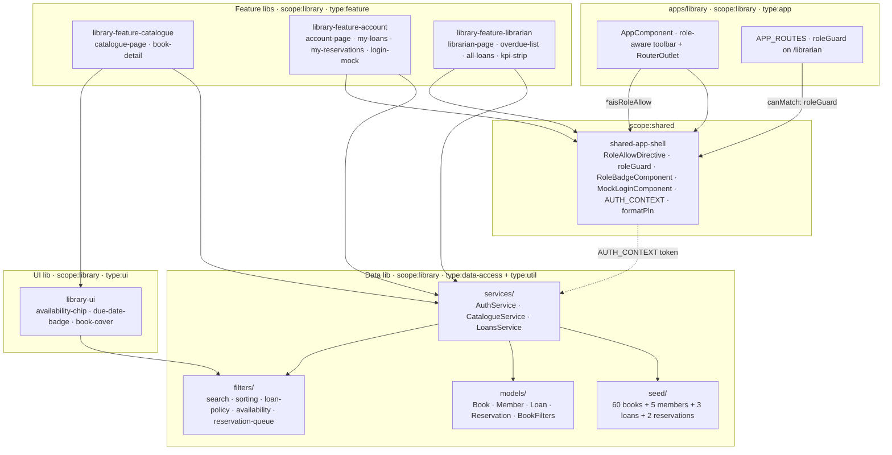

# Library — technical documentation

> Architecture + runbook. The "how" view. AC mapping → [`testing.md`](testing.md).
> Decisions → [ADR-0007](../../adr/0007-library-roles.md).

## Architecture overview



### Library structure

| Path                             | Scope           | Type                           | Public API                                                             |
| -------------------------------- | --------------- | ------------------------------ | ---------------------------------------------------------------------- |
| `apps/library`                   | `scope:library` | `type:app`                     | — (terminal)                                                           |
| `apps/library-e2e`               | —               | `type:e2e`                     | — (terminal)                                                           |
| `libs/library-data`              | `scope:library` | `type:data-access + type:util` | [`src/index.ts`](../../../libs/library-data/src/index.ts)              |
| `libs/library-ui`                | `scope:library` | `type:ui`                      | [`src/index.ts`](../../../libs/library-ui/src/index.ts)                |
| `libs/library-feature-catalogue` | `scope:library` | `type:feature`                 | [`src/index.ts`](../../../libs/library-feature-catalogue/src/index.ts) |
| `libs/library-feature-account`   | `scope:library` | `type:feature`                 | [`src/index.ts`](../../../libs/library-feature-account/src/index.ts)   |
| `libs/library-feature-librarian` | `scope:library` | `type:feature`                 | [`src/index.ts`](../../../libs/library-feature-librarian/src/index.ts) |

## Data model

| Type           | Purpose                                                                                                            |
| -------------- | ------------------------------------------------------------------------------------------------------------------ |
| `Book`         | Catalogue entry. `totalCopies` immutable per seed.                                                                 |
| `BookGenre`    | `fiction \| non-fiction \| fantasy \| sci-fi \| mystery \| biography \| history \| science \| children \| poetry`. |
| `BookLanguage` | `pl \| en \| de \| fr \| es`.                                                                                      |
| `Member`       | `{ id, firstName, lastName, role: 'reader' \| 'librarian', cardNumber }`.                                          |
| `Loan`         | Active or returned loan; `dueDate` derived from `LOAN_DAYS = 14`.                                                  |
| `Reservation`  | FIFO queue entry against a book.                                                                                   |
| `BookFilters`  | Active facet selection (genres, languages, year range, availability, query).                                       |
| `BookSortKey`  | `title-asc \| title-desc \| author-asc \| year-desc \| year-asc`.                                                  |

## State management

[ADR-0007](../../adr/0007-library-roles.md) chose **signals + services**
for state, and **defence-in-depth role gating** (`CanMatchFn` guard +
structural directive, both reading `AuthService.role()`).

| Service            | Owns                                                                                                         |
| ------------------ | ------------------------------------------------------------------------------------------------------------ |
| `AuthService`      | `currentMember` (writable) · `role` / `isReader` / `isLibrarian` (computed).                                 |
| `CatalogueService` | `books` (frozen) · `filters` · `sort` · `filtered` (computed) · `availabilityProbe` (set by `LoansService`). |
| `LoansService`     | `loans` · `reservations` (writable) · `availability` (computed) · `availabilityProbe` (computed wrapper).    |

`LoansService.availabilityProbe` is **injected back into** `CatalogueService`
in the `LoansService` constructor so the catalogue's `filtered` view can
honour the `availableOnly` facet without a circular service dep.

## Role gating

Two layers, single source of truth (`AuthService.role: Signal<MemberRole | null>`):

1. **Route layer** — `roleGuard(['librarian'], '/account')` factory from
   `@ai-studio/shared-app-shell`. Returns a `CanMatchFn` that
   `inject()`s the `AUTH_CONTEXT` (wired to `AuthService` in `main.ts`).
2. **UI layer** — `*aisRoleAllow="['librarian']"` structural directive.
   Hides menu items / buttons; uses an `effect()` so toggling roles
   re-renders.

### Why two layers

Defence in depth:

- The directive **hides** UI the user can't act on (UX).
- The guard **blocks** direct navigation by URL / bookmark (security).
- They cannot fall out of sync because they read the same signal.

Documented rationale: [ADR-0007 § Decision](../../adr/0007-library-roles.md#decision).

## Public APIs

### `@ai-studio/library-data`

```typescript
// Models
export type {
  Book,
  BookGenre,
  BookLanguage,
  Member,
  MemberRole,
  Loan,
  LoanStatus,
  Reservation,
  BookFilters,
  BookSortKey,
};
export { BOOK_GENRES, BOOK_LANGUAGES, EMPTY_FILTERS, BOOK_SORT_KEYS };

// Pure functions
export {
  matchesFilters,
  applyFilters,
  searchRank, // search
  sortBooks, // sorting
  issueLoan,
  daysOverdue,
  fineGrosze,
  canRenew,
  renewLoan,
  returnLoan, // loan policy
  buildAvailability,
  hasFreeCopy, // availability
  reservationPosition,
  queueForBook, // queue
  LOAN_DAYS,
  MAX_RENEWALS,
  FINE_GROSZE_PER_DAY, // constants
  type BookAvailability,
};

// Services
export { AuthService, CatalogueService, LoansService };

// Seed
export { BOOK_CATALOGUE, MEMBERS, LOANS, RESERVATIONS };
```

### `@ai-studio/library-ui`

```typescript
export { AvailabilityChipComponent }; // <ais-availability-chip [free]="…" [total]="…">
export { BookCoverComponent }; // <ais-book-cover [src]="…" [alt]="…">
export { DueDateBadgeComponent }; // <ais-due-date-badge [loan]="…" [today]="…">
```

Role-related primitives (`<ais-role-badge>`, `*aisRoleAllow`, `roleGuard`,
`<ais-mock-login>`) live in [`@ai-studio/shared-app-shell`](../../../libs/shared-app-shell).

### `@ai-studio/library-feature-*`

| Lib                         | Components                                                                                  |
| --------------------------- | ------------------------------------------------------------------------------------------- |
| `library-feature-catalogue` | `CataloguePageComponent`, `BookDetailComponent`                                             |
| `library-feature-account`   | `AccountPageComponent`, `LoginMockComponent`, `MyLoansComponent`, `MyReservationsComponent` |
| `library-feature-librarian` | `LibrarianPageComponent`, `OverdueListComponent`, `AllLoansComponent`, `KpiStripComponent`  |

## Routing

```typescript
// apps/library/src/app/app.routes.ts
APP_ROUTES = [
  { path: '',          loadComponent: → CataloguePageComponent  },
  { path: 'book/:id',  loadComponent: → BookDetailComponent     },
  { path: 'account',   loadComponent: → AccountPageComponent    },
  { path: 'librarian',
    canMatch: [roleGuard(['librarian'], '/account')],
    loadComponent: → LibrarianPageComponent                     },
  { path: '**',        component:    NotFoundComponent           },
];
```

All feature routes lazy-load. The `roleGuard` runs synchronously (reads
the role signal) before the chunk loads — non-librarians never
download `library-feature-librarian.js`.

## Wiring AUTH_CONTEXT

```typescript
// apps/library/src/main.ts
bootstrapApp(AppComponent, {
  providers: [
    provideRouter(APP_ROUTES, withComponentInputBinding()),
    provideHttpClient(withFetch()),
    { provide: AUTH_CONTEXT, useExisting: AuthService },
  ],
});
```

The shared `RoleAllowDirective` + `roleGuard` only know about
`AuthContext.role`. `AuthService` exposes that signal naturally;
no adapter needed.

## Algorithms

### Loan policy

```typescript
LOAN_DAYS = 14
MAX_RENEWALS = 1
FINE_GROSZE_PER_DAY = 50           // 0.50 zł / day

issueLoan({ id, bookId, memberId, today }) → Loan
  // dueDate = today + LOAN_DAYS

daysOverdue(loan, today) → number  // floor((today - loan.dueDate) / day)
fineGrosze(loan, today) → number   // max(0, daysOverdue) × FINE_GROSZE_PER_DAY

canRenew(loan) → boolean           // loan.status === 'active' && loan.renewals < MAX_RENEWALS
renewLoan(loan, today) → Loan      // dueDate = max(originalDue, today) + LOAN_DAYS
returnLoan(loan, today) → Loan     // status = 'returned', returnedAt = today
```

### Availability

```typescript
buildAvailability(books, loans, reservations) → Map<BookId, BookAvailability>
  // For each book: total, onLoan (active loans), reserved (active res), free = max(0, total - onLoan)

hasFreeCopy(bookId, availability) → boolean
```

### Reservation queue

FIFO ordered by `placedAt`:

```typescript
reservationPosition(bookId, memberId, reservations) → number  // 0 = not in queue, 1-based otherwise
queueForBook(bookId, reservations) → readonly Reservation[]
```

## Runbook

### Local development

```bash
pnpm start:library    # → http://localhost:4206
```

### Build

```bash
pnpm nx build library                                # production
pnpm nx build library --configuration=development    # dev sourcemaps
```

Bundle budgets in
[`apps/library/project.json`](../../../apps/library/project.json):
initial 750 kB warning / 1.5 MB error.

### Test

```bash
pnpm nx test library-data                  # 44 unit tests
pnpm nx test library-data --coverage       # coverage report
pnpm nx e2e library-e2e                    # Playwright smoke
```

### Lint + typecheck

```bash
pnpm nx run-many -t lint typecheck --projects=library,library-data,library-ui,library-feature-catalogue,library-feature-account,library-feature-librarian
```

## Troubleshooting

| Symptom                                      | Fix                                                                                                                                                |
| -------------------------------------------- | -------------------------------------------------------------------------------------------------------------------------------------------------- |
| `*aisRoleAllow` hides nothing                | Forgot `{ provide: AUTH_CONTEXT, useExisting: AuthService }` in `main.ts`.                                                                         |
| Route guard redirects in a loop              | `redirectTo` in `roleGuard()` points back to a route the guard blocks. Pick a public route (`/account` or `/`).                                    |
| Search returns 0 hits despite typing in seed | Check case — `searchRank` lowercases both sides; the haystack is `title + author + isbn`. ISBN substring search requires lowercase.                |
| Overdue chip shows wrong colour              | `daysOverdue` uses calendar-day math. Check `loan.dueDate` is ISO `YYYY-MM-DD`.                                                                    |
| `availableOnly` facet returns all books      | `LoansService` failed to wire `catalogue.availabilityProbe`. Confirm `LoansService` is injected somewhere on app boot (it's `providedIn: 'root'`). |

## Performance

| Operation                         | Budget   | Notes                                   |
| --------------------------------- | -------- | --------------------------------------- |
| Filter + sort over 60 books       | < 50 ms  | Pure JS.                                |
| MatTable pagination (10 per page) | < 16 ms  | Slice of `filtered()` per page.         |
| Lazy-route chunk fetch            | < 200 ms | Each feature is its own chunk.          |
| Mark-returned UI feedback         | < 16 ms  | `LoansService.return()` is signal-only. |

## Security

CSP defined in
[`apps/library/src/index.html`](../../../apps/library/src/index.html). No
cross-origin XHR; `connect-src 'self'`. Picsum.photos covers are
allowed via `img-src 'self' data: https:`.

`AuthService.currentMember` is a transient signal — no persistence.
Reload starts unauthenticated.

## Extensibility hooks

| Want to…                        | Touch                                                                                                                           |
| ------------------------------- | ------------------------------------------------------------------------------------------------------------------------------- |
| Wire real auth                  | Replace `AuthService` impl; keep the same `currentMember` + `role` shape. The `AUTH_CONTEXT` consumers continue working.        |
| Persist loans                   | Add an HTTP-backed implementation behind `LoansService`'s public methods.                                                       |
| Add a librarian-only action     | Add row in `librarian-page.component.ts`; gate via `*aisRoleAllow`. Add E2E.                                                    |
| Add a new role (e.g. archivist) | Extend `MemberRole`; update `roleGuard` calls; document in [ADR-0007 § Compliance](../../adr/0007-library-roles.md#compliance). |
| Add a third language            | Pull strings into `@ai-studio/shared-language` (already used by union-vault).                                                   |

## Web Component embedding

The app ships a Web Component build target ([ADR-0012](../../adr/0012-app-dual-mode-web-components.md)) so a non-Angular host page can drop in the entire feature with a single tag:

```bash
pnpm nx run library:build-element
# → dist/apps/library-element/{main.js,styles.css,polyfills.js,...}
```

```html
<link
  rel="stylesheet"
  href="https://fonts.googleapis.com/css2?family=Roboto:wght@400;500;700&display=swap"
/>
<link
  rel="stylesheet"
  href="https://fonts.googleapis.com/icon?family=Material+Icons"
/>
<link
  rel="stylesheet"
  href="./library-element/styles.css"
/>
<script
  type="module"
  src="./library-element/main.js"
></script>
<ais-library></ais-library>
```

Embeds the mock AuthService by default; swap to provideKeycloak() (from @ai-studio/keycloak-auth) for production deployments.

### Limitations

- Routing is virtual — the host page's URL bar does not reflect step / route changes inside the custom element.
- Each Web Component ships its own Angular runtime (~200 KB gzipped). For multiple AI Studio elements on one page, use the portal (ADR-0009) instead.
- CSP for the bundle is the host page's responsibility (the WC ships no <meta http-equiv="Content-Security-Policy">).

Combined demo of 4 Web Components side-by-side: [`docs/projects/elements-demo/index.html`](../elements-demo/index.html).
