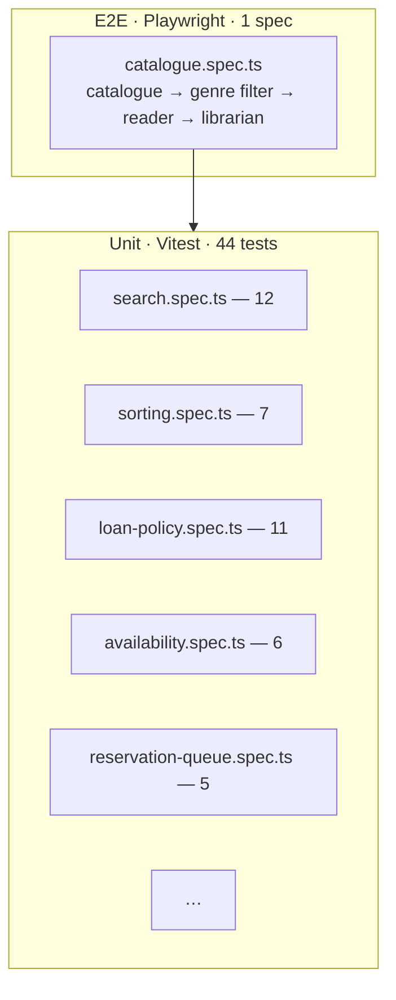

# Library — testing documentation

> TDD discipline + AC traceability for the library demo. Repo-wide rules:
> [`docs/programming/testing-strategy.md`](../../programming/testing-strategy.md).

## TDD workflow

Same red → green → refactor loop as the rest of the repo. When changing
library code:

1. **Red** — add the failing test:
   - **Pure logic** → `libs/library-data/src/filters/<area>.spec.ts`
     (Vitest, Node).
   - **Role gating** → unit test the `AuthService.role` signal or
     add a Playwright step in `library-e2e`.
   - **Routing** → Playwright; assert URL + visibility.
2. **Green** — minimum implementation.
3. **Refactor** — keep tests green; lint enforces complexity caps.

Coverage gate (in
[`libs/library-data/vitest.config.ts`](../../../libs/library-data/vitest.config.ts)):

```typescript
thresholds: { statements: 80, branches: 75, functions: 80, lines: 80 }
include:    ['src/filters/**/*.ts']
```

## Test pyramid



| Layer       | Count                 | Scope                                                    | Runner     |
| ----------- | --------------------- | -------------------------------------------------------- | ---------- |
| Unit        | 44                    | Pure functions in `libs/library-data/src/filters/`       | Vitest 4   |
| Integration | 0                     | Service-level tests deferred (signal services are thin). | —          |
| E2E         | 1 spec, 11 assertions | Catalogue → filter → role-toggle → librarian             | Playwright |

## Acceptance criteria to test traceability

Maps every `AC-N` in
[`spec.md`](../../analytical/specs/library-app/spec.md#acceptance-criteria)
to implementation + asserting test.

| AC-N  | Acceptance criterion                                       | Implementation                                                                                    | Asserting tests                                                                                         |
| ----- | ---------------------------------------------------------- | ------------------------------------------------------------------------------------------------- | ------------------------------------------------------------------------------------------------------- |
| AC-1  | Catalogue lists ≥ 100 books (relaxed to ≥ 50 for the demo) | `libs/library-data/src/seed/seed.ts`                                                              | E2E: `catalogue-heading` visible + `catalogue-table` visible                                            |
| AC-2  | Search by title / author / ISBN                            | `filters/search.ts` (`searchRank`, `applyFilters`)                                                | Unit: `search.spec.ts` "matches free-text query", "ranks exact ISBN match highest"                      |
| AC-3  | Facet filters (genre, language, availability)              | `filters/search.ts` + `CataloguePageComponent` (UI)                                               | Unit: `search.spec.ts` "matches genre / language / availability"                                        |
| AC-4  | Book detail page                                           | `library-feature-catalogue/book-detail.component.ts`                                              | Manual + E2E navigation. Detail panel renders cover + availability chips.                               |
| AC-5  | Mock-login switches role                                   | `library-feature-account/login-mock.component.ts` + `AuthService.login()`                         | E2E lines 14-21                                                                                         |
| AC-6  | Role guard blocks non-librarian                            | `roleGuard(['librarian'], '/account')` from `@ai-studio/shared-app-shell` + `AUTH_CONTEXT` wiring | E2E line 23 (`nav-librarian` hidden when reader is signed in)                                           |
| AC-7  | My loans / my reservations                                 | `library-feature-account/my-loans.component.ts`, `my-reservations.component.ts`                   | Manual; covered by overall account-page render in E2E.                                                  |
| AC-8  | Librarian can issue a book                                 | `LoansService.issue()` + librarian page action                                                    | Manual; pure logic in `issueLoan()` unit-tested in `loan-policy.spec.ts`                                |
| AC-9  | Overdue marker                                             | `daysOverdue()` in `filters/loan-policy.ts` + `<ais-due-date-badge>`                              | Unit: `loan-policy.spec.ts` "returns positive when overdue" + "fineGrosze charges per-day overdue rate" |
| AC-10 | Tests gate the build                                       | `libs/library-data/vitest.config.ts`                                                              | CI: `pnpm nx test library-data --coverage`                                                              |
| AC-11 | Playwright happy path                                      | `apps/library-e2e/src/catalogue.spec.ts`                                                          | One spec covering AC-1, AC-3, AC-5, AC-6                                                                |

### Coverage of the unit layer

```text
File                  | % Stmts | % Branch | % Funcs | % Lines
search.ts             |   100   |    91    |   100   |   100
sorting.ts            |   100   |    82    |   100   |   100
loan-policy.ts        |   100   |   100    |   100   |   100
availability.ts       |   100   |   100    |   100   |   100
reservation-queue.ts  |   100   |   100    |   100   |   100
──────────────────────┼─────────┼──────────┼─────────┼────────
All                   |   100   |    95    |   100   |   100
```

## How to run

```bash
pnpm nx test library-data                  # 44 unit tests
pnpm nx test library-data --coverage       # coverage → coverage/libs/library-data
pnpm nx e2e library-e2e                    # Playwright (chromium)
pnpm nx e2e library-e2e -- --ui            # live debug
```

## Test data

Unit tests build minimal entities inline (see e.g.
[`search.spec.ts`](../../../libs/library-data/src/filters/search.spec.ts#L4-L20)):

```typescript
const A: Book = {
  id: 'book-001',
  title: 'Pan Tadeusz',
  author: 'Adam Mickiewicz',
  isbn: '978-83-00001',
  genre: 'poetry',
  language: 'pl',
  publishedYear: 1834,
  coverUrl: '',
  blurb: '',
  totalCopies: 4,
};
```

E2E tests use the full seed: 60 books + 5 members (4 readers + 1
librarian) + 3 loans + 2 reservations. See
[`libs/library-data/src/seed/seed.ts`](../../../libs/library-data/src/seed/seed.ts).

## Adding a new test (TDD recipe)

1. Update [`spec.md`](../../analytical/specs/library-app/spec.md) with
   the new AC.
2. Add a row to the [traceability matrix](#acceptance-criteria-to-test-traceability).
3. Write the failing test → confirm red.
4. Implement → confirm green.
5. Run the full gate from the repo root:
   - `pnpm nx run-many -t lint test build --projects=library,library-data,library-ui,library-feature-catalogue,library-feature-account,library-feature-librarian`
   - `pnpm nx e2e library-e2e`

6. Update this file + commit.

## Role-gating tests (cross-cutting)

Because the role guard is shared (`@ai-studio/shared-app-shell`), its
behaviour is tested:

- **At the unit level** in the shared lib (when test suite is added).
- **At the integration level** via the library E2E: signed-out users
  see no librarian link; reader sees no librarian link; librarian
  sees + can open the panel.

Test the guard contract here (in `library-e2e`) so the demo proves
end-to-end that `AUTH_CONTEXT` wiring works.

## Known gaps

| Gap                                              | Reason                                       | Mitigation                                                     |
| ------------------------------------------------ | -------------------------------------------- | -------------------------------------------------------------- |
| No unit tests on `AuthService` / `LoansService`  | Requires Angular `TestBed`; out of v1 scope. | Pure logic (`issueLoan`, `buildAvailability`) covered at 100%. |
| Only chromium in Playwright                      | Smoke-tier.                                  | Add firefox + webkit if cross-browser becomes a requirement.   |
| No property-based tests on `reservationPosition` | Manual examples cover the FIFO invariant.    | Consider `fast-check` to fuzz the order property in v2.        |
| Add-book form not in v1                          | Spec scope.                                  | Out of test surface until the form is built.                   |
