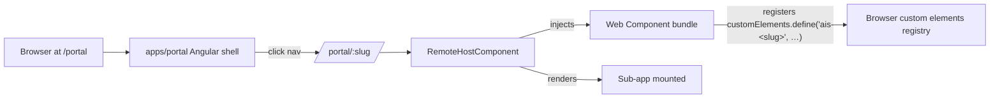

# Portal

> Host application (port **4220**) — a Material sidenav lists every demo
> in the monorepo; clicking a nav item lazy-loads the corresponding
> Web Component bundle into the main content area. WC-based composition
> per [ADR-0009](../../adr/0009-microfrontend-architecture.md). Native
> Federation is a future optimization tracked in Phase 3.5+ of the
> consolidated roadmap.

## Quickstart

```bash
# 1. Build every WC bundle once (parallel)
pnpm build:all-elements          # nx run-many -t build-element --parallel=4

# 2. Serve the portal (auto-copies dist/apps/<slug>-element/ as
#    /element-bundles/<slug>-element/ via the build target's `assets` field)
pnpm start:portal                # http://localhost:4220
```

Pierwsze otwarcie panelu sub-app pobiera `<script type="module" src="/element-bundles/<slug>-element/main.js">` na żądanie. Jeśli bundle nie istnieje (zapomniałeś `build-element`), portal renderuje przyjazny error state z instrukcją.

## Status

| Validator | Status                   |
| --------- | ------------------------ |
| lint      | ✅                       |
| typecheck | ✅                       |
| build     | ✅                       |
| test      | n/a (placeholder shell)  |
| e2e       | ⏸ planowany (Phase 3.10) |

## Layout

```
apps/portal/                   (scope:portal · type:app · port 4220)
  ├─ src/main.ts                                (standalone bootstrap)
  ├─ src/app/{app.component,app.routes}.ts     (PortalShellComponent host)
  └─ src/{index.html,styles.scss}               (Indigo + Cyan theme)

libs/portal-shell/             (scope:portal · type:ui)
  ├─ src/portal-nav.ts                          (RemoteEntry[] — single source of truth)
  ├─ src/portal-shell.component.ts              (toolbar + sidenav + router-outlet)
  ├─ src/portal-landing.component.ts            (card grid for /portal landing route)
  └─ src/remote-host.component.ts               (dynamic <script> injection + <ais-<slug>> render)
```

## Architektura



## ADRs

- [ADR-0009](../../adr/0009-microfrontend-architecture.md) — MFE architecture (`accepted`)
- [ADR-0012](../../adr/0012-app-dual-mode-web-components.md) — Web Components contract (`accepted`)

## Sibling

[`dashboard`](../dashboard/README.md) — first-class remote that the portal loads at the `/portal/dashboard` route.

## Limitations (v1)

- Each WC ships its own Angular runtime — multi-app navigation accumulates memory until the user reloads the portal page.
- Routing inside a WC is virtual (its router operates on a virtual URL); deep-linking into a remote's sub-route requires the portal to pass route data via custom-element attributes (Phase 3.5 follow-up).
- Shared singletons (`ShopCartService`, `AUTH_CONTEXT`) currently live per-WC. Hoisting to portal scope requires Native Federation (Phase 3 follow-up).
