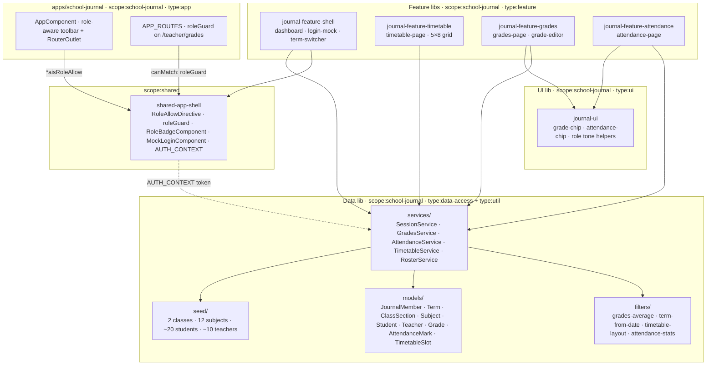

# School-journal — technical documentation

> Architecture + runbook. The "how" view. AC mapping → [`testing.md`](testing.md).
> Decisions → [ADR-0008](../../adr/0008-journal-context.md).

## Architecture overview



### Library structure

| Path                              | Scope                  | Type                           | Public API                                                              |
| --------------------------------- | ---------------------- | ------------------------------ | ----------------------------------------------------------------------- |
| `apps/school-journal`             | `scope:school-journal` | `type:app`                     | — (terminal)                                                            |
| `apps/school-journal-e2e`         | —                      | `type:e2e`                     | — (terminal)                                                            |
| `libs/journal-data`               | `scope:school-journal` | `type:data-access + type:util` | [`src/index.ts`](../../../libs/journal-data/src/index.ts)               |
| `libs/journal-ui`                 | `scope:school-journal` | `type:ui`                      | [`src/index.ts`](../../../libs/journal-ui/src/index.ts)                 |
| `libs/journal-feature-shell`      | `scope:school-journal` | `type:feature`                 | [`src/index.ts`](../../../libs/journal-feature-shell/src/index.ts)      |
| `libs/journal-feature-timetable`  | `scope:school-journal` | `type:feature`                 | [`src/index.ts`](../../../libs/journal-feature-timetable/src/index.ts)  |
| `libs/journal-feature-grades`     | `scope:school-journal` | `type:feature`                 | [`src/index.ts`](../../../libs/journal-feature-grades/src/index.ts)     |
| `libs/journal-feature-attendance` | `scope:school-journal` | `type:feature`                 | [`src/index.ts`](../../../libs/journal-feature-attendance/src/index.ts) |

## Data model

| Type               | Purpose                                                                                 |
| ------------------ | --------------------------------------------------------------------------------------- |
| `JournalMember`    | The active profile. Has `role`, `classSectionId`, `subjectIds`, `childId`.              |
| `JournalRole`      | `'student' \| 'parent' \| 'teacher' \| 'admin'`.                                        |
| `Term`             | `{ id: T1\|T2\|T3, label, startDate, endDate }`.                                        |
| `ClassSection`     | `{ id, label }` — e.g. `class-5a`, `class-5b`.                                          |
| `Subject`          | `{ id, label }` — 12 subjects total.                                                    |
| `Student`          | `{ id, firstName, lastName, classSectionId }`.                                          |
| `Teacher`          | `{ id, …, subjectIds, classSectionIds }`.                                               |
| `Grade`            | `{ value: 1..6, weight: 0.5..3.0, termId, studentId, subjectId, teacherId, issuedAt }`. |
| `AttendanceMark`   | `{ studentId, subjectId, date, period, status }`.                                       |
| `AttendanceStatus` | `'present' \| 'absent' \| 'late' \| 'excused'`.                                         |
| `TimetableSlot`    | `{ classSectionId, subjectId, teacherId, day, period, room }`.                          |
| `WeekDay`          | `'mon' \| 'tue' \| 'wed' \| 'thu' \| 'fri'`.                                            |

All entities are read from seed at boot; mutations stay in memory via
the signal services.

## State management

[ADR-0008](../../adr/0008-journal-context.md) chose **singleton
`SessionService`** as the source of truth for role + term + class
context. Other services consume it via `inject()` and build their
public-facing signals with `computed()`.

| Service             | Owns                                                                                                                                          |
| ------------------- | --------------------------------------------------------------------------------------------------------------------------------------------- |
| `SessionService`    | `currentMember` · `currentTerm` · `currentClassSectionId` · `role` (computed) · `today`.                                                      |
| `GradesService`     | `grades` (writable) · `currentStudentGrades` (computed, filtered by `session.currentTerm`) · `currentStudentAverages`. Add / update / remove. |
| `AttendanceService` | `marks` (writable) · `currentMarks` · `currentCounts`. `mark()` upserts a `(student, date, period)` triple.                                   |
| `TimetableService`  | `slots` (immutable from seed) · `currentClassSlots` · `currentGrid` (5×8 matrix).                                                             |
| `RosterService`     | `classSections` · `subjects` · `students` · `teachers` (frozen).                                                                              |

`SessionService` is the **only** service that holds writable state for
context selection. Everything else derives.

## Role and context

Two cross-cutting selections drive the view:

1. **Role** (`session.role()`) — gates UI via `*aisRoleAllow` and
   routes via `roleGuard(['teacher', 'admin'])`.
2. **Term** (`session.currentTerm()`) — every grade / attendance
   filter narrows by this signal.

Both read from the same `SessionService`. The shared role-allow
directive + guard see `session.role()` because `main.ts` provides:

```typescript
{ provide: AUTH_CONTEXT, useExisting: SessionService }
```

## Public APIs

### `@ai-studio/journal-data`

```typescript
// Models (types)
export type {
  JournalMember,
  JournalRole,
  Term,
  TermId,
  ClassSection,
  Subject,
  Student,
  Teacher,
  Grade,
  GradeValue,
  AttendanceMark,
  AttendanceStatus,
  TimetableSlot,
  WeekDay,
};

// Constants
export { ALL_TERMS, GRADE_VALUES, WEEK_DAYS, WEEK_DAY_LABELS, ATTENDANCE_LABELS };

// Pure functions
export {
  subjectAverages,
  formatAverage,
  isPassing,
  clampGradeValue, // grades
  termFromDate,
  isInTerm,
  termLabel, // terms
  buildTimetableGrid,
  hasConflict,
  slotsForDay, // timetable
  tallyAttendance,
  attendanceRate,
  marksForStudent,
  findMark,
  dailyCounts, // attendance
  TIMETABLE_PERIODS,
  type SubjectAverageMap,
  type TimetableGrid,
  type AttendanceCounts,
};

// Services
export { SessionService, GradesService, AttendanceService, TimetableService, RosterService };

// Seed
export {
  TODAY,
  TERMS,
  CLASS_SECTIONS,
  SUBJECTS,
  STUDENTS,
  TEACHERS,
  MEMBERS,
  GRADES,
  ATTENDANCE,
  TIMETABLE,
};
```

### `@ai-studio/journal-ui`

```typescript
export { AttendanceChipComponent }; // <ais-attendance-chip [status]="…">
export { GradeChipComponent }; // <ais-grade-chip [value]="…">
export { JOURNAL_ROLE_LABELS, JOURNAL_ROLE_TONES }; // Role → label / shared BadgeTone
```

Role-related primitives (`<ais-role-badge>`, `*aisRoleAllow`,
`roleGuard`, `<ais-mock-login>`) live in
[`@ai-studio/shared-app-shell`](../../../libs/shared-app-shell).

### `@ai-studio/journal-feature-*`

| Lib                          | Components                                                          |
| ---------------------------- | ------------------------------------------------------------------- |
| `journal-feature-shell`      | `DashboardComponent`, `LoginMockComponent`, `TermSwitcherComponent` |
| `journal-feature-timetable`  | `TimetablePageComponent`                                            |
| `journal-feature-grades`     | `GradesPageComponent`, `GradeEditorComponent`                       |
| `journal-feature-attendance` | `AttendancePageComponent`                                           |

## Routing

```typescript
// apps/school-journal/src/app/app.routes.ts
APP_ROUTES = [
  { path: '',          loadComponent: → DashboardComponent       },
  { path: 'timetable', loadComponent: → TimetablePageComponent   },
  { path: 'grades',    loadComponent: → GradesPageComponent      },
  { path: 'attendance',loadComponent: → AttendancePageComponent  },
  { path: 'teacher/grades',
    canMatch: [roleGuard(['teacher', 'admin'])],
    loadComponent: → GradeEditorComponent                        },
  { path: '**',        component:    NotFoundComponent           },
];
```

Default `roleGuard` redirect is `/` (the dashboard). All feature routes
lazy-load.

## Wiring AUTH_CONTEXT

```typescript
// apps/school-journal/src/main.ts
bootstrapApp(AppComponent, {
  providers: [
    provideRouter(APP_ROUTES, withComponentInputBinding()),
    provideHttpClient(withFetch()),
    { provide: AUTH_CONTEXT, useExisting: SessionService },
  ],
});
```

## Algorithms

### Weighted average

```typescript
subjectAverages(grades) → Map<SubjectId, number | null>
// For each grade, accumulate weight + value × weight.
// Empty (weight === 0) → null.
// Else: Σ(value·weight) / Σ(weight).
```

`formatAverage(null)` returns `'—'`; otherwise 2-decimal string.

### Timetable grid

```typescript
buildTimetableGrid(slots) → readonly (TimetableSlot | null)[][]   // 8 rows × 5 cols
// Rows: periods 1..8 (TIMETABLE_PERIODS).
// Cols: WEEK_DAYS order (mon..fri).
// Slots with out-of-range period are dropped.
// hasConflict() detects (class, day, period) collisions.
```

### Term from date

```typescript
termFromDate(terms, today) → Term | null
// Returns the term whose [startDate, endDate] inclusive contains `today`.
```

### Attendance

```typescript
tallyAttendance(marks) → { present, absent, late, excused }       // counts
attendanceRate({ present, absent, late, excused }) → number | null // (present + excused) / total
findMark(marks, studentId, date, period) → AttendanceMark | null   // O(n) lookup
dailyCounts(marks) → Map<Date, Map<Status, number>>                // for month view (future)
```

## Runbook

### Local development

```bash
pnpm start:school-journal     # → http://localhost:4207
```

### Build

```bash
pnpm nx build school-journal
```

Bundle budgets in
[`apps/school-journal/project.json`](../../../apps/school-journal/project.json):
initial 750 kB warning / 1.5 MB error.

### Test

```bash
pnpm nx test journal-data                  # 30 unit tests
pnpm nx test journal-data --coverage
pnpm nx e2e school-journal-e2e             # Playwright (chromium)
```

### Lint + typecheck

```bash
pnpm nx run-many -t lint typecheck --projects=school-journal,journal-data,journal-ui,journal-feature-shell,journal-feature-grades,journal-feature-timetable,journal-feature-attendance
```

## Troubleshooting

| Symptom                                       | Fix                                                                                                   |
| --------------------------------------------- | ----------------------------------------------------------------------------------------------------- |
| Toolbar shows no role badge after login       | Confirm `{ provide: AUTH_CONTEXT, useExisting: SessionService }` is present in `main.ts`.             |
| Grades view is empty for a logged-in student  | Term mismatch — seed grades all sit in T3. Switch the term-switcher chip to T3.                       |
| `roleGuard` redirect loop                     | `redirectTo` of `'/'` requires the dashboard to be unguarded. Don't gate the home route.              |
| Timetable cell shows `—` for a populated slot | The slot's `period` was 0 or > 8; `buildTimetableGrid` drops out-of-range slots silently. Check seed. |
| `JOURNAL_ROLE_TONES[role]` returns undefined  | A new `JournalRole` was added but the helper wasn't updated. Add the tone + label.                    |

## Performance

| Operation                                   | Budget  | Notes                                          |
| ------------------------------------------- | ------- | ---------------------------------------------- |
| Build the 5×8 grid                          | < 16 ms | Pure JS; 40 array slots.                       |
| Weighted-average across 1 student × 12 subj | < 1 ms  | Single pass per grade.                         |
| Switch term chip                            | < 16 ms | Signal swap; views re-render via `computed()`. |
| Switch profile chip                         | < 16 ms | Same.                                          |

## Security

CSP in
[`apps/school-journal/src/index.html`](../../../apps/school-journal/src/index.html)
forbids any external HTTP except Google Fonts CSS + woff2. No
Picsum.photos here (the demo doesn't load remote images).

`SessionService.currentMember` is transient — reload starts at
no-profile.

## Extensibility hooks

| Want to…                          | Touch                                                                                                                                   |
| --------------------------------- | --------------------------------------------------------------------------------------------------------------------------------------- |
| Wire real auth (Librus / SSO)     | Replace `SessionService` impl; expose the same signal shape. The `AUTH_CONTEXT` consumers don't change.                                 |
| Add a fourth class section        | Append to `CLASS_SECTIONS`; add students; refresh seed.                                                                                 |
| Add an attendance roll-call UI    | New component in `journal-feature-attendance`. Inject `AttendanceService.mark()`.                                                       |
| Add a fifth role (e.g. counselor) | Extend `JournalRole`; update `JOURNAL_ROLE_TONES` + `JOURNAL_ROLE_LABELS`; expand `roleGuard` calls; document in ADR-0008 § Compliance. |
| Localise (EN secondary)           | Lift PL strings to `@ai-studio/shared-language`.                                                                                        |

## Web Component embedding

The app ships a Web Component build target ([ADR-0012](../../adr/0012-app-dual-mode-web-components.md)) so a non-Angular host page can drop in the entire feature with a single tag:

```bash
pnpm nx run school-journal:build-element
# → dist/apps/school-journal-element/{main.js,styles.css,polyfills.js,...}
```

```html
<link
  rel="stylesheet"
  href="https://fonts.googleapis.com/css2?family=Roboto:wght@400;500;700&display=swap"
/>
<link
  rel="stylesheet"
  href="https://fonts.googleapis.com/icon?family=Material+Icons"
/>
<link
  rel="stylesheet"
  href="./school-journal-element/styles.css"
/>
<script
  type="module"
  src="./school-journal-element/main.js"
></script>
<ais-school-journal></ais-school-journal>
```

Role gating via AUTH_CONTEXT → SessionService; replace with provideKeycloak() for production.

### Limitations

- Routing is virtual — the host page's URL bar does not reflect step / route changes inside the custom element.
- Each Web Component ships its own Angular runtime (~200 KB gzipped). For multiple AI Studio elements on one page, use the portal (ADR-0009) instead.
- CSP for the bundle is the host page's responsibility (the WC ships no <meta http-equiv="Content-Security-Policy">).

Combined demo of 4 Web Components side-by-side: [`docs/projects/elements-demo/index.html`](../elements-demo/index.html).
