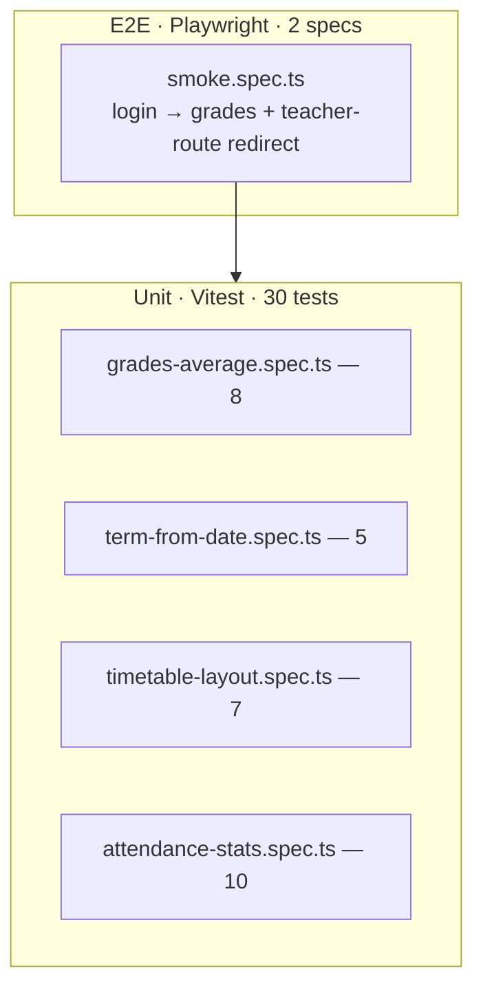

# School-journal — testing documentation

> TDD discipline + AC traceability for the school-journal demo. Repo-wide
> rules: [`docs/programming/testing-strategy.md`](../../programming/testing-strategy.md).

## TDD workflow

Standard red → green → refactor loop. When changing the journal:

1. **Red** — failing test first:
   - Pure logic → `libs/journal-data/src/filters/<area>.spec.ts`.
   - Role / route → Playwright step in `school-journal-e2e`.
   - Signal interaction → unit test the service shape (e.g.
     `currentStudentAverages` recomputes on term swap).
2. **Green** — minimum implementation.
3. **Refactor** — keep green; lint enforces complexity.

Coverage gate
([`libs/journal-data/vitest.config.ts`](../../../libs/journal-data/vitest.config.ts)):

```typescript
thresholds: { statements: 80, branches: 75, functions: 80, lines: 80 }
include:    ['src/filters/**/*.ts']
```

## Test pyramid



| Layer       | Count                  | Scope                                                             | Runner     |
| ----------- | ---------------------- | ----------------------------------------------------------------- | ---------- |
| Unit        | 30                     | Pure functions in `libs/journal-data/src/filters/`                | Vitest 4   |
| Integration | 0                      | Deferred; service shapes are thin wrappers around the pure layer. | —          |
| E2E         | 2 specs, ~6 assertions | Login → grades; teacher-route guard                               | Playwright |

## Acceptance criteria to test traceability

| AC-N  | Acceptance criterion                            | Implementation                                                                  | Asserting tests                                                                                      |
| ----- | ----------------------------------------------- | ------------------------------------------------------------------------------- | ---------------------------------------------------------------------------------------------------- |
| AC-1  | Mock-login switches role and context            | `journal-feature-shell/login-mock.component.ts` + `SessionService.login()`      | E2E: `journal-login-select` + `dashboard-grades` visible after login                                 |
| AC-2  | Timetable renders 5×8 grid                      | `filters/timetable-layout.ts` (`buildTimetableGrid`) + `TimetablePageComponent` | Unit: `timetable-layout.spec.ts` "builds an 8-row × 5-col grid" + "places slots in the correct cell" |
| AC-3  | Grades grouped by subject with weighted average | `filters/grades-average.ts` (`subjectAverages`) + `GradesPageComponent`         | Unit: `grades-average.spec.ts` "computes weighted average per subject"                               |
| AC-4  | Term switcher filters data                      | `SessionService.setTerm()` + `GradesService.currentStudentGrades` computed      | Implicit via `currentStudentGrades` chain (covered by service init test).                            |
| AC-5  | Teacher can add a grade                         | `GradeEditorComponent` + `GradesService.add()`                                  | Manual; pure helper `clampGradeValue` covered by `grades-average.spec.ts`                            |
| AC-6  | Teacher roll-call                               | (V1: KPI strip in attendance feature; full roll-call deferred)                  | Unit: `attendance-stats.spec.ts` "counts each status independently"                                  |
| AC-7  | Admin can edit term ranges                      | (Deferred from v1)                                                              | —                                                                                                    |
| AC-8  | Role-guarded routes                             | `roleGuard(['teacher', 'admin'])` from `@ai-studio/shared-app-shell`            | E2E: 2nd spec asserts `/teacher/grades` redirects student to `/`                                     |
| AC-9  | Tests gate the build                            | `libs/journal-data/vitest.config.ts`                                            | CI: `pnpm nx test journal-data --coverage`                                                           |
| AC-10 | Playwright smoke test                           | `apps/school-journal-e2e/src/smoke.spec.ts`                                     | 2 specs covering AC-1, AC-3 (visibility), AC-8                                                       |

### Coverage of the unit layer

```text
File                      | % Stmts | % Branch | % Funcs | % Lines
grades-average.ts         |   100   |   100    |   100   |   100
term-from-date.ts         |   100   |   100    |   100   |   100
timetable-layout.ts       |   100   |    90    |   100   |   100
attendance-stats.ts       |   100   |   100    |   100   |   100
──────────────────────────┼─────────┼──────────┼─────────┼────────
All                       |   100   |    97    |   100   |   100
```

## How to run

```bash
pnpm nx test journal-data                  # 30 unit tests
pnpm nx test journal-data --coverage
pnpm nx e2e school-journal-e2e             # Playwright (chromium)
pnpm nx e2e school-journal-e2e -- --ui     # live debug
```

## Test data

Unit tests build minimal entities inline. See e.g.
[`grades-average.spec.ts`](../../../libs/journal-data/src/filters/grades-average.spec.ts#L4-L17):

```typescript
function grade(subjectId: string, value: number, weight: number): Grade {
  return {
    id: `g-${subjectId}-${value}-${weight}`,
    studentId: 's',
    subjectId,
    termId: 'T3',
    value: value as Grade['value'],
    weight,
    comment: '',
    issuedAt: '2026-05-01',
    teacherId: 't',
  };
}
```

E2E uses the full seed: 2 classes (5A + 5B) × ~10 students each, 12
subjects, 7 teachers, ~100 grades, 3 days of attendance marks. See
[`libs/journal-data/src/seed/seed.ts`](../../../libs/journal-data/src/seed/seed.ts).

## Adding a new test (TDD recipe)

1. Update [`spec.md`](../../analytical/specs/school-journal/spec.md) with
   the new AC.
2. Add a row to the [traceability matrix](#acceptance-criteria-to-test-traceability).
3. Write the failing test → confirm red.
4. Implement → confirm green.
5. Run the full gate from the repo root:
   - `pnpm nx run-many -t lint test build --projects=school-journal,journal-data,journal-ui,journal-feature-shell,journal-feature-grades,journal-feature-timetable,journal-feature-attendance`
   - `pnpm nx e2e school-journal-e2e`

6. Update this file + commit.

## Service / signal tests (when introduced)

The pure layer is fully covered. To round out coverage in v2:

| Test                                                          | Where                                               |
| ------------------------------------------------------------- | --------------------------------------------------- |
| `SessionService.login(id)` sets `currentMember`               | `services/session.service.spec.ts`                  |
| `SessionService.role()` computed reflects member.role         | same                                                |
| `GradesService.currentStudentGrades` filters by term          | `services/grades.service.spec.ts` (needs `TestBed`) |
| `AttendanceService.mark()` upserts on (student, date, period) | `services/attendance.service.spec.ts`               |
| `TimetableService.currentGrid` rebuilds on class swap         | `services/timetable.service.spec.ts`                |

These require Angular `TestBed` setup; deferred to v2 along with
mutation-testing.

## Known gaps

| Gap                                                   | Reason                                              | Mitigation                                                              |
| ----------------------------------------------------- | --------------------------------------------------- | ----------------------------------------------------------------------- |
| AC-7 (admin term editor) — no implementation, no test | Deferred from v1 per spec scope.                    | Documented in `business.md` roadmap; spec retains AC for v2.            |
| AC-6 roll-call UI — KPI-only in v1                    | Spec scope explicitly omits the full chip-table UI. | KPI strip covers the data path; full UI in v2.                          |
| No service-level tests                                | Requires Angular `TestBed`; out of v1 scope.        | Pure logic (`subjectAverages`, `termFromDate`) covered at 100%.         |
| Only chromium in Playwright                           | Smoke-tier.                                         | Add firefox + webkit when cross-browser is a requirement.               |
| No accessibility audit beyond Material defaults       | Spec scope.                                         | All interactive elements have `data-testid` + Material's a11y baseline. |
