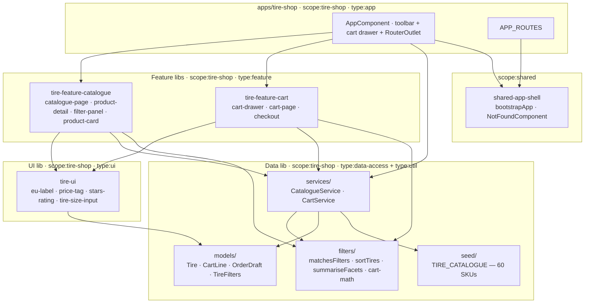

# Tire-shop — technical documentation

> Architecture + runbook + public API surface. The "how" view.
> AC mapping → [`testing.md`](testing.md). Decisions → [ADR-0006](../../adr/0006-tire-shop-state.md).

## Architecture overview



### Library structure

| Path                          | Scope             | Type                           | Public surface                                                      |
| ----------------------------- | ----------------- | ------------------------------ | ------------------------------------------------------------------- |
| `apps/tire-shop`              | `scope:tire-shop` | `type:app`                     | — (terminal)                                                        |
| `apps/tire-shop-e2e`          | —                 | `type:e2e`                     | — (terminal)                                                        |
| `libs/tire-data`              | `scope:tire-shop` | `type:data-access + type:util` | [`src/index.ts`](../../../libs/tire-data/src/index.ts)              |
| `libs/tire-ui`                | `scope:tire-shop` | `type:ui`                      | [`src/index.ts`](../../../libs/tire-ui/src/index.ts)                |
| `libs/tire-feature-catalogue` | `scope:tire-shop` | `type:feature`                 | [`src/index.ts`](../../../libs/tire-feature-catalogue/src/index.ts) |
| `libs/tire-feature-cart`      | `scope:tire-shop` | `type:feature`                 | [`src/index.ts`](../../../libs/tire-feature-cart/src/index.ts)      |

Module boundaries enforced by `@nx/enforce-module-boundaries` —
`scope:tire-shop` libs may depend only on `scope:shared`, other
`scope:tire-shop` libs and `scope:util` libs. See
[`eslint.config.mjs`](../../../eslint.config.mjs) for the exact rule.

## Data model

Defined in `libs/tire-data/src/models/`:

| Type           | Purpose                                                                       |
| -------------- | ----------------------------------------------------------------------------- |
| `Tire`         | One catalogue SKU. `priceCents` stored as integer grosze.                     |
| `TireSize`     | `{ width, profile, diameter }` (e.g. 205 / 55 R 16).                          |
| `TireSeason`   | `'summer' \| 'winter' \| 'all-season'`.                                       |
| `SpeedIndex`   | `'T' \| 'H' \| 'V' \| 'W' \| 'Y'` (passenger-car range).                      |
| `EuLabel`      | `{ fuel: A–E, wet: A–E, noiseDb }`.                                           |
| `TireFilters`  | Active facet selection (sets, dimensions, query, in-stock).                   |
| `TireSortKey`  | `'popularity' \| 'price-asc' \| 'price-desc' \| 'eu-label' \| 'rating-desc'`. |
| `CartLine`     | `{ tireId, quantity }` tuple in the cart.                                     |
| `CartSnapshot` | Serialised to `localStorage` under `ais.tire-shop.cart.v1`.                   |
| `OrderDraft`   | Final checkout payload (contact + delivery + invoice + lines).                |

`Tire` is immutable after seed. Cart state mutates through
`CartService` methods only.

## State management

[ADR-0006](../../adr/0006-tire-shop-state.md) chose **signals +
services + localStorage** over NgRx.

| Service            | Owns                                                                                                                  |
| ------------------ | --------------------------------------------------------------------------------------------------------------------- |
| `CatalogueService` | `tires` (frozen) · `filters` (mutable signal) · `sort` · `filtered` (computed) · `facets` (computed).                 |
| `CartService`      | `lines` (mutable signal) · `count` / `totalCents` / `views` (computed). Mirrored to `localStorage` on every mutation. |

Cart persistence:

```text
ais.tire-shop.cart.v1   →   { "version": 1, "lines": [ { "tireId": "tire-001", "quantity": 4 } ] }
```

Version key prefix lets future schema migrations bump to `v2` without
losing v1 readers. Browser-only side effects guarded by `isPlatformBrowser`
so Node test runs don't crash.

## Public APIs

Each lib's barrel (`src/index.ts`) is the only allowed import surface.

### `@ai-studio/tire-data`

```typescript
// Models (types only)
export type {
  Tire,
  TireSize,
  TireSeason,
  SpeedIndex,
  EuLabel,
  EuLabelGrade,
  CartLine,
  CartLineView,
  CartSnapshot,
  ContactDetails,
  DeliveryDetails,
  DeliveryMethod,
  InvoiceDetails,
  OrderDraft,
  TireFilters,
  TireSortKey,
};

// Constants
export { SPEED_INDEX_ORDER, EU_LABEL_GRADES, EMPTY_FILTERS, TIRE_SORT_KEYS };

// Pure functions
export {
  matchesFilters,
  applyFilters, // filter
  sortTires,
  euLabelScore,
  popularityScore, // sort
  summariseFacets, // facet counts
  buildCartView,
  cartTotal,
  cartCount,
  mergeLines, // cart math
  formatPln, // PLN currency
  type FacetSummary,
};

// Services (DI-provided)
export { CatalogueService, CartService };

// Seed
export { TIRE_CATALOGUE };
```

### `@ai-studio/tire-ui`

```typescript
export { EuLabelComponent }; // <ais-eu-label [grade]="…" axis="…">
export { PriceTagComponent }; // <ais-price-tag [priceCents]="…" [oldPrice]="…">
export { StarsRatingComponent }; // <ais-stars-rating [rating]="…" [reviewCount]="…">
export { TireSizeInputComponent }; // <ais-tire-size-input [width]…  (widthChange)…
```

### `@ai-studio/tire-feature-catalogue`

```typescript
export { CataloguePageComponent }; // <ais-catalogue-page>
export { ProductDetailComponent }; // <ais-product-detail [id]="…">
export { ProductCardComponent }; // <ais-product-card [tire]="…"  (addToCart)…
export { FilterPanelComponent }; // <ais-filter-panel>
```

### `@ai-studio/tire-feature-cart`

```typescript
export { CartDrawerComponent }; // <ais-cart-drawer [isOpen]="…" (closed)…
export { CartPageComponent }; // <ais-cart-page> — route /cart
export { CheckoutComponent }; // <ais-checkout>  — route /checkout
```

## Routing

```typescript
// apps/tire-shop/src/app/app.routes.ts
APP_ROUTES = [
  { path: '',           loadComponent: → CataloguePageComponent  }, // lazy
  { path: 'product/:id', loadComponent: → ProductDetailComponent }, // lazy
  { path: 'cart',       component:     CartPageComponent  },        // eager
  { path: 'checkout',   component:     CheckoutComponent  },        // eager
  { path: '**',         component:     NotFoundComponent  },
];
```

`/cart` and `/checkout` are eager so the cart drawer (header-mounted)
can statically import the cart feature without breaking the
"static-import-of-lazy-lib" lint rule.

## Algorithms

### Filter

`matchesFilters(tire, filters)` delegates each facet to a small
predicate to keep cognitive complexity under the lint budget (15):

```typescript
matchesFilters = AND(
  matchesSetFacet(filters.brands, tire.brand),
  matchesSetFacet(filters.seasons, tire.season),
  matchesSetFacet(filters.euFuel, tire.euLabel.fuel),
  matchesSetFacet(filters.euWet, tire.euLabel.wet),
  matchesSetFacet(filters.speedIndices, tire.speedIndex),
  matchesDimension(filters.width, tire.size.width),
  matchesDimension(filters.profile, tire.size.profile),
  matchesDimension(filters.diameter, tire.size.diameter),
  matchesPriceFloor(filters.minPriceCents, tire.priceCents),
  matchesPriceCeiling(filters.maxPriceCents, tire.priceCents),
  matchesStock(filters.inStockOnly, tire.stock),
  matchesQuery(tire, filters.query),
);
```

Each predicate is pure and unit-tested in
[`matching.spec.ts`](../../../libs/tire-data/src/filters/matching.spec.ts).

### Sort

| Key           | Comparator                                                |
| ------------- | --------------------------------------------------------- |
| `popularity`  | `popularityScore = rating × log(reviewCount + 1)` desc.   |
| `price-asc`   | `priceCents` ascending, tiebreak by `id`.                 |
| `price-desc`  | `priceCents` descending, tiebreak by `id`.                |
| `eu-label`    | `euLabelScore = rank(fuel) + rank(wet) + noiseDb/10` asc. |
| `rating-desc` | `rating` desc, tiebreak by `id`.                          |

Stable: every comparator breaks ties on `id` (`localeCompare`).

### Cart math

```typescript
mergeLines(existing, incoming) → readonly CartLine[]
buildCartView(lines, tires)   → readonly CartLineView[]   // joins lines × tires
cartTotal(views)              → number                    // Σ subtotal
cartCount(lines)              → number                    // Σ quantity
```

## Runbook

### Local development

```bash
pnpm install                      # one-shot
pnpm bootstrap                    # idempotent post-install fixups
pnpm start:tire-shop              # → http://localhost:4205
```

### Build

```bash
pnpm nx build tire-shop                      # production bundle
pnpm nx build tire-shop --configuration=development
```

Output: `dist/apps/tire-shop/browser/`.

Bundle budgets are configured in
[`apps/tire-shop/project.json`](../../../apps/tire-shop/project.json):

| Budget    | Warning | Error  |
| --------- | ------- | ------ |
| Initial   | 750 kB  | 1.5 MB |
| Component | 6 kB    | 10 kB  |

### Test

```bash
pnpm nx test tire-data             # unit tests (35)
pnpm nx test tire-data --coverage  # coverage report → coverage/libs/tire-data
pnpm nx e2e tire-shop-e2e          # Playwright happy path (chromium)
```

### Lint + typecheck

```bash
pnpm nx run-many -t lint typecheck --projects=tire-shop,tire-data,tire-ui,tire-feature-catalogue,tire-feature-cart
```

### Deploy

Out of scope for the demo. The build output is a standard static SPA;
any static host (Nginx, S3+CloudFront, Vercel) serves it. SPA fallback
to `index.html` is required.

## Troubleshooting

| Symptom                                        | Likely cause / fix                                                                                               |
| ---------------------------------------------- | ---------------------------------------------------------------------------------------------------------------- |
| `Cannot find package '@ai-studio/tire-data'`   | Missing path in [`tsconfig.base.json`](../../../tsconfig.base.json). Re-run `pnpm install`.                      |
| `@nx/enforce-module-boundaries` error          | A lib tried to depend outside its scope/type allowlist. Re-check tags in `project.json`.                         |
| `Cart drawer empty after add-to-cart`          | localStorage disabled (privacy mode). Service degrades silently; signal still works.                             |
| `Build budget warning ≥ 750 kB`                | Check `dist/apps/tire-shop/browser/`. Likely a new Material module imported eagerly.                             |
| `eslint No files matching the pattern "<lib>"` | The `lint` target wasn't inferred. Add `"lint": { "executor": "@nx/eslint:lint" }` to `project.json` explicitly. |

## Performance

| Operation                        | Budget       | Notes                                 |
| -------------------------------- | ------------ | ------------------------------------- |
| Filter any combo over 60 SKUs    | < 50 ms      | Pure JS, no Angular change detection. |
| Initial route render             | < 500 ms     | OnPush + lazy-loaded catalogue page.  |
| Cart drawer open animation       | 200 ms (mat) | Material default.                     |
| `localStorage.setItem(snapshot)` | < 2 ms       | < 4 kB JSON for a 50-line cart.       |

## Security

CSP defined in [`apps/tire-shop/src/index.html`](../../../apps/tire-shop/src/index.html#L14-L19):

```
default-src 'self';
script-src 'self' 'unsafe-inline';
style-src 'self' 'unsafe-inline' https://fonts.googleapis.com;
img-src 'self' data: https:;           # Picsum.photos placeholder gallery
font-src 'self' data: https://fonts.gstatic.com;
connect-src 'self';
base-uri 'self';
form-action 'self'
```

`frame-ancestors` is intentionally omitted (`<meta>` form is ignored
by browsers; set it as an HTTP header at deploy time).

See [`SECURITY.md`](../../../SECURITY.md) for the workspace-wide policy.

## Extensibility hooks

| Want to…                        | Touch                                                                                                                               |
| ------------------------------- | ----------------------------------------------------------------------------------------------------------------------------------- |
| Swap the dataset for a REST API | `CatalogueService` — replace `signal(TIRE_CATALOGUE)` with an HTTP-driven signal.                                                   |
| Add a new facet (load index)    | Add field to `TireFilters` + predicate in `matching.ts` + UI checkbox group in `filter-panel.component.ts`.                         |
| Add a new sort key              | Add to `TIRE_SORT_KEYS` + comparator branch in `sortTires`.                                                                         |
| Add a payment provider          | Replace `placeOrder()` mock in `checkout.component.ts` with a real call. Move out of `tire-data` to a new `tire-data-payments` lib. |
| Localise (EN / DE)              | Wrap strings with `@ai-studio/shared-language` toggle.                                                                              |

## Web Component embedding

The app ships a Web Component build target ([ADR-0012](../../adr/0012-app-dual-mode-web-components.md)) so a non-Angular host page can drop in the entire feature with a single tag:

```bash
pnpm nx run tire-shop:build-element
# → dist/apps/tire-shop-element/{main.js,styles.css,polyfills.js,...}
```

```html
<link
  rel="stylesheet"
  href="https://fonts.googleapis.com/css2?family=Roboto:wght@400;500;700&display=swap"
/>
<link
  rel="stylesheet"
  href="https://fonts.googleapis.com/icon?family=Material+Icons"
/>
<link
  rel="stylesheet"
  href="./tire-shop-element/styles.css"
/>
<script
  type="module"
  src="./tire-shop-element/main.js"
></script>
<ais-tire-shop></ais-tire-shop>
```

Self-contained — predates the shop-core split, so the bundle is slightly heavier than the bookstore/tools/toy variants.

### Limitations

- Routing is virtual — the host page's URL bar does not reflect step / route changes inside the custom element.
- Each Web Component ships its own Angular runtime (~200 KB gzipped). For multiple AI Studio elements on one page, use the portal (ADR-0009) instead.
- CSP for the bundle is the host page's responsibility (the WC ships no <meta http-equiv="Content-Security-Policy">).

Combined demo of 4 Web Components side-by-side: [`docs/projects/elements-demo/index.html`](../elements-demo/index.html).
