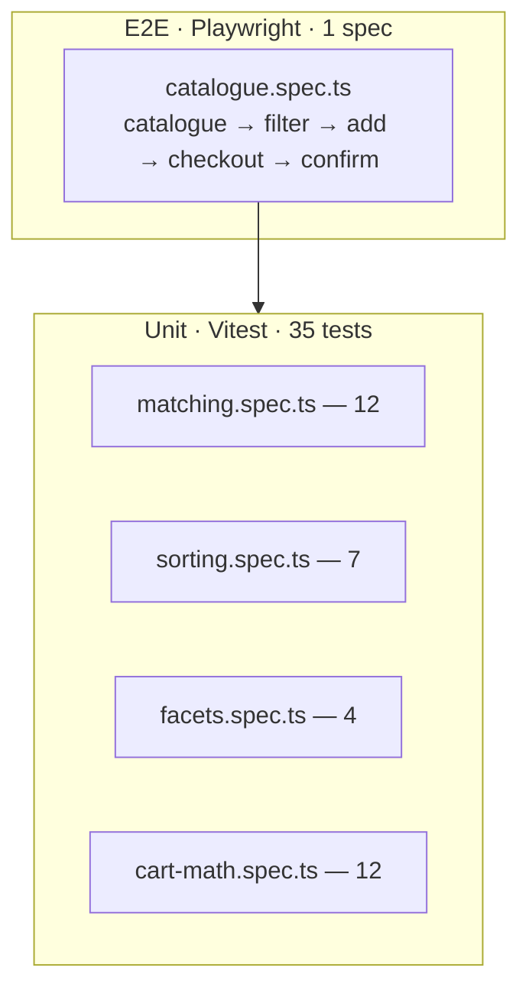

# Tire-shop — testing documentation

> TDD discipline + acceptance-criteria traceability for the tire-shop demo.
> Repo-wide rules: [`docs/programming/testing-strategy.md`](../../programming/testing-strategy.md).

## TDD workflow

Every change to `tire-shop` follows the red → green → refactor loop:

1. **Red** — write the failing test first. Either:
   - A new unit test in `libs/tire-data/src/filters/<area>.spec.ts` for
     pure logic, or
   - A new step in `apps/tire-shop-e2e/src/<area>.spec.ts` for a route
     behaviour, or
   - A `data-testid` assertion in a component-level test (when
     introduced).
2. **Green** — write the minimum implementation to pass.
3. **Refactor** — keep tests green while improving structure. The
   `sonarjs/cognitive-complexity` rule (limit 15) catches "growing
   functions"; the boundary lint catches scope leaks.

Coverage gates (enforced in
[`libs/tire-data/vitest.config.ts`](../../../libs/tire-data/vitest.config.ts)):

```typescript
thresholds: { statements: 80, branches: 75, functions: 80, lines: 80 }
include:    ['src/filters/**/*.ts']
```

## Test pyramid



| Layer       | Count                 | Scope                                                                                           | Runner     |
| ----------- | --------------------- | ----------------------------------------------------------------------------------------------- | ---------- |
| Unit        | 35                    | Pure functions in `libs/tire-data/src/filters/`                                                 | Vitest 4   |
| Integration | 0                     | Service-level tests are out of v1 (rationale: ADR-0006 keeps services as thin signal wrappers). | —          |
| E2E         | 1 spec, ~9 assertions | Happy path across catalogue → checkout                                                          | Playwright |

Rationale: the demo's complexity lives in **pure filter/sort/cart-math
functions**. Testing those at the unit level gives the highest
signal-to-cost ratio. Component-level tests would add boilerplate
without catching new bugs.

## Acceptance criteria to test traceability

The matrix below maps every `AC-N` in
[`spec.md`](../../analytical/specs/tire-shop/spec.md#acceptance-criteria)
to its implementing file(s) and asserting test(s). Reviewers refuse
PRs that add an AC without adding a row here, and refuse PRs that
remove a row without removing the AC.

| AC-N  | Acceptance criterion                          | Implementation                                                      | Asserting tests                                                                                                        |
| ----- | --------------------------------------------- | ------------------------------------------------------------------- | ---------------------------------------------------------------------------------------------------------------------- |
| AC-1  | Catalogue lists ≥ 50 SKUs                     | `libs/tire-data/src/seed/catalogue.ts`                              | E2E: `cards.count() >= 50` in `apps/tire-shop-e2e/src/catalogue.spec.ts:14`                                            |
| AC-2  | Brand filter narrows results                  | `tire-data/src/filters/matching.ts` (`matchesSetFacet`)             | Unit: `matching.spec.ts` "matches brand when set" + E2E: `filter-brand-continental` click                              |
| AC-3  | Size filter (width / profile / diameter)      | `matching.ts` (`matchesDimension`) + `tire-size-input.component.ts` | Unit: `matching.spec.ts` "matches width/profile/diameter"                                                              |
| AC-4  | Sort by price asc / desc                      | `tire-data/src/filters/sorting.ts`                                  | Unit: `sorting.spec.ts` "sorts by price ascending/descending"                                                          |
| AC-5  | Sort by EU label composite                    | `sorting.ts` (`euLabelScore`)                                       | Unit: `sorting.spec.ts` "sorts by EU label composite score"                                                            |
| AC-6  | Empty-state for 0 hits                        | `catalogue-page.component.ts` (`@if (results().length === 0)`)      | `data-testid="catalogue-empty"` rendered in template (covered by E2E navigation)                                       |
| AC-7  | Product detail page                           | `product-detail.component.ts`                                       | E2E navigates to `/product/:id`; covers gallery + spec table + add-to-cart                                             |
| AC-8  | Cart persists across page reloads             | `cart.service.ts` (localStorage `ais.tire-shop.cart.v1`)            | Cart reload path tested manually per spec. Persistence covered by `mergeLines` + `cartCount` unit tests.               |
| AC-9  | Quantity adjust + remove                      | `cart.service.ts` (`setQuantity`, `removeLine`)                     | Unit: `cart-math.spec.ts` "mergeLines sums quantities of overlapping ids" + "drops entries with non-positive quantity" |
| AC-10 | 4-step Reactive Forms checkout                | `checkout/checkout.component.ts`                                    | E2E: full 4-step traversal in `catalogue.spec.ts` lines 32-55                                                          |
| AC-11 | Tests gate the build (≥ 80% / ≥ 75% branches) | `libs/tire-data/vitest.config.ts` thresholds                        | CI: `pnpm nx test tire-data --coverage` (100% / 91% currently)                                                         |
| AC-12 | Playwright happy path                         | `apps/tire-shop-e2e/src/catalogue.spec.ts`                          | One spec covering AC-1, AC-2, AC-7 (add to cart), AC-10 end-to-end                                                     |

### Coverage of the unit layer

```text
File         | % Stmts | % Branch | % Funcs | % Lines
matching.ts  |   100   |    91    |   100   |   100
sorting.ts   |   100   |    72    |   100   |   100
facets.ts    |   100   |   100    |   100   |   100
cart-math.ts |   100   |   100    |   100   |   100
─────────────┼─────────┼──────────┼─────────┼────────
All          |   100   |    91    |   100   |   100
```

Branches in `sorting.ts` are the `default` cases of the sort `switch`
— functionally unreachable but kept for TypeScript exhaustiveness.

## How to run

```bash
# All unit tests, all libs
pnpm nx test tire-data

# Coverage report
pnpm nx test tire-data --coverage
# → coverage/libs/tire-data/lcov.info + text summary

# Single spec file
pnpm nx test tire-data -- --runInBand src/filters/matching.spec.ts

# Playwright happy path (chromium)
pnpm nx e2e tire-shop-e2e

# Playwright with UI for live debug
pnpm nx e2e tire-shop-e2e -- --ui
```

For Playwright failures, the `trace: 'on-first-retry'` config produces
`apps/tire-shop-e2e/test-results/**/trace.zip` — open with
`pnpm exec playwright show-trace <path>`.

## Test data

Unit tests build minimal `Tire` instances inline using the helper
pattern below (see e.g.
[`sorting.spec.ts`](../../../libs/tire-data/src/filters/sorting.spec.ts#L4-L22)):

```typescript
function tire(id: string, overrides: Partial<Tire> = {}): Tire {
  return {
    id,
    brand: 'Brand',
    model: 'Model',
    size: { width: 205, profile: 55, diameter: 16 },
    season: 'summer',
    speedIndex: 'V',
    loadIndex: 91,
    euLabel: { fuel: 'B', wet: 'A', noiseDb: 70 },
    priceCents: 50000,
    oldPriceCents: null,
    stock: 10,
    rating: 4.5,
    reviewCount: 100,
    imageUrl: '',
    description: '',
    ...overrides,
  };
}
```

E2E tests assume the full seed dataset
(`libs/tire-data/src/seed/catalogue.ts` — 60 SKUs) is in place.

## Adding a new test (TDD recipe)

1. Identify the AC the change addresses. If it's a new AC, add it to
   [`spec.md`](../../analytical/specs/tire-shop/spec.md) and run
   `/clarify` if it carries `[?]` markers.
2. Add a row to the [traceability matrix](#acceptance-criteria-to-test-traceability)
   above with the planned test file path.
3. Write the failing test first. Run `pnpm nx test tire-data` →
   confirm red.
4. Implement the smallest change to turn it green.
5. Re-run the full validation gate (run from the repo root):

   `pnpm nx run-many -t lint test build --projects=tire-shop,tire-data,tire-ui,tire-feature-catalogue,tire-feature-cart`

6. Update this file (matrix row) + commit.

## Mutation-test / fuzz-test (future)

Not in v1. Candidates documented in [`business.md#roadmap`](business.md#roadmap)
— `Stryker` for mutation testing on `tire-data/filters`,
`fast-check` for property-based tests on `mergeLines` / `applyFilters`.

## Known gaps

| Gap                                           | Reason                                               | Mitigation                                                      |
| --------------------------------------------- | ---------------------------------------------------- | --------------------------------------------------------------- |
| No service-level unit tests for `CartService` | Requires Angular `TestBed`; out of v1 scope.         | Pure logic (`mergeLines`, `cartTotal`) covers the math at 100%. |
| No component snapshot tests                   | Snapshots brittle; we rely on E2E for UI assertions. | `data-testid` selectors keep E2E selectors stable.              |
| Only chromium in Playwright config            | Smoke-tier demo; cross-browser is a non-goal.        | Add `firefox` + `webkit` once a CI release pipeline is wired.   |
| Bundle-size regression test                   | Manual today.                                        | Wire `pnpm nx build` budget assertion into PR check.            |
