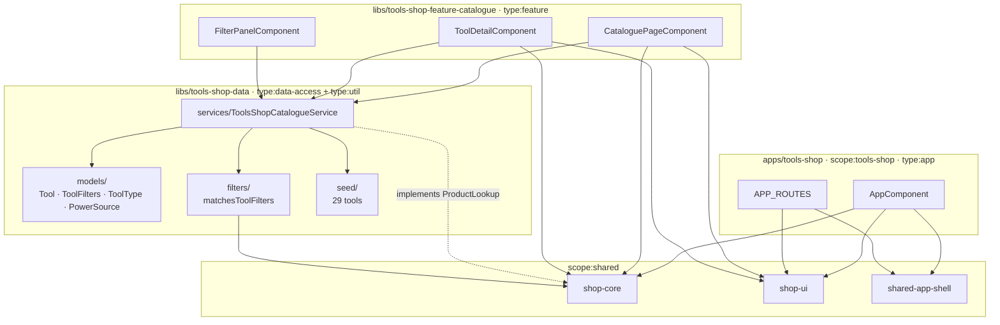

# Tools-shop — technical documentation

> Architecture + runbook for the tools-shop demo. AC mapping →
> [`testing.md`](testing.md).

## Architecture overview



### Library structure

| Path                                | Scope              | Type                           | Public API                                                                |
| ----------------------------------- | ------------------ | ------------------------------ | ------------------------------------------------------------------------- |
| `apps/tools-shop`                   | `scope:tools-shop` | `type:app`                     | — (terminal)                                                              |
| `apps/tools-shop-e2e`               | —                  | `type:e2e`                     | — (terminal)                                                              |
| `libs/tools-shop-data`              | `scope:tools-shop` | `type:data-access + type:util` | [`src/index.ts`](../../../libs/tools-shop-data/src/index.ts)              |
| `libs/tools-shop-feature-catalogue` | `scope:tools-shop` | `type:feature`                 | [`src/index.ts`](../../../libs/tools-shop-feature-catalogue/src/index.ts) |

## Data model

```typescript
interface Tool extends BaseProduct {
  readonly toolType:
    | 'drill'
    | 'saw'
    | 'grinder'
    | 'sander'
    | 'screwdriver'
    | 'wrench'
    | 'hammer'
    | 'measuring'
    | 'safety';
  readonly powerSource: 'manual' | 'corded' | 'battery' | 'pneumatic';
  readonly voltage: number | null;
  readonly weightKg: number;
  readonly warrantyMonths: number;
  readonly skuCode: string;
}

interface ToolFilters extends BaseFilters {
  readonly toolTypes: ReadonlySet<ToolType>;
  readonly powerSources: ReadonlySet<PowerSource>;
}
```

## Cart wiring

```typescript
// apps/tools-shop/src/main.ts
{ provide: PRODUCT_LOOKUP,    useExisting: ToolsShopCatalogueService },
{ provide: CART_STORAGE_KEY,  useValue:    'ais.tools-shop.cart.v1' },
```

## Routing

```typescript
APP_ROUTES = [
  { path: '',        loadComponent: → CataloguePageComponent },
  { path: 'tool/:id',loadComponent: → ToolDetailComponent    },
  { path: 'cart',    component:     CartPageComponent  },
  { path: 'checkout',component:     CheckoutComponent },
  { path: '**',      component:     NotFoundComponent },
];
```

## Public APIs

### `@ai-studio/tools-shop-data`

```typescript
export type { Tool, ToolFilters, ToolType, PowerSource };
export { TOOL_TYPES, POWER_SOURCES, TOOL_CATEGORIES, EMPTY_TOOL_FILTERS };
export { matchesToolFilters, applyToolFilters };
export { ToolsShopCatalogueService };
export { TOOL_CATALOGUE };
```

### `@ai-studio/tools-shop-feature-catalogue`

```typescript
export { CataloguePageComponent }; // <ais-tools-shop-catalogue-page>
export { ToolDetailComponent }; // <ais-tools-shop-tool-detail [id]="…">
export { FilterPanelComponent }; // <ais-tools-shop-filter-panel>
```

## Runbook

```bash
pnpm start:tools-shop                 # → http://localhost:4209
pnpm nx build tools-shop              # production bundle
pnpm nx lint tools-shop               # eslint
pnpm nx e2e tools-shop-e2e            # Playwright (chromium)
```

Bundle budgets in
[`apps/tools-shop/project.json`](../../../apps/tools-shop/project.json):
initial 900 kB warning / 1.5 MB error (raised because the 4-step
Material stepper from `shop-ui` is heavy).

## Troubleshooting

| Symptom                                        | Fix                                                                                         |
| ---------------------------------------------- | ------------------------------------------------------------------------------------------- |
| Cart drawer empty after add-to-cart            | Missing `{ provide: PRODUCT_LOOKUP, useExisting: ToolsShopCatalogueService }` in `main.ts`. |
| `null` voltage breaks the chip                 | Detail template guards `@if (tool.voltage !== null)`.                                       |
| Filter panel doesn't react to category toggles | `category` chips on the toolbar use the base `categories` Set, not `toolTypes`.             |

## Extensibility hooks

- New tool attribute (e.g. `accessoryCompatible: boolean`) → add to
  `Tool` model + seed + (optionally) `ToolFilters`.
- Wishlist → new `ShopWishlistService` mirroring `ShopCartService`'s
  signal/localStorage pattern.
- Brand-specific landing pages → static route per brand reading from
  `ToolsShopCatalogueService.facets().brandCounts`.

## Web Component embedding

The app ships a Web Component build target ([ADR-0012](../../adr/0012-app-dual-mode-web-components.md)) so a non-Angular host page can drop in the entire feature with a single tag:

```bash
pnpm nx run tools-shop:build-element
# → dist/apps/tools-shop-element/{main.js,styles.css,polyfills.js,...}
```

```html
<link
  rel="stylesheet"
  href="https://fonts.googleapis.com/css2?family=Roboto:wght@400;500;700&display=swap"
/>
<link
  rel="stylesheet"
  href="https://fonts.googleapis.com/icon?family=Material+Icons"
/>
<link
  rel="stylesheet"
  href="./tools-shop-element/styles.css"
/>
<script
  type="module"
  src="./tools-shop-element/main.js"
></script>
<ais-tools-shop></ais-tools-shop>
```

Wires the tools catalogue into the shared ShopCartService; same WC pattern as bookstore.

### Limitations

- Routing is virtual — the host page's URL bar does not reflect step / route changes inside the custom element.
- Each Web Component ships its own Angular runtime (~200 KB gzipped). For multiple AI Studio elements on one page, use the portal (ADR-0009) instead.
- CSP for the bundle is the host page's responsibility (the WC ships no <meta http-equiv="Content-Security-Policy">).

Combined demo of 4 Web Components side-by-side: [`docs/projects/elements-demo/index.html`](../elements-demo/index.html).
