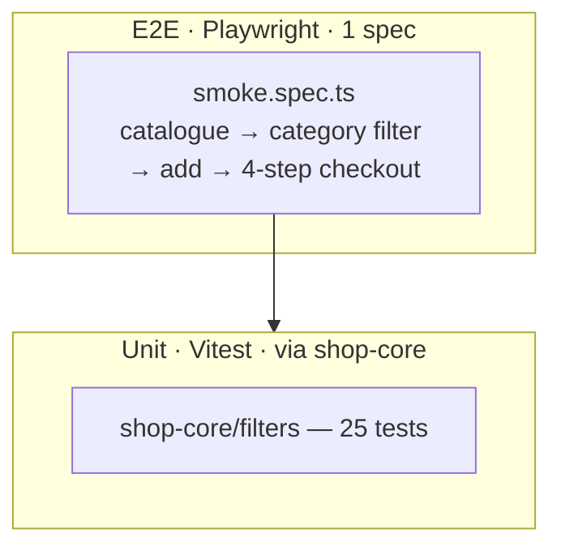

# Tools-shop — testing documentation

> TDD discipline + AC traceability.

## TDD workflow

Standard red → green → refactor. Tests sit at two layers:

1. **Shared pure layer** (`libs/shop-core/src/filters/`) — reused by
   every shop. 25 tests already at ~100% coverage.
2. **Domain-specific layer** (`libs/tools-shop-data/src/filters/`) —
   add tests when `matchesToolFilters` grows non-trivial branches.
3. **E2E** (`apps/tools-shop-e2e/src/smoke.spec.ts`) — happy path.

## Test pyramid



| Layer         | Count                | Scope                                      | Runner     |
| ------------- | -------------------- | ------------------------------------------ | ---------- |
| Unit (shared) | 25                   | `libs/shop-core/src/filters/`              | Vitest 4   |
| Unit (domain) | 0                    | Will be added when domain predicates grow. | —          |
| E2E           | 1 spec, 9 assertions | Catalogue → checkout                       | Playwright |

## Acceptance criteria to test traceability

| AC-N  | Acceptance criterion                                 | Implementation                                                    | Asserting test                                  |
| ----- | ---------------------------------------------------- | ----------------------------------------------------------------- | ----------------------------------------------- |
| AC-1  | Catalogue lists ≥ 20 products                        | `libs/tools-shop-data/src/seed/catalogue.ts`                      | E2E: `cards.count() > 20` in `smoke.spec.ts:9`  |
| AC-2  | Category facet narrows results                       | `tools-shop-data/filters/matching.ts` + `FilterPanelComponent`    | E2E: clicks `filter-category-power-tools`       |
| AC-3  | Tool type / power source / price / in-stock facets   | `ToolFilters` + base predicates from `shop-core`                  | Covered by `shop-core/filters/matching.spec.ts` |
| AC-4  | Sort works                                           | `shop-core/filters/sorting.ts`                                    | `shop-core/filters/sorting.spec.ts`             |
| AC-5  | Empty-state for 0 hits                               | `<ais-shop-empty-state>` from shop-ui                             | Manual; E2E reset path covers it.               |
| AC-6  | Tool detail with chips (voltage / weight / warranty) | `ToolDetailComponent`                                             | Manual + E2E navigation.                        |
| AC-7  | Add to cart                                          | `(addToCart)` output → `cart.addLine(id)`                         | E2E: `card-add-to-cart` click                   |
| AC-8  | Cart persists across reloads                         | `ShopCartService` + `CART_STORAGE_KEY = 'ais.tools-shop.cart.v1'` | Manual.                                         |
| AC-9  | 4-step checkout                                      | `<ais-shop-checkout>` from shop-ui                                | E2E: 4-step traversal `smoke.spec.ts:18-32`     |
| AC-10 | Tests gate the build                                 | `libs/shop-core/vitest.config.ts` thresholds                      | CI: `pnpm nx test shop-core --coverage`         |
| AC-11 | Playwright smoke green                               | `apps/tools-shop-e2e/src/smoke.spec.ts`                           | The spec itself.                                |

## How to run

```bash
pnpm nx test shop-core               # 25 unit tests
pnpm nx test shop-core --coverage    # coverage report
pnpm nx e2e tools-shop-e2e           # Playwright (chromium)
```

## Adding a new test

1. Row to the traceability matrix.
2. Test under `shop-core` if generic, else `tools-shop-data` (set up
   `vitest.config.ts` first).
3. Red → green → refactor.
4. Full gate:
   - `pnpm nx run-many -t lint test build --projects=tools-shop,tools-shop-data,tools-shop-feature-catalogue`
   - `pnpm nx e2e tools-shop-e2e`

5. Update this file + commit.

## Known gaps

| Gap                                    | Reason                                                     | Mitigation                                             |
| -------------------------------------- | ---------------------------------------------------------- | ------------------------------------------------------ |
| No vitest config for `tools-shop-data` | Domain predicates are simple wrappers over shop-core base. | Add when `matchesToolFilters` grows independent logic. |
| Only chromium                          | Smoke-tier.                                                | Cross-browser when needed.                             |
| No detail-page snapshot                | Brittle.                                                   | E2E navigation is the contract.                        |
