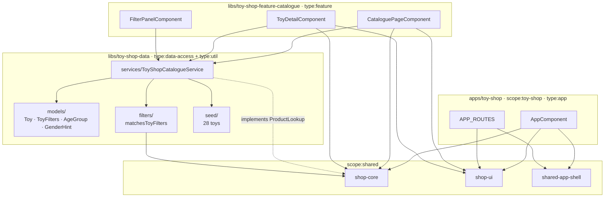

# Toy-shop — technical documentation

> Architecture + runbook. AC mapping → [`testing.md`](testing.md).

## Architecture overview



### Library structure

| Path                              | Scope            | Type                           | Public API                                                              |
| --------------------------------- | ---------------- | ------------------------------ | ----------------------------------------------------------------------- |
| `apps/toy-shop`                   | `scope:toy-shop` | `type:app`                     | — (terminal)                                                            |
| `apps/toy-shop-e2e`               | —                | `type:e2e`                     | — (terminal)                                                            |
| `libs/toy-shop-data`              | `scope:toy-shop` | `type:data-access + type:util` | [`src/index.ts`](../../../libs/toy-shop-data/src/index.ts)              |
| `libs/toy-shop-feature-catalogue` | `scope:toy-shop` | `type:feature`                 | [`src/index.ts`](../../../libs/toy-shop-feature-catalogue/src/index.ts) |

## Data model

```typescript
interface Toy extends BaseProduct {
  readonly ageGroup: '0-2' | '3-5' | '6-8' | '9-12' | '13+';
  readonly minAge: number;
  readonly maxAge: number;
  readonly pieceCount: number | null;
  readonly genderHint: 'any' | 'boys' | 'girls';
  readonly batteryRequired: boolean;
  readonly safetyCertified: boolean;
}

interface ToyFilters extends BaseFilters {
  readonly ageGroups: ReadonlySet<AgeGroup>;
  readonly genderHints: ReadonlySet<GenderHint>;
  readonly batteryFreeOnly: boolean;
}
```

`batteryFreeOnly` is the toy-specific predicate that has no analogue in
the base layer — `matchesToyFilters` adds it on top of
`matchesBaseFilters`.

## Cart wiring

```typescript
// apps/toy-shop/src/main.ts
{ provide: PRODUCT_LOOKUP,    useExisting: ToyShopCatalogueService },
{ provide: CART_STORAGE_KEY,  useValue:    'ais.toy-shop.cart.v1' },
```

## Routing

```typescript
APP_ROUTES = [
  { path: '',        loadComponent: → CataloguePageComponent },
  { path: 'toy/:id', loadComponent: → ToyDetailComponent     },
  { path: 'cart',    component:     CartPageComponent  },
  { path: 'checkout',component:     CheckoutComponent },
  { path: '**',      component:     NotFoundComponent },
];
```

## Public APIs

### `@ai-studio/toy-shop-data`

```typescript
export type { Toy, ToyFilters, AgeGroup, GenderHint };
export { AGE_GROUPS, GENDER_HINTS, TOY_CATEGORIES, EMPTY_TOY_FILTERS };
export { matchesToyFilters, applyToyFilters };
export { ToyShopCatalogueService };
export { TOY_CATALOGUE };
```

### `@ai-studio/toy-shop-feature-catalogue`

```typescript
export { CataloguePageComponent }; // <ais-toy-shop-catalogue-page>
export { ToyDetailComponent }; // <ais-toy-shop-toy-detail [id]="…">
export { FilterPanelComponent }; // <ais-toy-shop-filter-panel>
```

## Runbook

```bash
pnpm start:toy-shop                  # → http://localhost:4210
pnpm nx build toy-shop               # production bundle
pnpm nx lint toy-shop                # eslint
pnpm nx e2e toy-shop-e2e             # Playwright (chromium)
```

Bundle budgets in
[`apps/toy-shop/project.json`](../../../apps/toy-shop/project.json):
initial 900 kB warning / 1.5 MB error.

## Troubleshooting

| Symptom                             | Fix                                                                                                         |
| ----------------------------------- | ----------------------------------------------------------------------------------------------------------- |
| Cart drawer empty after add-to-cart | Missing `{ provide: PRODUCT_LOOKUP, useExisting: ToyShopCatalogueService }`.                                |
| Battery-free toggle does nothing    | `batteryFreeOnly` is a property on `ToyFilters`, not in base filters — only `matchesToyFilters` honours it. |
| Age chip shows wrong label          | `AGE_LABELS` map missing for the new age group; extend the helper.                                          |

## Extensibility hooks

- New age group → add to `AGE_GROUPS` + label map. Filter predicates
  pick it up automatically.
- New safety axis (e.g. `chokingHazard: boolean`) → add to `Toy` model
  - seed + (optionally) `ToyFilters`.
- Gift cards / vouchers → new feature lib under `scope:toy-shop`.
