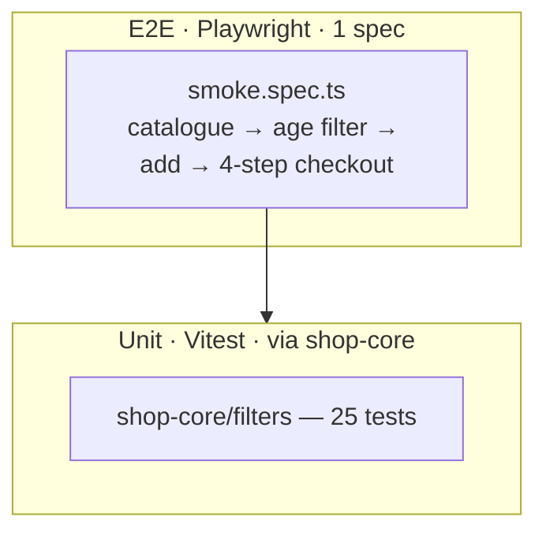

# Toy-shop — testing documentation

> TDD discipline + AC traceability.

## TDD workflow

Same red → green → refactor pattern as the rest of the repo. Tests at:

1. **Shared pure layer** (`libs/shop-core/src/filters/`) — 25 tests at
   ~100% coverage.
2. **Domain layer** (`libs/toy-shop-data/src/filters/`) — add tests when
   the `batteryFreeOnly` / `ageGroups` predicates need defending against
   future change.
3. **E2E** (`apps/toy-shop-e2e/src/smoke.spec.ts`).

## Test pyramid



| Layer         | Count                | Scope                                  | Runner     |
| ------------- | -------------------- | -------------------------------------- | ---------- |
| Unit (shared) | 25                   | `libs/shop-core/src/filters/`          | Vitest 4   |
| Unit (domain) | 0                    | Domain predicates are simple wrappers. | —          |
| E2E           | 1 spec, 9 assertions | Catalogue → checkout                   | Playwright |

## Acceptance criteria to test traceability

| AC-N  | Acceptance criterion                                   | Implementation                                                  | Asserting test                                                 |
| ----- | ------------------------------------------------------ | --------------------------------------------------------------- | -------------------------------------------------------------- |
| AC-1  | Catalogue lists ≥ 20 products                          | `libs/toy-shop-data/src/seed/catalogue.ts`                      | E2E: `cards.count() > 20` in `smoke.spec.ts:9`                 |
| AC-2  | Age-group facet narrows results                        | `toy-shop-data/filters/matching.ts` + `FilterPanelComponent`    | E2E: clicks `filter-age-3-5`                                   |
| AC-3  | Battery-free toggle filters out battery-required toys  | `matchesToyFilters` (`batteryFreeOnly` branch)                  | Domain-specific predicate; add a vitest spec when changing it. |
| AC-4  | Category / price / in-stock facets                     | `BaseFilters` from `shop-core`                                  | Covered by `shop-core/filters/matching.spec.ts`                |
| AC-5  | Sort works                                             | `shop-core/filters/sorting.ts`                                  | `shop-core/filters/sorting.spec.ts`                            |
| AC-6  | Empty-state for 0 hits                                 | `<ais-shop-empty-state>` from shop-ui                           | E2E reset path.                                                |
| AC-7  | Toy detail with age / piece-count / battery / CE chips | `ToyDetailComponent`                                            | Manual + E2E navigation.                                       |
| AC-8  | Add to cart                                            | `(addToCart)` output → `cart.addLine(id)`                       | E2E: `card-add-to-cart` click                                  |
| AC-9  | Cart persists across reloads                           | `ShopCartService` + `CART_STORAGE_KEY = 'ais.toy-shop.cart.v1'` | Manual.                                                        |
| AC-10 | 4-step checkout                                        | `<ais-shop-checkout>` from shop-ui                              | E2E: 4-step traversal `smoke.spec.ts:18-32`                    |
| AC-11 | Tests gate the build                                   | `libs/shop-core/vitest.config.ts` thresholds                    | CI: `pnpm nx test shop-core --coverage`                        |
| AC-12 | Playwright smoke green                                 | `apps/toy-shop-e2e/src/smoke.spec.ts`                           | The spec itself.                                               |

## How to run

```bash
pnpm nx test shop-core               # shared 25 tests
pnpm nx test shop-core --coverage    # coverage report
pnpm nx e2e toy-shop-e2e             # Playwright (chromium)
```

## Adding a new test

1. Row to the traceability matrix.
2. Test under `shop-core` (generic) or `toy-shop-data` (domain).
3. Red → green → refactor.
4. Full gate:
   - `pnpm nx run-many -t lint test build --projects=toy-shop,toy-shop-data,toy-shop-feature-catalogue`
   - `pnpm nx e2e toy-shop-e2e`

5. Update this file + commit.

## Known gaps

| Gap                                      | Reason                                                         | Mitigation                                                           |
| ---------------------------------------- | -------------------------------------------------------------- | -------------------------------------------------------------------- |
| `batteryFreeOnly` not unit-tested per se | One-line predicate; the base layer covers everything else.     | Add `matching.spec.ts` under `toy-shop-data` if the predicate grows. |
| Only chromium                            | Smoke-tier.                                                    | Cross-browser when needed.                                           |
| `genderHint` facet not exposed in the UI | Cultural sensitivity; v1 hides the facet but the field exists. | Surface as a toggle if needed by the product team.                   |
