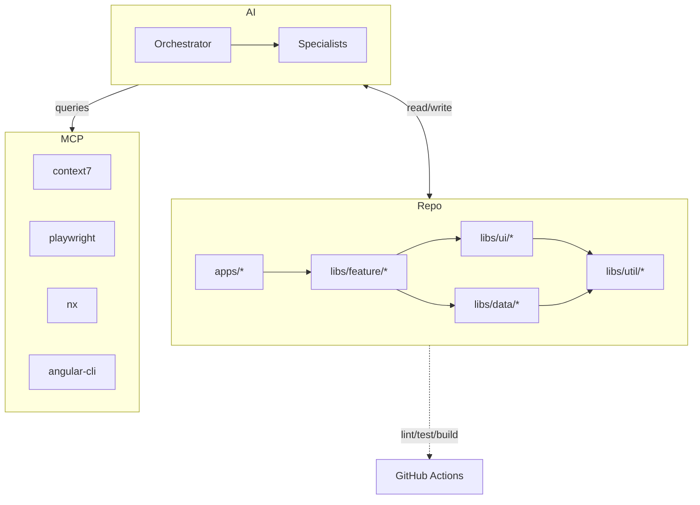
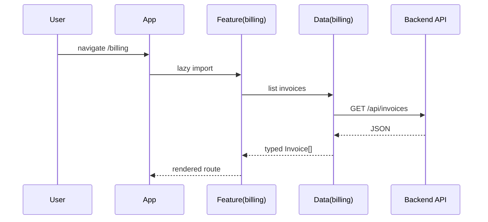
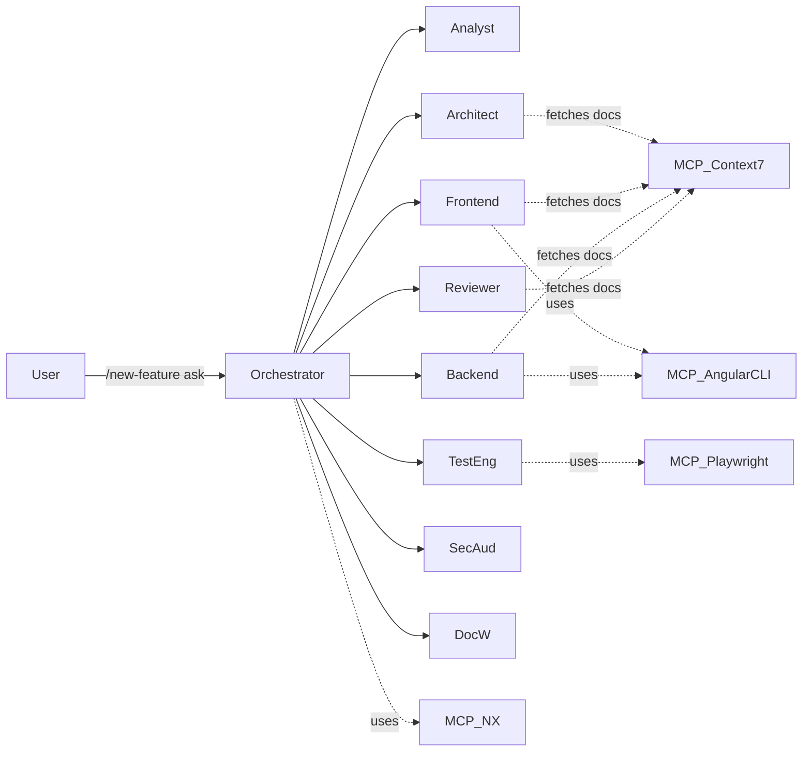

# Architecture overview

> A bird's-eye picture of AI Studio. For decision rationale, see [ADRs](../adr/).

## TL;DR

- Nx monorepo with one or more Angular apps under `apps/`.
- Strict library taxonomy in `libs/` (`feature`, `ui`, `data`, `util`, `shared`).
- AI multi-agent layer (`.ai/` + `.claude/`) coordinates non-trivial changes.
- MCP servers (`context7`, `playwright`, `nx`, `angular-cli`) extend agents with live capabilities.
- CI runs `lint`, `typecheck`, `test`, `e2e`, `build` on **affected** projects.

## High-level diagram

## Library taxonomy

| Layer            | Allowed dependencies    | Examples                          |
| ---------------- | ----------------------- | --------------------------------- |
| `apps/*`         | feature, ui, data, util | `apps/studio`                     |
| `libs/feature/*` | ui, data, util          | `libs/feature/billing`            |
| `libs/ui/*`      | ui, util                | `libs/ui/button`, `libs/ui/forms` |
| `libs/data/*`    | data, util              | `libs/data/billing`               |
| `libs/util/*`    | util only               | `libs/util/logger`                |
| `libs/shared/*`  | util                    | `libs/shared/theme`               |

Boundary enforcement: `@nx/enforce-module-boundaries` (see `eslint.config.mjs`).

## Runtime composition

## AI layer

See [`docs/ai-workflow/multi-agent-flow.md`](../ai-workflow/multi-agent-flow.md) for the protocol.

## CI pipeline

| Workflow        | Trigger            | Jobs                                               |
| --------------- | ------------------ | -------------------------------------------------- |
| `ci.yml`        | push, PR           | validate-ai, lint, typecheck, test, build          |
| `e2e.yml`       | push, PR, dispatch | Playwright on chromium, firefox, webkit            |
| `pr-checks.yml` | PR opened/edited   | Conventional commits, PR title, docs-on-API-change |
| `release.yml`   | manual dispatch    | `nx release` (dry-run by default)                  |

## Performance budget

- App initial JS: **< 200 kB gzipped**.
- E2E suite per app in CI: **< 5 min** wall-clock.
- Vitest suite per project: **< 30 s**.

## Where to next

- Pick a workflow in [.ai/workflows/](../../.ai/workflows/) for a concrete recipe.
- See [system design](system-design.md) for component-level diagrams.
