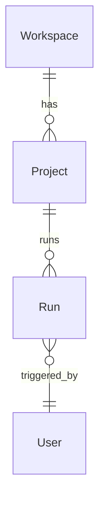

# Data model

> Updated as schemas land. Keeps in lock-step with `libs/data/*` and `.ai/context/domain-model.md`.

## Conventions

- Every DTO has a Zod schema in `libs/util/schemas` and is parsed at the boundary (HTTP, model output, file import).
- Types derive from schemas via `z.infer<typeof X>`.
- Field naming: `camelCase` in app code, mapped at the API boundary if the server uses `snake_case`.

## Placeholder example

```ts
// libs/util/schemas/src/lib/workspace.schema.ts
import { z } from 'zod';

export const workspaceIdSchema = z.string().regex(/^ws_[a-zA-Z0-9]{12}$/);
export const workspaceSchema = z.object({
  id: workspaceIdSchema,
  name: z.string().min(1).max(80),
  createdAt: z.string().datetime(),
});
export type Workspace = z.infer<typeof workspaceSchema>;
```

## ER (placeholder)



> Replace once the first real schema lands. Move complete schemas under `docs/technical/data-model/<area>.md`.
