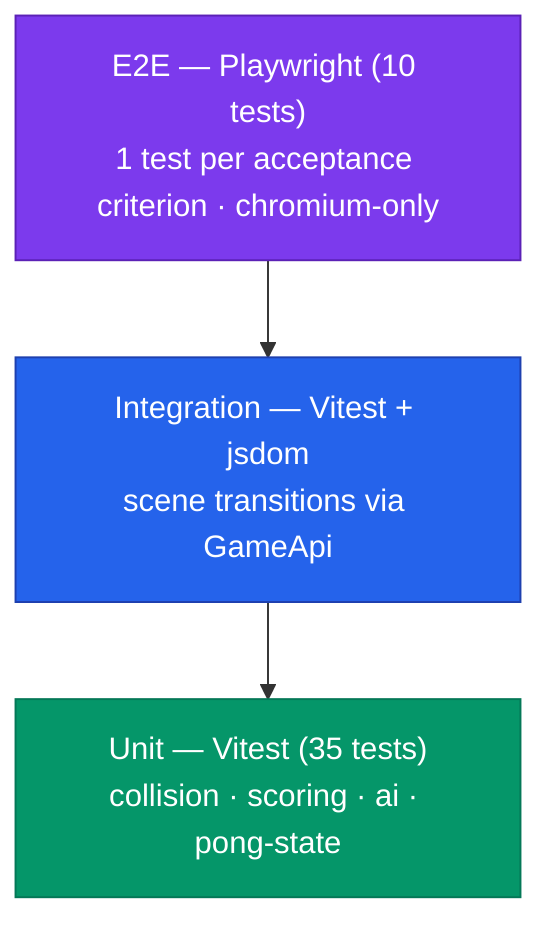
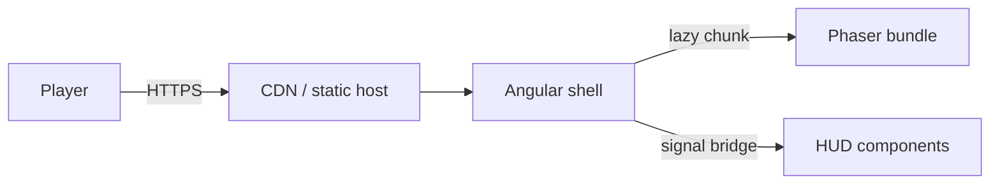

# Pong — technical guide

> Single-player browser Pong built with **Phaser 3** inside an **Angular 21 Nx app**, produced as the worked-example for the trinity-aware Spec-Driven Development flow. This document is the canonical entry point — every persona finds their section below.

## Persona index

| If you are…            | Read this section                                                                                                                               |
| ---------------------- | ----------------------------------------------------------------------------------------------------------------------------------------------- |
| **Analyst / product**  | [Spec & acceptance criteria](#analyst--spec--acceptance-criteria), [Success metrics](#success-metrics)                                          |
| **Tester / QA**        | [Test pyramid](#tester--test-pyramid), [Test scenarios](#test-scenarios), [Running tests locally](#running-tests-locally)                       |
| **Frontend developer** | [Architecture](#developer--architecture), [Public API](#public-api), [How to extend](#how-to-extend), [Performance budget](#performance-budget) |
| **DevOps / SRE**       | [Build & serve](#devops--build--serve), [Deployment topology](#deployment-topology), [Observability](#observability)                            |
| **Admin**              | [Feature flag](#admin--feature-flag), [Configuration](#configuration), [Troubleshooting](#troubleshooting)                                      |

---

## Analyst — spec & acceptance criteria

The full specification lives at (historic, see git log). It contains:

- **User stories** US-1…US-4 (casual play, reference implementation, scenario traceability, configurable rollout).
- **10 acceptance criteria** (AC-1…AC-10) in Given/When/Then form. Each maps to ≥ 1 Playwright test.
- **Success metrics** with measurable targets.
- **Non-goals** to keep scope honest.

### Success metrics

| Metric                  | Target            | Where measured                                                           |
| ----------------------- | ----------------- | ------------------------------------------------------------------------ |
| Time to first frame     | < 500 ms          | Lighthouse CI, `pong-game` build report                                  |
| Frames per second       | ≥ 55 fps          | `Phaser.game.loop.actualFps` exposed via `GameApi` (future; placeholder) |
| Bundle size delta       | < 250 KB gzip     | Build report, dist analyzer                                              |
| Unit-test coverage      | ≥ 80 % statements | `coverage/libs/game-pong/`                                               |
| E2E acceptance coverage | every AC mapped   | `apps/pong-game-e2e/src/pong.e2e.spec.ts`                                |

### Traceability matrix (AC → test)

| AC    | Spec section        | Unit test                               | E2E test                               |
| ----- | ------------------- | --------------------------------------- | -------------------------------------- |
| AC-1  | Game starts on menu | `pong-state.spec.ts`                    | `AC-1 — game starts on the menu`       |
| AC-2  | Round resets state  | `pong-state.spec.ts`                    | `AC-2 — starting a round resets state` |
| AC-3  | Keyboard input      | `pong-state.spec.ts`                    | `AC-3 — player paddle responds…`       |
| AC-4  | AI tracking         | `ai.spec.ts`, `pong-state.spec.ts`      | `AC-4 — AI paddle tracks the ball`     |
| AC-5  | Ball reflections    | `collision.spec.ts`                     | `AC-5 — ball bounces off paddles…`     |
| AC-6  | Scoring on miss     | `scoring.spec.ts`, `pong-state.spec.ts` | `AC-6 — scoring on miss`               |
| AC-7  | First to 5 wins     | `scoring.spec.ts`, `pong-state.spec.ts` | `AC-7 — first to 5 wins`               |
| AC-8  | Pause/resume        | `pong-state.spec.ts`                    | `AC-8 — pause and resume`              |
| AC-9  | Mute/unmute         | (host integration)                      | `AC-9 — mute and unmute`               |
| AC-10 | Feature flag        | (build-time gate)                       | `AC-10 — feature flag gates the route` |

---

## Tester — test pyramid



### Test scenarios

Source of truth: the `Given / When / Then` blocks in `spec.md`. Generated test files:

- **Unit:**
  - [`libs/game-pong/src/logic/collision.spec.ts`](../../libs/game-pong/src/logic/collision.spec.ts)
  - [`libs/game-pong/src/logic/scoring.spec.ts`](../../libs/game-pong/src/logic/scoring.spec.ts)
  - [`libs/game-pong/src/logic/ai.spec.ts`](../../libs/game-pong/src/logic/ai.spec.ts)
  - [`libs/game-pong/src/state/pong-state.spec.ts`](../../libs/game-pong/src/state/pong-state.spec.ts)
- **E2E:**
  - [`apps/pong-game-e2e/src/support/pong.page.ts`](../../apps/pong-game-e2e/src/support/pong.page.ts) — page object
  - [`apps/pong-game-e2e/src/pong.e2e.spec.ts`](../../apps/pong-game-e2e/src/pong.e2e.spec.ts) — 10 acceptance tests

### Running tests locally

```bash
# unit + integration
pnpm exec vitest run libs/game-pong

# E2E (auto-starts dev server)
pnpm exec nx e2e pong-game-e2e

# everything affected by your branch
pnpm affected:test
pnpm affected:e2e
```

### Coverage thresholds

Configured in `libs/game-pong/vitest.config.ts`:

| Metric     | Threshold |
| ---------- | --------- |
| statements | 80 %      |
| branches   | 75 %      |
| functions  | 80 %      |
| lines      | 80 %      |

CI fails the run if coverage drops below these on touched files.

---

## Developer — architecture

```mermaid
flowchart LR
  subgraph apps/pong-game (Angular)
    AC[AppComponent]
    AR[app.routes.ts]
    PH[PongHostComponent]
    NF[NotFoundComponent]
  end
  subgraph libs/game-pong (Phaser)
    CG[createGame]
    PS[PongState]
    SC[Scenes: Boot · Play]
    L[Logic: collision · scoring · ai]
  end
  subgraph libs/game-pong-ui (Angular HUD)
    SD[ScoreDisplay]
    MO[MenuOverlay]
    GO[GameOverOverlay]
  end

  AC --> AR
  AR -- lazy --> PH
  AR -- lazy --> NF
  PH -- mount canvas --> CG
  CG --> SC
  SC --> PS
  PS --> L
  CG -- events --> PH
  PH -- signal --> SD
  PH -- signal --> MO
  PH -- signal --> GO
```

### Public API

`@ai-studio/game-pong` exports:

```typescript
import { createGame, type GameApi, type PongConfig, DEFAULT_PONG_CONFIG } from '@ai-studio/game-pong';

const api: GameApi = createGame(host, { winScore: 3 });
const off = api.subscribe((event) => /* … */);
api.start();
// later
api.destroy();
off();
```

`@ai-studio/game-pong-ui` exports `ScoreDisplayComponent`, `MenuOverlayComponent`, `GameOverOverlayComponent`. All standalone, OnPush, `ais-` prefix.

### How to extend

| Want to…                      | Touch                                                                        |
| ----------------------------- | ---------------------------------------------------------------------------- |
| Change physics                | `libs/game-pong/src/logic/collision.ts`, add unit tests next to it           |
| Tune AI difficulty            | `DEFAULT_PONG_CONFIG.aiSpeed` in `types.ts`, update `ai.spec.ts`             |
| Add a new HUD widget          | New component in `libs/game-pong-ui/src/<name>/`, export from its `index.ts` |
| Add a new scene               | `libs/game-pong/src/scenes/<name>.scene.ts`, register in `createGame`        |
| Mirror to ai-mcp-alm/devtools | None — game does not affect trinity baseline                                 |

### Performance budget

- Initial bundle (gzip): **< 500 KB** (Angular shell), **< 750 KB** with Phaser chunk lazy-loaded.
- Frame budget: `update()` ≤ 4 ms (per `.ai/rules/games.md` § 5).
- No allocations per frame — paddles and ball are pre-created in `create()`.

---

## DevOps — build & serve

### Common commands

```bash
# dev server
pnpm exec nx serve pong-game

# production build
pnpm exec nx build pong-game --configuration=production

# build everything affected by a branch
pnpm affected:build
```

Artefacts: `dist/apps/pong-game/`. Static — any static-host CDN works.

### Deployment topology



No backend, no auth, no DB. Suitable for any static host (S3+CloudFront, Cloudflare Pages, Netlify, GitHub Pages).

### Observability

The host component logs `console.error` only on bootstrap failure. The game itself never writes to stdout (`.ai/rules/games.md` § 7 forbids `console.*` in scenes). For runtime telemetry hook into `GameApi.subscribe()`:

```typescript
api.subscribe((event) => analytics.track(event));
```

---

## Admin — feature flag

The route is gated by the **build-time** env var `PONG_ENABLED`:

| `PONG_ENABLED`              | Behaviour                                                                               |
| --------------------------- | --------------------------------------------------------------------------------------- |
| unset (default) or `"true"` | Game route active at `/`. Phaser bundle lazy-loaded on visit.                           |
| `"false"`                   | Every route falls through to `NotFoundComponent`. Phaser **not** built into the bundle. |

To produce a "kill-switch" build:

```bash
PONG_ENABLED=false pnpm exec nx build pong-game --configuration=production
```

The bundle should not contain `phaser`; verify with `dist/apps/pong-game/stats.json` or:

```bash
grep -ril phaser dist/apps/pong-game || echo "phaser absent"
```

### Configuration

All knobs live in [`libs/game-pong/src/types.ts`](../../libs/game-pong/src/types.ts) under `DEFAULT_PONG_CONFIG`. To override per deployment, build a small wrapper around `createGame`:

```typescript
createGame(host, { winScore: 11, aiSpeed: 240 });
```

### Troubleshooting

| Symptom               | Likely cause                                    | Fix                                                              |
| --------------------- | ----------------------------------------------- | ---------------------------------------------------------------- |
| Black canvas, no menu | WebGL disabled in browser                       | `Phaser.AUTO` falls back to Canvas; check browser console        |
| 404 on `/`            | `PONG_ENABLED=false` baked into the build       | Rebuild without the env var                                      |
| No sound              | Browser autoplay policy                         | Sound starts on first user gesture (Start button); document this |
| Score never reaches 5 | AI tracking too weak                            | Increase `aiSpeed` in config                                     |
| Test flake on `AC-7`  | CI runner WebGL fallback to swiftshader is slow | Bump test timeout; tracked in playwright.config                  |

---

## Related documents

- Spec — Phase 1 (Specify)
- Plan — Phase 2 (Plan)
- Tasks — Phase 3 (Tasks) DAG
- [ADR-0004](../adr/0004-phaser-as-default-game-library.md) — Phaser as default game library
- [Games rules](../../.ai/rules/games.md) — every constraint enforced here
- [Spec-driven workflow](../../.ai/workflows/spec-driven.md) — methodology
