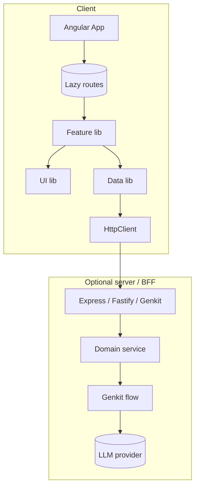
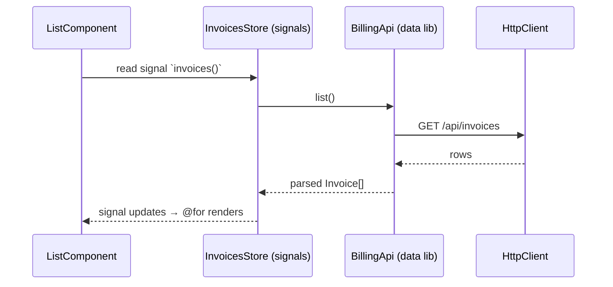
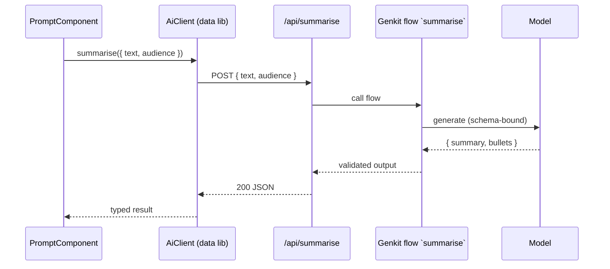

# System design

> Component-level view of how the apps and libraries fit together. Updated by the **doc-writer** agent on every accepted ADR.

## Composition model

## Module boundaries

Enforced by `@nx/enforce-module-boundaries` (rules in `eslint.config.mjs`). See [architecture overview](architecture.md#library-taxonomy).

## Cross-cutting concerns

| Concern        | Where it lives                              | Notes                                          |
| -------------- | ------------------------------------------- | ---------------------------------------------- |
| Logging        | `libs/util/logger`                          | Structured JSON, redaction, `LoggerService`    |
| HTTP client    | `libs/data/http`                            | Interceptors: auth, csrf, retry, telemetry     |
| Theming        | `libs/shared/theme`                         | CSS custom properties, dark mode               |
| i18n           | `libs/shared/i18n`                          | Angular built-in i18n (compile-time)           |
| Feature flags  | `libs/util/feature-flags`                   | `provideFeatureFlags(...)`                     |
| Telemetry      | `libs/util/telemetry`                       | OpenTelemetry browser SDK                      |
| Forms          | `libs/ui/forms`                             | Reactive forms only, validators kit            |
| AI flows       | `libs/data/ai-flows` (browser proxy types)  | Server-only secrets, schema-bound output       |

## Configuration

- **Build-time**: `apps/<app>/src/environments/environment.{dev,prod}.ts` — no secrets here, only feature toggles and public URLs.
- **Run-time**: server endpoint that returns a JSON config under `/config` (cached). Apps pull on bootstrap via `provideConfig()`.
- **Secrets**: never in client. Server reads from platform secret manager (Firebase, AWS SM, GCP SM).

## Data flow examples

### Feature renders a list

### AI feature with server-side flow

## Failure modes

| Source            | Strategy                                                          |
| ----------------- | ----------------------------------------------------------------- |
| Backend 5xx       | Retry with backoff (idempotent endpoints) → user-facing error UI  |
| Model unavailable | Cache last-good response; persist user input for retry            |
| Network offline   | Service-worker fallback page (when SSR/PWA enabled)               |
| Validation error  | Surface inline; form remains live                                  |

## Build outputs

| Project type | Output             |
| ------------ | ------------------ |
| App          | `dist/apps/<name>` |
| Lib          | _(consumed via TS path mapping; no separate build by default)_ |
| Server       | `dist/apps/<name>/server` |
| E2E          | `playwright-report/`, `test-results/` |
